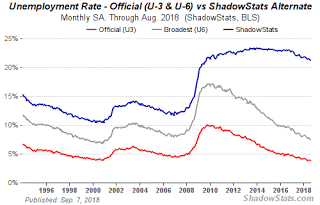

# Week 36

Question

How did Trump do on unemployment?

Little better than previous admin

Graph is from Shadowstats. There is some decrease in the real
unemployment. This # increased and remained steady during and until
the end of previous admin. So some improvement.

But gov did nothing on the deficit and actually made it worse. Bubbles
abound.

---

Question

Can Trump win the 2020 election?

Likely

Based on the statistical model here, and using a potential 3% GDP
growth, -15% current Trump net approval rating (from Gallup), and the
fact that he will be the leading the incumbent party in its first term
in power, the confidence interval for Rep win is (49.84. 53.543). This
is a high probability for a second term. The main factor here is
incumbency, it is extremely hard for voters to switch leaders that
fast. I tried growth figure of 1%, u still get (49.19  51.87), some
chance for Dems but still Rep is favored. Unless there is an econ
crisis, or Trump's popularity plunges further, 2nd term is
likely. With less growth, and oppo pulls a Dubya... maybe there is a
chance for Dems.

---

Benedict Evans

Its always weird when Americans on the right dismiss 'socialized'
healthcare as a terrible idea without also condemning the 'socialized'
police

Nice

---

Question

How do we explain the rise of the right in European countries with
strong social state?

With that sentence

Maybe ppl were afraid to lose services of that social state bcz of the
influx of refugees. I am not saying right or wrong, just saying that
might have been the impression.

---

Comment

There are only three optimizations: Do less. Do it less often. Do it faster.

The largest gains come from 1, but we spend all our time on 3.

Right

---

Question

Did quantitative easing programme, executed by many central banks in
the world after 2008 crisis, work?

No

See paper, based on Bank of England (UK central bank) data. 

https://www.ifk-cfs.de/fileadmin/downloads/publications/wp/2011/11_29.pdf

US QE involved FED buying government securities and mortgage bonds. So
FED printed money and bought  securities (but this move is seen as
"unorthodox", not part of normal operation, and everyone is freaked
out about it one way or another, want it to end). On one hand,
government debt is "monetized", on the other, mortgage bond purchases
in a way became a continuous bailing out of financial institutions. US
debt burden grew higher.  

In cases / countries where QE is used to buy up corporate debt, it is
used on large institutional debt, a move that would help cement large
companies' position in the marketplace. Inequality.

QE, purchasing long-term bonds, depressed their rates, pushing
investors to the stock market, creating a bubble there (see today), as
well as in bonds. More inequality. The situation in bonds is even more
severe (in terms of bubble) where investors front-loading FED moves
made a killing by simple mirroring their actions.

---

John McCain

[Paraphrasing] politics is about compromise, we need to start
compromising, unite Democrats and Republicans. 

Wrong

We need to seperate Democrats and Republicans. 

Most useful policies are self-contained, atomic, whole-or-nothing
positions. Take 15-dollar-minimum-wage for example.. You either do it
as-is, or don't do it at all. If you smush it, bend it in this way or
that way "well... if an employee, is btw 30-40, is married, working in
blah, then before noon it is 12 dollars, but if female, working in
software, on Mondays it is $15"..  Then the policy becomes useless, it
becomes like.. Obamacare (a certifiable over-engineered piece of
shit). 

I was watching this video on the Oslo accords the other day,  about
"the Clinton solution" for the Israeli-Palestine problem. It goes like
this: "Split the West Bank in three sections. Area A (some patchy shit
area) gave Palestenians X amt of control, Area B (another patchy shit
area inside the previous patchy shit area) Pals govern, Israel
security handles security, Area C (everything else that remains),
Israel controls everything.". 

https://youtu.be/E0uLbeQlwjw?t=297

I looked at this map, and the patchy "solution" it represented, and I
thought to myself this is how a fucking centrist thinks... Always
these roundabouts, curvy moves - in a small landscape. 

The main problem is a centrist often makes a bigger decision first,
and makes it wrong. Democrat centrists for example (the worst kind),
decide first to be Republican-lite, and as such, constrain themselves
to one particular area, then they think they can accomplish things
with "on the one hand.. on the other hand.." quick body moves,
tactical maneuvers, delivering non-solutions but "selling it" with
lip-biting, Holywood delivery, the West Wing'uesque Aaron Sorkin
politico-techno-babble. 

But they constrained themselves to a small area, and the strategic
implication of that choice asserts itself one way or another, and
collapses, on their head, burying them under it.

---

Question

Do you support 15$ minimum wage?

No

I'd rather give ppl free money, instead of restricting businesses with
minimum wage.

---

Question

Without compromise how can political horse-trading work?

It can

You don't compromise on the atomic issue, but you can still
horse-trade on the palette. I give you 15MW, you give me M4A. There is
a palette of issues a politician wants to further, may not get them
all, but can further some.

---

News

CBS's [CEO] Les Moonves quits amid new allegations of abuse

Great

Word is he effed it all up with Star Trek Disco. Maybe CBS will have
better scifi in the future.

https://youtu.be/jLl17YXrAZY?t=207

Can we have Stargate Atlantis back? Or some kind of Stargate.. that
doesn't look like a Lost remake?

---

\#voterShaming

[[-]](https://youtu.be/lWurVlHdSWA)

---

---

\#russia \#russia \#russia

---

\#nra

---

