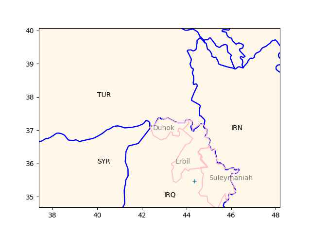

# Week 4


"@TheEuropeanNetwork@mstdn.social

Germany will join the new hydrogen pipeline project between Spain,
Portugal and France. The project, called H2Med, will connect Portugal
and Spain with France and now Germany to supply about two million tons
of hydrogen annually, or about 10% of the European Union's hydrogen
demand, by 2030" via Deutsche Welle

---

TR nemesis Kurdish PKK and sister org YPG are closer to PUK - one
Talabani made a visit to Rojova (YPG stronghold in NE Syria). Barzanis
are seen as too close to Ankara, as their poodle (which makes them the
poodle to poodle's poodle).

---

KRG, Iraqi central gov also have conflicts; after KRG 2017 indep
referandum central gov attacked KRG, took 20% of its land including
Kirkuk - major oil production center.

The loss of Kirkuk then became a PUK-KDP sore spot; PUK reportedly
left the fight, KDP was gung-ho, and lost. Major loss of face for KRG
especially KDP. Papa Barzani resigned after that one.

---

Iraq Kurdish map again; two families Barzani / Talabani are feuding,
one is based at Erbil the other at Suleymaniah, + sign is Kirkuk.

```python
u.sm_plot_kurd()
plt.plot(44.36168251,35.469605,'+') 
```



---

Trouble in Kurdish regional gov (KRG) of Iraq. The two major parties
in it, KDP, PUK are not getting along..

---

"@Hy_Economy@mastodon.social

Heating with \#hydrogen: Gerstofen, Germany, plans to blend H₂, that
is available as waste from industrial processes, in their gas grid
(for heating purposes).  90% of the grid are already suitable for the
planned 7% blend"

---

TASS: "The West may be heading for 'a catastrophic stalemate,' at
best, for Ukraine, Sherelle Jacobs, head of the Online Comment at The
Daily Telegraph, wrote on Monday night.

She views a decisive Russian breakthrough in spring as an alternative
scenario. According to her, while Western elites assume that a victory
for the Ukrainians 'must surely be around the corner,' the fact is
that Ukraine is increasingly on the back foot"
 
---

If such a win *did* occur BTW the Russian state would cease to exist -
and that's not going to happen.

---

It would be very difficult in the following year, or the one after
that as well..

Newsweek: 'From a military standpoint, I still maintain that for this
year it would be very, very difficult to militarily eject the Russian
forces from...every inch of Russian-occupied Ukraine,' [CJCS] Milley
said"

---

Manchin was on Cuck Todd, says Biden *should* have a lot of regrets
about how he handled classified docs. ROFL. WH got burned.

---

Reuters: "Pipeline operators Gascade (WINT.UL) and Fluxys (FLUX.BR)
are stepping up the pace on plans for a green hydrogen pipeline in the
North Sea by applying to the European Commission to qualify for
fast-track approvals and funding"

---

AU is a good scientist; I agree with his general stance on how
fundamental science needs to be conducted. The Standard Model needs to
go.

---

A. Unzicker is disappointed with America - his new book is called
*Make Physics Great Again*, he is blaming sci culture in US for setting
back fundamental research.

[[-]](https://youtu.be/YpGy5V3fr6o?t=65)

---

Hindustan Times: "Russian oil is getting mixed in Singapore and then
re-exported, sources say"

---

🤣 🤣 

[[-]](distracted_boyf_1.jpg)

---

Pimps Of Joytime - Take The L Train \#music

[[-]](https://youtu.be/lLqTxuxDSDY)

---

H2 Central: "Alkaline Fuel Cell Power Corp Announces Prototype Launch
of Jupiter 1.0, a Powerful Fuel Cell System for Homes and Small
Buildings..

The planet Jupiter is made up of roughly 90% hydrogen, and similarly,
this PWWR fuel cell converts hydrogen to heat and electricity at
approximately 90% efficiency. Jupiter 1.0 is built to supply power
during peak demand periods and serves as a back-up when required for
homes and small buildings...

Jupiter 1.0, requires fewer components compared to conventional fuel
cells and also eliminates the need for expensive, precious metals"

---

Reuters: "Lula floats shared 'trading currency' during Argentina trip"

---

Reuters: "Brazil’s Lula fires army chief in wake of pro-Bolsonaro
riots.. In the immediate aftermath of the riots, Lula said he
suspected collusion by 'people in the armed forces'"

---

H2 Central: "Ecopetrol, the largest oil company in Colombia, has
signed the hydrogen company H2B2.. for its green transition... H2B2 is
confident that the hydrogen energy market will be worth $10 billion by
2030, with an increase in electrolyser installations in the coming
years"

---

H2 Central: "Brazilian chemical maker Unigel said on Wednesday it will
invest up to $1.5 billion in its complex in the state of Bahia to
produce.. green hydrogen, the first in the country to do so on an
industrial scale... The plant, located in the city of Camaçari, should
have the first of three phases inaugurated by the end of 2023,
expanding capacity until it achieves production of 100,000 tonnes of
hydrogen by 2027, or 600,000 tonnes of one of its derivatives,
ammonia"

---

ARkStorm looks like serious shit. Read some of the scenarios - dam

---

"@weatherwest@mastodon.social

The recent storm sequence in California--as damaging, disruptive, and
(sadly) deadly as it was--is still nowhere near the severity level of
plausible events we foresee in the ARkStorm scenarios. The risks are
rising in a warming climate...and we need to prepare"

---

We could gauge the effectiveness of the vax (and the system delivering
it) using the 1% method. Deaths in US are 1.11 million, `1.11 /
(330*0.01)` equals 0.33 meaning 67% effectiveness.

---

Will Dr. Luigi go on trial for possibly triggering this pandemic?

---

Some nasty effin thing this virus is..

---

That would be the optimistic scenario, a lower bound. If we
[assume](../../2020/02/corona.html) overall mortality rate of 1%, the
outcome could reach over 10 million. Assume with an half effective
vax, the final number could be at about 5 mil.

NDTV: "China Lifting Covid Lockdown Could Kill Upto 2.1 Million People"

---

"ZeroAvia Achieves First Flight with Hydrogen-powered Regional
Airliner" via @Hypx@mastodon.social


---

MHI has tech for pure NH3 based power plants too. So many
options.. with some coal, or completely without coal.. Such are the
benefits of a solid base tech.

H2 View: "Mitsubishi Heavy Industries (MHI) is set to conduct a
feasibility study for the introduction of ammonia co-firing at a
coal-fired thermal power plant in Thailand, in pursuit of a
decarbonising power production with hydrogen-based fuels"

---

Detailed birdeye view is my thing

---

"@FionaGrayPhD@aus.social

Fast Fashion Facts:

- We buy 60% more than we did in 2000 but each garment is kept for half as long.
- Of the billions of clothing items made each year, over half are thrown away.
- The fashion industry employs millions of people but only around 2% earn a living wage.
- 60% of clothes are made from synthetic fabrics derived from fossil fuels.
- The production of textiles produces almost 1.2 billion tonnes of CO2 per year"

---

H2 Fuel News: "China has the most hydrogen stations of any country in
the world"

---

Obviously, mining as a means to encourage server availability was an
obscenely stupid idea caused waste of precious energy.

---

Open social media can provide the backdrop for fantastic net-centric
apps to be developed. Bitcoin bribed miners with mined money reward so
their machines provided other services to users. OSM servers are
already available for socmed purposes anyway, will probably outnumber
miner machines pretty soon, and on that processing power many services
can be built.. Digital currency is only one example.

"@anildash@me.dm

Really clear to me that the new web of fediverse.. is moving very
quickly towards something pretty amazing. As much promise as all the
hype of “Web3”, but open, interoperable, and no ties to crypto
scams. A lot of incredible things are going to be built across this
surface area in the next few years"

---

AFP: "The planned H2Med hydrogen pipeline is to be extended to Germany"

---

CNBC: "'China cannot be out, China must be in': France says it's
diverging with Washington on Beijing ties"

---

The Independent: "Putin ‘massing significant forces in Zaporizhzhia’"

---

The Independent: "Outrage as Iowa Republicans want to ban food stamp
users from buying sliced cheese, white rice, or fresh meats"

---

H2 Fuel News: "Hydrogen fuel cell market to hit $26.7B by the end of
the decade. New forecasts issued by Emergen Research predicted a CAGR
of 22.8 percent until 2030"

---

H2 Central: "Gasunie And STORAG ETZEL Team up in Hydrogen Storage in
The Etzel Caverns in Germany"

---

The Guardian: "Revealed: more than 90% of rainforest carbon offsets by
biggest provider are worthless, analysis shows.. Investigation into
Verra carbon standard finds most are ‘phantom credits’ and may worsen
global heating"

[[-]](https://www.theguardian.com/environment/2023/jan/18/revealed-forest-carbon-offsets-biggest-provider-worthless-verra-aoe)

---

Latest

```python
u.sw_border_encounter('2022-Oct/sbo-encounters-fy19-fy22.csv')
```

```text
YMD
202209    227547.0
202210    164837.0
202211    174845.0
202212    179253.0
Name: Encounter Count, dtype: float64
```


---

H2 Central: "Spain – The Government Increases its Commitment to
Hydrogen with New Aid for 74 Million Euros"

---

Sure not exactly "a good guy" but he was fighting commies for you, how
else did ppl think he achieved all of that? 

---

Well you sided with US, and now in case of "an event" you'd have to
fight the Chinese.. A tough spot.

But daddy would've been proud (although he was sort of sold out by US
in the end).

Arab News: "Philippines’ Marcos says South China Sea keeps him ‘up at
night’"

---

Al Monitor: "America's prestigious Harvard University said Thursday it
would offer a fellowship to a leading human rights advocate after an
initial snub over his criticism of Israel sparked a backlash"

---

TCD: "One Texas factory will soon be using clean energy to turn water
into fuel.. The new facility in Wilbarger County, Texas, is using a
massive amount of wind and solar power to create vehicle fuel from
[water]. Beyond bringing half a billion dollars in tax benefits to
Texas.. [it] is estimated that the factory could help us avoid more
than 55 million tons of... carbon pollution"

---

Politico.eu: "No German tanks for Ukraine until America sends its own,
Scholz tells US lawmakers"

---

First Post: "Saudi Arabia to trade in Indian rupee? Kingdom says open
to discussions on settlement in currencies other than dollar"

---

TASS: "Indian payment system RuPay can be used in trade with Russia — expert"

---

TASS: "Hungary blocks another EU tranche to finance military aid to
Ukraine — Polish radio"

---

Al Jazeera: "Are the US and Europe uniting or drifting apart?.. Many
European countries hesitate to adopt the same Ukraine policies
advocated by Washington"

---
