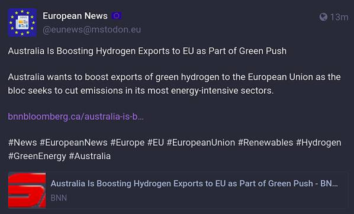
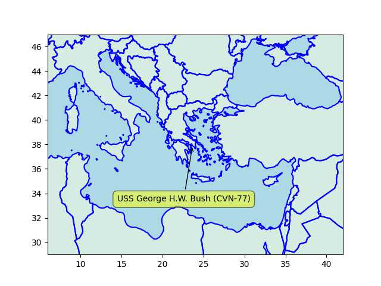

# Week 6

WaPo: "The Big Tech companies that won dominance of the internet
brought in billions of dollars a year, spending it on eye-popping
salaries, gleaming offices and constant acquisition of smaller
companies.

But the past year of rising interest rates and falling stock prices
has shaken the industry, along with the San Francisco Bay region it
dominates. Now, tens of thousands of layoffs from Google, Microsoft,
Amazon, Facebook and dozens of other companies have made it clear: The
golden age is over. Speeches about austerity have replaced the
free-flowing stock grants and free sushi lunches"

---

ABC News: "Honda is expanding the use of hydrogen to trucks and
construction equipment, electricity for buildings and even in outer
space, not just cars on roads..  [The company] plans a new fuel cell
vehicle for sale next year, packed with a fuel cell stack developed
with General Motors Co. of the U.S., its general manager, Testsuya
Hasebe, told reporters..  That will lower the cost of the fuel cell
stack to a third of what it is now, he said"

---

This new age of durability can help prev shared poultry mix to last
longer... good

---

Yogurt used to go bad, now it doesn't. Seriously it'll stay for weeeks
and still good esp certain brands.. Read some of the processing they
do, heat, cool, add yeast, heat, cool, goes on and on.. I guess
whatever bacteria is in there gets smacked around really bad. Mfkers
are like f.. this Im outa here.

---

Phys.org: "[Adelaide Professors Shizhang Qiao Yao Zheng] 'We have
split natural seawater into oxygen and hydrogen with nearly 100
percent efficiency, to produce green hydrogen by electrolysis, using a
non-precious and cheap catalyst in a commercial electrolyzer'. A
typical non-precious catalyst is cobalt oxide with chromium oxide on
its surface"

---

TASS: "Lithuanian imports of Russian LPG rise 8.5-fold in 2022"

---

 

---

"[A]s of 2023, open source really has won. There are more Unix-like
OSes than ever, and some very un-Unix-like OSes which are highly
compatible with it, but the official line [about Unix's death] is, to
all intents and purposes, dead and gone. All the proprietary,
commercial Unixes are now on life support: they will get essential bug
fixes and security updates, but we won't be seeing any major new
releases.

Send flowers. ®"

[[-]](https://www.theregister.com/2023/01/17/unix_is_dead/)

---

"@digiconomist@mastodon.nl

.. Yesterday Bitcoin mining company Luxor mined the largest block ever,
containing almost exactly 4MB of data. Only 63 transactions could fit
into the block, as the NFT used up the rest of the available space

The carbon footprint: ~888 metric tons of CO2, equivalent to the per
passenger carbon footprint of taking a flight from New York to Tokyo
and back - 466 times"

---

But overall a lot of hardware is parked stateside and Japan, not a war-time
mobilization.

[[-]](../../2019/05/usmil.html#navy)

---

One carrier is at a Greek port

```python
df = u.usnavy(); u.sm_plot_list1(38, 24, 2.0, np.array(df[['name','lat','lon']]))
```

 

---

Some groups in TR are in a tizzy on US warships - one docked in Stanpoli?

---

<iframe width="340" src="https://www.youtube.com/embed/38fC172MTEk" title="The race to find clean fuel: Ammonia-powered transportation" frameborder="0" allow="accelerometer; autoplay; clipboard-write; encrypted-media; gyroscope; picture-in-picture; web-share" allowfullscreen></iframe>

---

The Guardian: "Six states in the western United States that rely on
water from the Colorado River have agreed on a model to dramatically
cut water use in the basin.. [the] river [is] stressed by drought and
overuse"

---

H2 Fuel News: "GP JOULE ordering over 100 Nikola hydrogen trucks"

---

H2 Fuel News: "BP considering German hydrogen hub"

---

There's been no treaty after Cold War.. Treaty after Thirty Years'
War, treaty after WWI, treaty after WWII, nothing after the Cold War?
Forget Europe, Japan and Russia are still at war today - legally
speaking. Same for North and South Korea.

---

Whatever SOTA is, e-jagoff's company is surely below it. 

Insider: "Mercedes-Benz 'Drive Pilot' surpasses Tesla's autonomous driving system"

---

Mercedes-Benz: "At the time of this publishing, Drive Pilot's ODD
[Operational Design Domain] is limited to fully access-controlled
highways (commonly called 'freeways') up to a specific maximum
speed. (A fully access-controlled highway is defined as a divided
highway with at least two lanes of traffic in each direction that has
no intersections – only on-ramps and off-ramps.).. ODD is further
restricted according to the presence or absence of certain road
features and/or conditions, such as:

• Machine-detectable lane markings

• The absence of tunnels, toll booths and traffic control devices
(stop signs, traffic lights, etc.)

• Applicable legal requirements

The resulting ODD boundaries (including available routes) are defined
within a precise, high-definition map.  These boundaries comprise the
“geo-fence” for the area of operation of Drive Pilot; it will not
allow the driver to engage the feature, nor will the feature operate
the vehicle, outside of these boundaries"

[PDF](https://group.mercedes-benz.com/documents/innovation/other/2019-02-20-vssa-mercedes-benz-drive-pilot-a.pdf)

---

Mercedes self-driving reached Level 3 - one of the highest right now,
but even its abilities are pretty limited.

---

"@drewharwell@mastodon.social

New: Memphis spent $10 million installing thousands of 24/7
police-linked surveillance cameras, called SkyCops, on the promise
they'd deter crime. But crime's only gone up. And even the cops who
beat Tyre Nichols to death weren't deterred" via WaPo

---

2022 police shootings data is now all in. Data file location changed,
its content too somewhat.. The increase of 'Other' category for 2021
was [higher](../../2023/01/allshoot1.png) previously which I'd interpreted
as they were simply not recording the race, fudging the numbers.

But an increase of overall killings for 2022 is clearly visible. 

[[-]](../../2023/01/us-crime.html#allshoot)

---

Dehydrated poultry - take three.

[[-]](../../2023/01/dried-turkey.html)

---

H2 Central: "The H2 retrofit kit proposed by SAFRA, registered under
the brand name H2-PACK®, and supported by ADEME, the French Agency for
Ecological Transition, is a real technical achievement which enables
the transformation of a diesel coach into a Zero Emission vehicle
running on hydrogen"

---

Putin's gonna Putin. Opposing leader's job is to make sure things did
not escalate to this situation... I won't sit here and repeat the
"evil Putin" mantra just to cover up someone else's fuck up

---

Why won't Russia follow the rules-based-order? They won't follow your
rules if they are not part of the order. In fact, it looks like the
order was built to freeze them out... Which lead to Ukraine.

---
