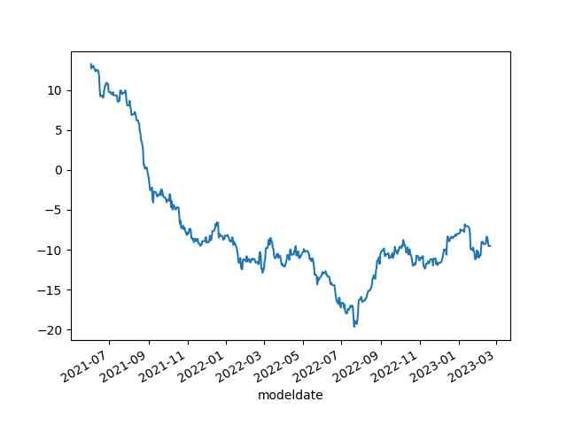
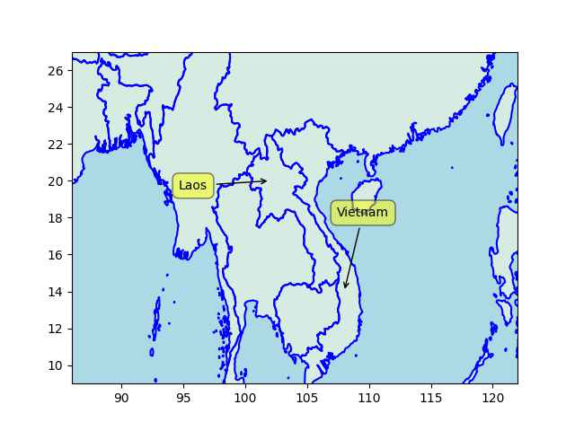

# Week 8

Paper: "Dr Lex van Loon [writes] the biggest concern [with space flight]
is prolonged exposure to microgravity - near zero gravity -
which, combined with exposure to damaging radiation from the Sun,
could cause 'fundamental' changes to the body"

[[-]](https://www.anu.edu.au/news/all-news/mars-model-provides-method-for-landing-humans-on-red-planet)

---

First Post: "Pakistan’s elite in trouble amid bankruptcy as IMF tells
Shehbaz Sharif govt to tax only the rich"

---

Atjazz - Kidnapped \#music

[[-]](https://youtu.be/vlz_hjdL7rE)

---

"Norway produces 50% of 'energy' with hydropower!!". When you look
closely it is electricity, not just "energy" and elec consump is at
20%. So now the number goes down to 10% - for a country of 5 million ;)
Is this supposed to impress someone?

---

Of overall *energy* the percentage is actually <4%. Electricity does
not represent all energy consumption (a mere 15% in most
countries). That is why most rosy renewable energy numbers are also
false eg Germany, Norway

"Today the US produces just 7% of its energy from renewables, the
majority from hydroelectric schemes"

[[-]](../../2022/01/energstats.html#usenergy)

---

It looks like generating things that can be interpreted one way or
another problem (some might call that art) was solved earlier by today's
crude attempts at AI.. Didn't scifi shows and movies have us believe
art was the *last* thing to arrive? The android on Trek tried very
hard to make jokes, create paintings after demonstrating excellent
abilities in strong AI, feats today's algorithms can't even touch. I
guess the only thing the super duper android from 24th century had to
do was use some shit neural network code from 21st century, shove
bunch of data in there, and let it "generate art" for him.

---

See sample GDELT output files [here](http://data.gdeltproject.org/events).
Pick one, and check `Actor1Name`, `Actor2Name`, and `EventCode`
triplets for every record, meaning someone does something to someone
else. Half the time they are wrong... This is one of the best language models.
Use SOTA, and forget 90, 95%, if you can surpass 80% I will eat my hat. 

The codes are documented in this [PDF](http://data.gdeltproject.org/documentation/CAMEO.Manual.1.1b3.pdf).

---

When specific answers are required to be true, one could say part of
the definition of (strong) AI, deep neural nets have a huge problem.

---

It goes wrong frequently, miscategorizes stuff all the time

"GDELT uses some of the world's most sophisticated natural language
and data mining algorithms, including the world's most powerful deep
learning algorithms, to extract more than 300 categories of events,
millions of themes and thousands of emotions and the networks that tie
them together"

---

It's funny I helped architect the tigger version of Ticketmaster,
which was eventually acquired by... Ticketmaster. Expansion at all
costs is clearly their thing, at home and abroad.

---

A recent claim is Ticketmaster monopoly caused an absence of choices
when TX systems went awry and "Swifties" went batshit 

LA Times: "[2010] Ticketmaster-Live Nation merger gets Justice
Department’s approval"

---

Euractiv: "Putin: The more long-range Western systems are being
delivered to Ukraine, the farther we will be forced to move the threat
from our borders"

---

Shut up! Say 'Evil Russia"! \#Kirby

[[-]](https://youtu.be/h3HIDTpcM3g?t=24)

---

Politico: "The First Step Act, a criminal-justice reform law, created,
among other things, quicker pathways home for certain nonviolent
federal prisoners and delivered some sentencing reforms... Activists
now estimate that perhaps 20,000 people have been released so far
because of the law, according to Lance Kramer, the producer of the
newly released documentary The First Step. And this happened because a
self-described “law-and-order” president [Trump], who had months
earlier called for the execution of major drug dealers, somehow found
common ground with members of the social-justice left.

---

Major spike in new Masto users - from 300/hr it's now over 1000/hr.

---

Cuck votes up norm votes down

```python
u.rottentomatoes_tv("Star Trek Discovery")
```

```text
Out[1]: {'tomatometer score': '84%', 'audience score': '36%'}
```

---

*Fringe* was good scifi.. The strange thing is Ibrahim, Kurtzman,
Akiva were all part of it... Then they mucked it all up for ST
Discovery, "STD"

---

<iframe width="340" src="https://www.youtube.com/embed/kroU3SfCXE8" title="A Cloud City on Venus: Why Venus is a Better Choice" frameborder="0" allow="accelerometer; autoplay; clipboard-write; encrypted-media; gyroscope; picture-in-picture; web-share" allowfullscreen></iframe>

---

ABC News: "Artisanal cobalt mining swallowing city in Democratic
Republic of the Congo, satellite imagery shows"

[[-]](https://abcnews.go.com/International/cobalt-mining-transforms-city-democratic-republic-congo-satellite/story?id=96795773)

---

There are doctoral degrees awarded for machine learning; was it too
premature to turn this 'eclectic mix of CS/Stat subjects' into a whole
new field? There aren't any major theoretical advances to their name,
all they have is applications that are created by jury rigging ever
larger neural nets, feeding more and more data into them to do it.

---

There is a small chance for the challenger to win, for that Dems have
to campaign like Gore and the Rep have to do extremely well, I'm
talking Dubya, Karl Rove level well.

---

At a potential 2% Q2 GDP growth incumbent is likely to win 2024 reelection. 

```text
Interval: [49.79 53.43] Average: 51.61
```

---

Net approval settled at around -10%. 


```python
u.biden_approval().net.plot()
```

 

---

Maps show who has been historically better at war - looking at Laos
and Vietnam, the latter's landmass starts all the way from South,
circles around, goes North, always in command of the seashore. Laos
could have had a piece of that for access but has none - completely
landlocked. Clearly Vietnam has been better at war.

```python
u.sm_plot_list1(18, 104, 2, [['Laos',20,102],['Vietnam',14,108]])
```

 

---

Fox News: "Ron DeSantis rips Biden's 'blank-check' Ukraine policy"

---

US probably doesn't care as much about the Kurds of Rojova (NE Syria),
but cares more about Shite Assad does not have an easy connection to
the now-Shite-majority Iraq. Scared of an Iran-Iraq-Syria connectivity
towards the Medi? The Kurdish areas cut them off nicely... There is
some SYR-IRQ connection in the SE, and of course US has a base there
(Al-Tanf) and the area is conveniently infested with the Sunni
extremist Daesh.

[[-]](https://newlinesinstitute.org/wp-content/uploads/20220712-Syria-NA.png)

---

CNBC: "The SEC has a stablecoin firm in its sights — and it could
shake up the whole $137 billion market.. The U.S. Securities and
Exchange Commission (SEC) could be gearing up to take action against
Paxos"

---

China Daily: "The world's biggest project using solar and wind power
to produce hydrogen started construction in Ordos, Inner Mongolia
autonomous region on Wednesday... It is being built by Sinopec.. the
world's largest refiner by volume and the country's biggest geothermal
developer"

---

"@Hy_Economy@mastodon.social

Aschaffenburg, Germany, ordered 12 hydrogen buses"

---

Robb Report: "How This Hydrogen-Powered America’s Cup Chase Cat Could
Change the Future of Boating Dubbed Chase Zero, the foiling-power
catamaran spans 10 meters in length and can carry up to 550 pounds"

---

 

David Mumford (Fields medal winner) started some work around the
mathematics of intelligence, pattern recognition, in a book on what he
calls "pattern theory"; this direction needs to be explored further
IMO. 

---

Mainstream "AI" research is moving in a completely wrong
direction. They need to change direction, fix how they conduct the
science.

---

There is a term in FD formulas that says 'if there is a pressure
difference between two regions there will be a force between those
regions, from high to low' for example. This is the type of formula
AI, or AGI needs, not "neurons". Observe external variables (via
experiments, trial/error), then using mathematics create releations
among them. AGI needs to follow the same approach adopted by nearly
all natural sciences. What are the variables of intelligence? What is
the Calculus that can bind them together? These need to be
invented. It isn't about "computation", not at first, brogrammers are
slow to grasp this..  It's about declarative, broad relations, finding
the ever-present pattern among them, like making a cat's
cradle. Starting with one set of relations, transforming it another,
it goes on.. Then as a *last* step, you can compute.

---

There is a fluid dynamics *formula* that works for any point in space,
point in time, at macro level.. We "discretize" that formula, chop it
up into pieces for computation and program that into the computer,
much later. This is a different approach from using micro particles
trying to build up to a system. As with many other things bottom up
approach doesn't work, top-down design is necessary. High
organization / design matters.

---

We don't simulate fluids with particles

"[Deep] neural nets will give us true AI, intelligence is all about
neurons, if we can simulate enough neurons we can simulate the brain,
just like simulating water with many (water) particles"

---

*The Big Bang Never Happened* author Eric Lerner @ IAI.

[[-]](https://youtu.be/bqtFlKQO2FQ?t=11)

---

Why ruin the mystery

NYT: "U.S. Calls Off Search for Unidentified Objects It Shot Down"

---

If there are 10 dead/injured per building on avg, the current reported
figures may double in the future.

---

TR \# of buildings collapsed after eq per city - UNHCR [PDF](https://data.unhcr.org/en/documents/download/98820)

```python
u.sm_tr_eq_buildings("0214")
```

```text
Total : 23498
```

[[-]](treq4.jpg)

---

But Al Jazeera has good content overall, and a fair take on the
Israel/Palestine issue. Glad it is available.

---

Qatar (who finances Al Jazeera) must still be butthurt from not being
able to topple Assad after all that money spent to achieve it. I look
at my timeline (below); there are gazillion of other events between
that amnesty and, say, the capture of Falluja in 2014 by ISIS, years
later. 

[[-]](../../0119/2017/12/timeline-syria-tr.html)

---

:) Al Jazeera docu says Assad released (Sunni) political prisoners
which created ISIS

---

Free Julian Assange

[[-]](https://cdn-az.allevents.in/events2/banners/0dfcc4f36e9fe07174629fa51afdd1e76fd9e52a245403439ad4fcb1ad1a9fbf-rimg-w960-h320-gmir.jpg)

---

Rage Against The War Machine - organized by Libertarian Party and the
People's Party. Catchy title. Good event. Make noise.. little
cacerolazo.. good trouble.

---

Ohio governor (R) was grilled pretty well on Fox & Friends - and they
say journalism is dead!

---

Informed Comment: "Israeli Delegate Expelled from African Union
Summit, in what may be First Global South Reaction to new Extremist
Netanyahu Government"

---

Science.org: "The Malian discovery was vivid evidence for what a small
group of scientists, studying hints from seeps, mines, and abandoned
wells, had been saying for years: Contrary to conventional wisdom,
large stores of natural hydrogen may exist all over the world, like
oil and gas—but not in the same places. These researchers say
water-rock reactions deep within the Earth continuously generate
hydrogen, which percolates up through the crust and sometimes
accumulates in underground traps. There might be enough natural
hydrogen to meet burgeoning global demand for thousands of years,
according to a U.S. Geological Survey (USGS) model that was presented
in October 2022 at a meeting of the Geological Society of America"

[[-]](https://www.science.org/content/article/hidden-hydrogen-earth-may-hold-vast-stores-renewable-carbon-free-fuel)

---

2000 Project - It's About Time \#music

[[-]](https://youtu.be/nk5ocgVUArM)

---

Paper: "Incomplete recovery of bone strength and trabecular
microarchitecture at the distal tibia 1 year after return from long
duration spaceflight" via \#AntonPetrov

[[-]](https://www.nature.com/articles/s41598-022-13461-1)

---

H2 Central: "Advent Technologies Methanol Fuel Cell Supplies Highly
Efficient Heating and Cooling in New CHP Offering"

---

H2 Central: "The Netherlands and Germany Enhance Their Hydrogen Import
Partnership with Australia"

---

H2 Fuel News: "Hydrogen plane granted experimental airworthiness
certificate by the FAA.. Universal Hydrogen completed its first taxi
tests, received its certificate, inked an Air New Zealand agreement"

---

"University of Limerick, Ireland researchers discover new material to
‘trap and store volatile gases’..  The discovery has just been
published in the world leading journal Nature Chemistry"

---

That was a great game

"@256@mastodon.social

Unreal Tournament 2004

BR-IceFields"

 

---

I can't see anything mission-critical being managed by those things.
Tensorflow will kill you, in extremely dumb ways.

---

Updated the section with the most recent additions - becoming massive

[[-]](../../2020/07/ai-comments.html)

---

It is like AI - yes 😂 it certainly has as much smarts as those shit
codes of "AI".

---

I dont pick label locations in graph below they are picked randomly

---

```python
u.sm_tr_eq_deaths('0214')
```

[[-]](treq3.jpg)

---

But there might be more to mull over here.. A theologian once said
'every prophet worked as a shephard at least once in their
lives'.. I'd made a connection back then with them gaining people
management skills through the work (people are sheep), but this
pastoral people business brings in a new angle; were prophets
temperamentally pastoral but peaceful who wanted to be left alone by
the plundering farmer-slave state, then created a space for themselves
and like-minded others through a religious ideology?

---

There has been warrior monks in history so warrior shephard is not too
surprising.  I've seen a few of those guys I always thought they could
kick some ass.

---

If wages/inf is problematic, within this system there isn't much else
that can be done about it... For better results, need a better system.

---

Businesses work on credit, and credit is newly printed money which pay
salaries.. Only money in general circulaton can be inflationary. Ergo
reducing inf means reducing that circulation. 

[[-]](../../2021/01/inflation.html)

---

2000 Project - Parallax \#music

[[-]](https://youtu.be/wP1DM1KhYvU?t=11)

---

Phys.org: "Facile and scalable production of a fuel-cell nanocatalyst
for the hydrogen economy.. The researchers demonstrated that these
uniformly sized (3-4 nanometers) cobalt-platinum (Co-Pt) alloy
nanoparticles can be produced by simple heat treatment"

 

---

Total Consumer Credit Outstanding as % of GDP is actually down (see
link)

"Credit card debt hits record high $986 billion"

[[-]](../../2021/01/stats.html#debt)

---
