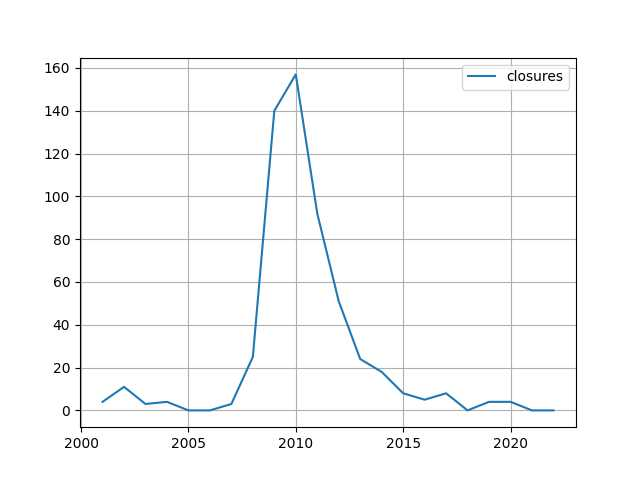

# Week 11


Euractiv: "Construction sector bets on EU green buildings law as new
growth engine.. Revamping Europe's building stock is not only expected
to reduce energy bills and help tackle climate change, it is also
widely supported by the construction sector, which sees a business
opportunity in renovation"

---

"First Truck with Dual Fuel Hydrogen-Diesel Combustion Launched in Oman"

---

"@Hypx@mastodon.social

1,000 km hydrogen pipelines are under construction in China"

---

SW is the Die Linke "rebel" mentioned [earlier](mbl/2023/week06.html).

"@sahra_wagenknecht@social.linksfraktion.de

There is an obligation under international law to \#negotiate [per
UA/RU conflict], says ex-UN diplomat von der Schulenburg. If it is
argued today that a \#peace can only be achieved by force of arms,
this is a throwback to warlike times before the UN Charter"

[[-]](https://social.linksfraktion.de/@sahra_wagenknecht/109976993905729765)

---

"Worley [UK] secures contract for East Coast Hydrogen project, Project
to deliver 10 GW of hydrogen into the network"

---

\#GIF \#Trek

[[-]](https://mastodon.online/@davidaugust/110022399641027068)

---

Feb inflation fell

```
2023-01-01  6.410147
2023-02-01  6.035613
```

---

Linus in the house. All Hail Linus 

"@torvalds@social.kernel.org

Random first trial post: today, March 14th, is the 29th anniversary of
the Linux 1.0 announcement.

Of course, there are other arguably more important dates in Linux
history, but this is one of them"

---

The Atlantic: "Boycott Bans Are an Assault on Free Speech.. America
began with boycotts. Angry about Britain’s tax raises, the historian
T. H. Breen writes, American colonists saw their refusal to purchase
British goods as a 'reflexive response to taxation without
representation'..

I think what’s really offensive about the anti-BDS laws in particular
is the way that they single out not even boycotts generally, but on
this one specific issue for special penalties—I think that really
gives the game away that the government is trying to suppress specific
viewpoints here,” Brian Hauss, an attorney for the ACLU, which
challenged the Arkansas law and several others like it, told me"

---

Updates on [da map](2022/12/ru-africa.html).

Africa News: "'In 2021, when the presence of the private military
company Wagner was increasingly intrusive in [Central African
Republic], France considered that the conditions were no longer met
for us to continue working for the [CAR] armed forces,'.. commander of
French forces in Gabon, told AFP"

---

Holywood's obsession with the multiverse concept is likely for
gaslighting, distraction.. MV creates an illusion of a "multiplicity
of options", regular citizen might be suffering in real life, but then
goes to a movie theater watches a "multiverse movie" and starts
feeling good about himself.. Maybe there is another him out there in a
parallel world who is better off? Add little time travel future him
can time travel to his old (current) self and help him (creating "new
branches" in the MV too bro, but it's all good). So many
options... Intoxicating. Poor person does not know where to start.  I
guess with so many options his current sorry state is his fault, which
could be the main point of the exercise. Psyop.

---

H2 Central: "China Energy to Start Establishing $5,1bln Green Hydrogen
Plant in Egypt in May"

----

"@hollie@social.coop

Picked up [son] at school and on our way to grab coffee we saw the
best window sticker"

[[-]](https://social-coop-media.ams3.cdn.digitaloceanspaces.com/media_attachments/files/110/017/855/821/117/315/small/2aeaf3eb442b578c.jpeg)

---

"@cassidoo@notacult.social

A wise QA dev once said, 'There is no I in team, but there is a u in
bug'"

---

NYT: "Inside the Global Race to Turn Water Into Fuel..

A consortium of energy companies led by BP plans to cover an expanse
of land eight times as large as New York City with as many as 1,743
wind turbines, each nearly as tall as the Empire State Building, along
with 10 million or so solar panels and more than a thousand miles of
access roads to connect them all. But none of the 26 gigawatts of
energy the site expects to produce, equivalent to a third of what
Australia’s grid currently requires, will go toward public
use. Instead, it will be used to manufacture a novel kind of
industrial fuel: green hydrogen. This patch of desert, more than 100
miles from the nearest town, sits next to the biggest problem that
green hydrogen could help solve: vast iron ore mines that are full of
machines powered by immense amounts of dirty fossil fuels. Three of
the world’s four biggest ore miners operate dozens of mines
here.Proponents hope green hydrogen will clean up not only mining but
other industries by replacing fossil fuel use in steel making,
shipping, cement and elsewhere..

Last year, government subsidies sped up action in the European Union,
India, Australia, the United States and elsewhere. The Inflation
Reduction Act, the Biden administration’s landmark climate
legislation, aims to drive the domestic cost of green hydrogen down to
a quarter of what it is now in less than a decade through tax
incentives and $9.5 billion in grants. 'We are about to jump from the
starting blocks,' said Anja-Isabel Dotzenrath, who once led Germany’s
biggest renewable energy company and now runs BP’s gas and low-carbon
operations. 'I think hydrogen will grow even faster than wind and
solar have.'"

[[-]](https://www.nytimes.com/2023/03/11/climate/green-hydrogen-energy.html)

---

Al Monitor: "Israeli leaders trade accusations over Saudi-Iran
rapprochement via China.. Coalition and opposition leaders are trading
accusations over which government is to blame over the
relations-renewal deal between Tehran and Riyadh"

---

H2 Central: "Bloom Energy fuel cells successfully used aboard cruise
ship"

---

GP is the current, and the first left-wing President of Columbia, also
former mayor of Bogota.

Gustavo Petro: "A developed country is not a place where the poor have
cars. It's where the rich use public transportation."

---

For Prez elections the ultimate Hail Mary was from the Rep side during
the 2000 election. I don't mean to downplay the skills of other
campaigns who also won... Maybe they too had it in them to snatch a
win out of the lion's den, just snatching that shit, snatching it and
going home with the trophy.. Maybe. But we didn't see those campaigns,
we almost exclusively saw the ones who won with an advantage. I need to
base the take on data.

---

Previous share on AI+ethics debate is similar in spirit to AI+doomsday
debate. In both cases the underlying assumption / message is the tech
is *that good*. It's a good trick, sales-by-presumption. If A implies
B develop arguments as if B is already true, which telegrams A is a
done deal. These c--suckers are always selling...

---

Taxpayers are absolutely on the hook for SVIB bailout. Gov covered not
just some, but all depositors; and the bank's total deposits reach
over $170 billion - no pocket change.

But if gov works the books, spreads the damage forwards can reap some
if not all loss... it's possible. 

---

The first AUKUS announcement was happier, snappy, woo hoo we are on
top of the world baby..! This one looks more sad, dour. Two of the
three figures have low approval ratings, one is certainly on the way
out. The war in Ukraine is not going well for the "Rules-Based Order"
and the opposition is coalescing.

---

"@Floofer@mk.catgirlsfor.science

A pizza is basically a real life pie chart that shows the amount of
pizza left"

---

H2 Central: "West Virginia Hydrogen Hub Coalition Applauds Appalachian
Hydrogen Hub’s Continued Success.. Senator Manchin said: 'West
Virginia and Appalachia have a long history of powering our great
nation, and I am pleased the Appalachian Regional Clean Hydrogen Hub’s
tireless efforts have been rewarded by the Department of Energy'"

---

Mozilla Mastodon instance is up

[[-]](https://mozilla.social/public/local)

---

Need to stress the approach can fail sometimes

Seeking Alpha: "1953 and 1957 [recessions], were not preceded by yield
curve inversions. So this concept is not perfect by any means"

---

"The curve" has indeed inverted (longer maturity treasuries have lower
yield than shorter ones) which some take as a signal of recession. 

[[-]](../../2021/01/stats.html#tcurve)

---

DGW Magazine: "Engine maker INNIO plans to convert a German power
plant to 100% green hydrogen by 2035"

---

Euractiv: "Germany ‘not opposed’ to nuclear-made hydrogen, says will
import from France"

---

Some banks need to fail, it is a sign the system is punishing bad
management. See the plot below, \# of bank bankruptcies per year, data
from FDIC. Notice the two years when there were **zero** bank
closures.  2005, and 2006. What happened afterwards? 🤔

```python
url = 'https://www.fdic.gov/bank/historical/bank/bfb-data.csv'
df = pd.read_csv(url,parse_dates=['Closing Date'])
df['year'] = df['Closing Date'].dt.year
dfg = pd.DataFrame(index=range(2001,2023))
dfg['closures'] = df.groupby('year').size()
dfg.fillna(0).plot(grid=True)
```

 

---

"@joeyh@octodon.social

[Y Combinator] posted a petition to get a goverment bailout for SVB,
and the \#HackerNews post for it attracted so many people telling them
to go jump in a lake that YC flagged it right off their own website"

---

Ng is a Stanford prof, taught deep neural nets for many years. DNNs
are okay for limited, well-defined, focused use.. But notice the
subtext - ain't gonna get no AGI with them neural nets.

---

Reshare 2018.

"@AndrewYNg

AI+ethics is important, but has been partly hijacked by the AGI
(artificial general intelligence) hype. Let's cut out the AGI nonsense
and spend more time on the urgent problems: Job loss/stagnant wages,
undermining democracy, discrimination/bias, wealth inequality"

---

"Brookings’s Aaron Klein argued that total avoidance of bank failure is
not necessarily a good thing, as some banks that make bad business
model decisions deserve to fail"

[[-]](https://www.brookings.edu/2023/03/10/forum-on-the-future-of-the-federal-home-loan-bank-system-highlights-from-the-brookings-and-bu-law-event/)

---

"@wallstcynic

The chutzpah here beggars belief. The VC 'community' literally started
the SIVB run on Thursday, when it urged its portfolio companies to
pull their deposits.. which they did ($42B). And they now want the
Taxpayer to bailout their investments…?!"

---

Come to Butthead \#music

[[-]](https://youtu.be/Iht77cJGRl4)

---

I could improve the visuals, or.. I could just steal Github Pages
template. [Boom](https://muratk5n.codeberg.page/en/).

---

For the backup site I generate the visual pages (HTML) from raw content,
using Python `markdown` pkg. 

---

H2 Central: "German hydrogen firm Thyssenkrupp Nucera (TKAG.DE) has
seen customer interest soar in the U.S. as a result of the Inflation
Reduction Act (IRA) and may create local production capacity with
Italy’s De Nora (DNR.MI) if the market takes off.

Thyssenkrupp Nucera held talks about several potential green hydrogen
projects 'with very concrete timelines' during a trip to the United
States last week, Chief Executive Werner Ponikwar said in an interview"

---
