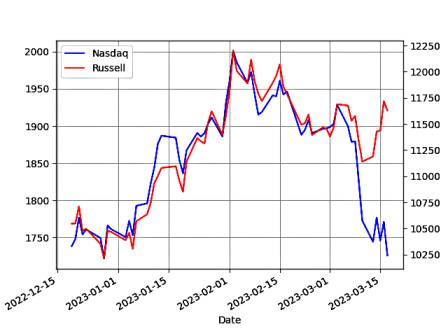

# Week 12


H2 View: "Air Products and ENOWA to develop a hydrogen refuelling
station in NEOM"

---

H2 View: "Viridis Bulk Carriers receives Approval in Principle for
ammonia-powered vessel"

---

Brzezinski as in Mika Brzezinski, yes, his daughter - who Trump called
"was bleeding from the facelift" during 2016 campaign. She is married
to "Psycho Joe" (also per Trump) Scarborough, they have a little
shitlib talk show on MSDNC. Both are of course ardent supporters of
endless war in Ukraine until the last Ukranian dies.  Mika's dad
would've been proud.

---

Carter is one tough son of a bitch.. he is still alive isn't he
(medically at least)?  Sturdy mother.

---

A quick glance at a Zybybgybdy Brzezinski book reveals three words
that are obviously key for US policymakers - Eurasia, Eurasia,
Eurasia. ZB is the architect of US help to Afghan mujaheddin against
the Soviets during the 80s, and was the NatSec advisor to Carter.

[[-]](../../2023/03/grand-chessboard-brzezinski.html)

---

Al Jazeera: "Russia overtakes Saudi Arabia as China’s top oil supplier"

---

TASS: "NATO seeking to split Eurasia to contain Russia and China but
will fail — Putin"

---

They'll do whatever your deep state requires.

New York Post: "ISIS could hit US, West from Afghanistan in ‘under 6
months’ [CENTCOM commander Genera Kurilla]"

---

First Post: "US continues to use Islamic State terrorists to carry out
attacks in Syria, claims Russia"

---

You get into conflict with US, and Daesh attacks you.. Strange

Al Monitor: "The Taliban governor of Afghanistan's Balkh province,
known for fighting against Islamic State jihadists, was killed in a
suicide attack"

---

Green Car Congress: "JCB publicly unveiled its new port fuel injected,
4.8L inline-four hydrogen combustion [engine](https://bioage.typepad.com/.a/6a00d8341c4fbe53ef02b7519b8300200c-pi)
.. the company’s zero-carbon emissions solution for construction and
agricultural equipment—at the Conexpo 2023 show in Las Vegas ... JCB
is investing £100 million in the project to produce super-efficient
hydrogen engines. A team of 150 engineers is working on the
initiative and more than 50 prototypes have already been manufactured
at JCB’s UK engine plant"

---

"@andrewdessler@mastodon.world

From the new IPCC report. This plot seems inconsistent with the
oft-made claim that we're on track for 2.5°C of warming this century"

[[-]](https://s3.eu-central-2.wasabisys.com/mastodonworld/media_attachments/files/110/056/362/965/895/379/small/6f07ee4f64cdf80d.png)

---

"@gregpak@mastodon.social

This is no longer the Digital Age or even the Information Age.

This is the Bullshit Age"

---

Can't be mum on people that are on one side, always complain about
leaders on the other side. If institutions of the "Rules-Based Order"
are seen as taking sides, not being impartial, they'll become
irrelevant.

---

And nothing on Netanyahu..? 

The Guardian: "ICC judges issue arrest warrant for Vladimir Putin over
alleged war crimes"

---

CNBC: "Fed poised to approve quarter-point rate hike next week,
despite market turmoil"

---

"@Energy4Europe@respublicae.eu

The \#HydrogenBank aims to unlock private investments in #hydrogen
value chains, domestically + in 3rd countries, by connecting
\#renewableenergy supply to EU demand & addressing the initial
investment challenges, offering growth opportunities and jobs!"

---

Techdirt: "Yes, The US Government Threatening To Block TikTok Violates
The 1st Amendment"

---

Wunc.org: "North Carolina's Republican U.S. Senators have joined a
bipartisan group that supports building a hub for hydrogen energy in
the southeast... Southeastern utilities — including Duke Energy,
Southern Company, and Dominion Energy — have formed a coalition to
attract one of the hubs to the southeast"

---

"@Hypx@mastodon.social

BMW to make hydrogen-fuelled cars as it admits EVs won’t work for everyone"

---

Maybe another reason US estab doesn't like Medicare-for-All is it
would hamper military recruitment for their endless wars. Who would
sign up for the military as a grunt if everyone had enough money to
live on and a proper health insurance?

---

On another video he says "I joined the military because I was poor".
Military gives you a salary, food, shelter, healthcare (it puts u in
situations that might be bad for health but anyway), why wouldn't he
join?

---

Isiah James is speaking some truth

[[-]](../../2023/03/isiah-james-iraq.html)

---

Iraq War 20th year anniversary...  Yippee-Ki-Yay mo--f--kas.

---

Comment: "[Referring to [news](https://s3.masto.ai/cache/media_attachments/files/110/047/783/364/412/018/original/c6c3b68843095dba.jpg)]
The group of banks proposes that those banks that chose to
participate in the increased deposit insurance program should pay for
that expanded insurance themselves, through an increased
deposit-insurance assessment—this is a winning proposal"

---

Sustainable Bus: "TPER Bologna has published a tender for 127 fuel
cell buses (with option for further 140)"

---

Forbes: "Speaker McCarthy Threatens Federal Probe If Trump Arrested"

---

They are right

BBC: "Prosecuting Donald Trump would be politically motivated, say Republicans"

---

Green Car Congress: "Cummins’ Accelera showcases Gen 4 fuel cell
system.. At Con Expo, Accelera, the new brand for Cummins’ New Power
business segment, showcased its fourth-generation fuel cell engine,
which provides improved power density, efficiency and durability while
delivering zero greenhouse gas and zero criteria air emissions"

---

"Union dues and typically hover around 1-2%. The most common structure
sets dues as a percentage of gross earnings. If dues are 1%, workers
pay $1 for every 100 dollar earned"

---

Investopedia: "In 27 U.S. states, 'right to work' laws allow non-union
members to obtain the benefits of collective bargaining by unions
without paying union dues. The laws serve to undermine union financing
and organizing"

---

Democrats doing lefty things..? Hell has frozen over 😶

Yahoo News: "Democratic lawmakers in the upper chamber of the Michigan
Legislature voted to repeal the state’s 2012 'right-to-work' law,
which prohibits public and private unions from requiring that nonunion
employees pay union dues.. it is expected to be signed into law"

---

F24: "Push for carbon-free hydrogen accelerates in US.. A source of
renewable and storable energy, hydrogen is experiencing a breakthrough
in the United States after years of sluggish growth as Biden
administration climate policies spark major investments. 'America came
from nowhere and now they're in the lead,' Mark Hutchinson, CEO of
Fortescue Future Industries, said of America's ascent in renewable
energy in general and hydrogen more specifically, at last week's
CERAWeek energy conference in Houston, Texas"

---

I guess 'some city officials' wanted to maximize the amount of bribes
they were earning, they opened up every possible square centimeter of
the city to construction.

---

City green spaces as percentage of land (data [source](http://www.worldcitiescultureforum.com/data/of-public-green-space-parks-and-gardens)),

```python
import pandas as pd
df = pd.read_csv('city_green.csv',sep='\t',index_col=['City'])
df = df.sort_values('Figure')
df['Figure'].to_csv('green-out.txt')
```

[Output](green-out.txt)

Stanpoli is not doing good. 

---

"@Hy_Economy@mastodon.social

A several-year-long technical and economical assessment concluded that
the whole German gas pipeline network is suitable for transporting
\#hydrogen.

This assessment included 30 types of steel used in the German network.

The German Chancellor, the Economic minister and the finance minister
have been informed about the results" via Die Welt

---

Future Meat, The world of meat substitutes, \#DW

[[-]](https://youtu.be/5Vq03gYWiXE?t=1273)

---

H2 storage in carbon nanotubes

[[-]](../../2022/02/h2-carbon-nanotubes.html)

---

Energy & Sustainable World: "[T]here are innovations on the horizon
that will make large-scale production of hydrogen much more
feasible. One such innovation is called Nanotubes. These tiny tubes
can store large amounts of hydrogen gas at room temperature...

Another innovation involves attaching some nanoparticles (i.e., tiny
particles) to some plastics; this makes them hydrophobic, which means
they won't absorb any water or moisture. When these hydrophobic
plastics are in contact with water, they release their stored hydrogen
gas (H2) and then change back into their hydrophilic state"

---

The stock market is still overvalued, Wilshire above 190. Levels of
around 100 would be normal. High FED rates can help get there. Same
for housing prices. Housing is a huge part of CPI and PCE.

[[-]](../../2021/01/stats.html#wilshire)

---

Nasdaq and Russell have parted ways..

The Russell tracks small companies, Nasdaq is tech heavy. Tech
companies are hurting likely due to contagion fears from SVIB, SB.

 

---
