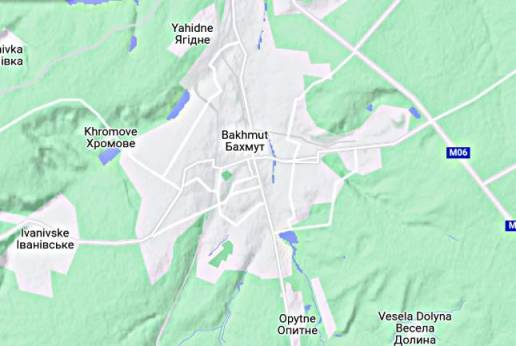

# Week 15

That ship was last spotted at a Japanese base; major firepower piled
up over there BTW, occasionally a ship from the base takes a little
trip, does a little moonwalk up and down someone else's backyard, goes
back to port.

```python
sh = np.vstack([np.array(u.usnavy()[['name','lat','lon']]), ['Taiwan',23,120]])
u.sm_plot_list1(29, 131, 2.0, sh)
```

 

---

TASS: "'On April 10, the USS Milius guided-missile destroyer illegally
entered the waters around the Meiji Reef near China’s Nansha islands
without the approval of the Chinese government,' China Central
Television [said]"

---

Chomsky: "[NYT Opinion] The False Promise of ChatGPT.. OpenAI’s
ChatGPT, Google’s Bard and Microsoft’s Sydney..  have been hailed as
the first glimmers on the horizon of artificial general intelligence —
that long-prophesied moment when mechanical minds surpass human
brains.. That day may come, but its dawn is not yet breaking.. [as
long as] machine learning programs like ChatGPT continue to dominate
the field of A.I...

The human mind is not, like ChatGPT and its ilk, a lumbering
statistical engine for pattern matching, gorging on hundreds of
terabytes of data and extrapolating the most likely conversational
response or most probable answer to a scientific question. On the
contrary, the human mind is a surprisingly efficient and even elegant
system that operates with small amounts of information; it seeks not
to infer brute correlations among data points but to create
explanations..

It summarizes the standard arguments in the literature by a kind of
super-autocomplete.. In short, ChatGPT and its brethren are
constitutionally unable to balance creativity with constraint. They
either overgenerate (producing both truths and falsehoods, endorsing
ethical and unethical decisions alike) or undergenerate (exhibiting
noncommitment to any decisions and indifference to
consequences). Given the amorality, faux science and linguistic
incompetence of these systems, we can only laugh or cry at their
popularity"

[[-]](https://www.nytimes.com/2023/03/08/opinion/noam-chomsky-chatgpt-ai.html)

---

Al Monitor: "Saudi delegation in Yemen for peace talks with
rebels.. The delegation's arrival comes roughly a month after China
helped broker a surprise rapprochement between Saudi Arabia and Iran"

---

Bloomberg: "China Energy Investment Corporation signed an agreement
with French state utility Electricite de France SA to construct an
offshore green hydrogen facility for energy storage, according to a
statement posted on the Chinese company’s website"

---

NYT: "French Visit Undercuts U.S. Efforts to Control China"

---

Bakhmut became strategically key, both due to its location (at a
gateway to the rest of Donbas), also bcz Ukraine decided to take a
stand there and *make* it important. Looking at its topo I can see why - 
has two funky mountain systems going into it from South, and another
ranging along its West. Surely UA exploited that structure to set up
staggered defense lines, and delayed RU for as long as they could. But
it looks like the game is nearing its end.



---

A lot of ignorant people are commenting on things they don't fully understand.

"@timnitGebru@dair-community.social

Because we were looking for more things to do when these clowns
decided to write 'the letter,' [about so-called 'AI pause'] and cite
our \#StochasticParrots paper while saying the opposite of what we
write, we.. [wrote](https://www.dair-institute.org/blog/letter-statement-March2023)
a statement in response.. It is dangerous to distract ourselves with a fantasized
AI-enabled utopia or apocalypse which promises either a 'flourishing' or
'potentially catastrophic' future. Such language that inflates the capabilities
of automated systems and anthropomorphizes them, as we note in [Stochastic Parrots](https://dl.acm.org/doi/abs/10.1145/3442188.3445922), 
deceives people into thinking that there is a sentient being behind the
synthetic media. This not only lures people into uncritically trusting
the outputs of systems like ChatGPT, but also misattributes agency"

---

NATO was useful for Asia Minor for a while but the Western alliance
has not been doing well - it is mostly the instigator of chaos now,
creating much damage offering little in return.

---

[Link](https://drive.google.com/uc?export=view&id=1ZNibTZyjEWqYTS8qeFW3Kw4siw_GOMnA)

---

It will all be fine. NATO is just great.

Reuters: "Finland joins NATO in historic shift"

---

The Sound Stylistics - Soul Dynamite \#music

[[-]](https://youtu.be/l5L2dyMGbUU)

---

At least WH is owning up to a good decision to pull out from AFG when
it did. But it is possible WH was way too embarrassed about the
situation earlier, and went cowboy with Ukraine to offset it, to "show
strength", also trying to deter "certain countries" who might get
funky ideas later. That did not work too well for Ukraine.

PBS: "U.S. report on Afghanistan evacuation blames intelligence
failures, Trump administration"

---

Quick reminder on which countries are responsible for CO2 emissions

[[-]](../../2021/01/historical-carbon-emissions.html#alltime)

---

NL could turn into a "seasteading nation" by then, as in most houses
will be floating.

---

Checked flooding levels using tool [here](https://coastal.climatecentral.org/).
Below is the result of simulated 7m rise. Red parts will be regions
under water.

[Map 1](searise1.jpg),
[Map 2](searise2.jpg),
[Map 3](searise3.jpg),
[Map 4](searise4.jpg),
[Map 5](searise5.jpg).

NYC, South Florida, Venice, Shangai, Netherlands are in trouble.

---

DK was the Chief Scientific Adviser to the UK Government 2000-07.

David King: "Once the ice on Greenland is gone, global sea levels will
be up to 7.4 metres higher"

---

Informed Comment: "The last time there was this much CO2, there were
Sabertooth Tigers, California Monsoons and an Undersea Florida"

---

WGRZ: "[University of Buffolo] is part of New York State's team —
along with 6 other Northeast states — to seek $1.6 billion in federal
tax dollars for a 'hydrogen hub'"

---

H2 Fuel News: "Conversions from diesel to hydrogen trucks are drawing
interest.. Researchers from the University of New South Wales have
developed a system that converts up to 90% of diesel operations, with
an efficiency boost of 26%. This system does not require high-purity
hydrogen fuel, as it uses a stratification technique to form pockets
of higher and lower H2 concentrations, reducing nitrous oxide
emissions"

---

Informed Comment: "Netanyahu Brought Israeli Extremists to Power and
Seeks more Arab Recognition; He can’t have Both"

---

WION: "Coronavirus led to brain damage in two infants infected during
pregnancy: Study"

---

When it was on, the game was great. You could even do variations; you
could say "Democrats and Republicans need to come together" even when
the schisms they experienced were manufactured and subpar, but the uniter
narrative offered some brownie points.. You could pretend to [hate the game](https://drive.google.com/uc?export=view&id=1r8wAGwhOmflPy0vCbbSEM0mSb16Ua7qF), 
while being a much loved player in it (at least for one side).. 

---

The gun issue *became* deadly of course due to neglect, in a sane
political discourse it could have been solved. Now it is hot-button
material, untouchable, member on each side need to be fanatical about it
to affirm their party allegiance. 

---

The establishment is dying to go back to that narrative (great for
ratings, makes politicians look like they are actually discussing
something, albeit second-rate, usually agreeable stuff). At the same
time both sides offer bipartisan support to a war that could be ended
in a day, letting a legit journalist rot in jail and healthcare issue
kept MIA. The guy who says he signed up to military to fight in
[useless wars](../../2023/03/isiah-james-iraq.html) because he was poor and
had no healthcare gets no traction. That shit is just too real - not
part of the plan.

---

[Link](../2022/twimg/FimCFrjWIAMztMt.jpg)

---

Ah the good ol' gun issue is back, with racial overtones this time
\#Tennesee. Culture war, the next phase. Throw in some abortion, "trans
issues", with little toxic masculunity on the side the picture would
be complete. Continuing on the [Dick Morris](../../2021/10/all-too-human.html#triangulation)
plan.

---

[Link](https://drive.google.com/uc?export=view&id=1rH7FA_oixN4sZ2hbZeYxPP8H1pHWfmPs)

---

"We go to the moon because I'm haaahd"

---

NYT: "China to Do Military Drills Around Taiwan"

---

The Japan Times: "U.S. deploys nuclear submarine in Mideast amid Iran
tension.. The USS Florida — capable of carrying as many as 154
Tomahawk land-attack cruise missiles — began transiting the Suez Canal
from the Mediterranean Sea"

---
