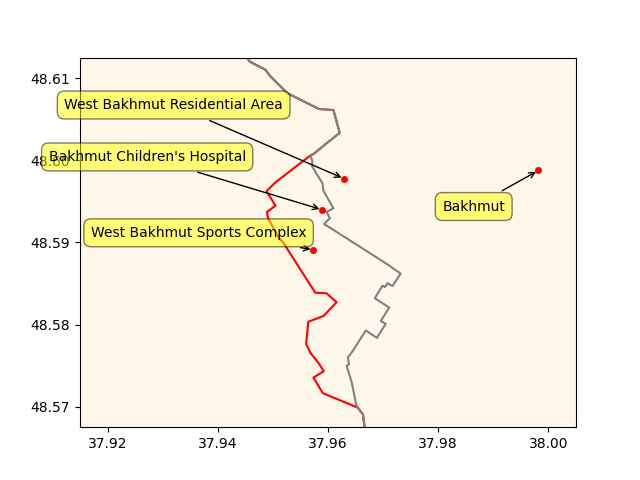

# Week 21

Politico: "[Matthew Desmond] makes a refreshing, brutally honest case
that poverty is pervasive in America by design, to enable the
lifestyles of affluent people. U.S. rates of poverty are substantially
higher and more extreme than those found in 25 other developed OECD
countries.. [His] greatest contribution is changing the lens from
individual behavior — the hoary focus of so many books about poverty —
to asking and answering the larger question, 'Who benefits from
practices that keep people poor?' Poverty, he argues, results from
three quintessentially American habits: exploitation of the poor;
subsidization of the rich; and the intentional segregation of the
affluent and the poor such that opportunity is hoarded and social
mobility is rare"

---

End of empire?

Politico: "Debt ceiling talks break down and attacks escalate as
deadline approaches"

---

The Japan Times: "China and Russia lash out at G7 'double containment'
attempt"

---

F24: "More than 36,000 people displaced by northern Italy floods"

---

Informed Comment: "[Far-right] Smotrich Plans to Send 500k further
Israeli Squatters in to Steal More Palestinian Land in West Bank"

---

WION: "UN chief, Indian PM Modi call for reform of security council to
reflect ‘realities’ of today"

---

Others in the Gulf were involved in Syria conflict too, but Qatar took
to the effort with more gusto, became wedded to it as a win there would
prove that they had "arrived". It all went bust. 

---

Al-Monitor: "Qatar emir skips Assad's Arab League speech in Saudi
Arabia.. The leaders of Saudi Arabia, Jordan and Egypt publicly
praised Syrian President Bashar al-Assad’s participation in the summit
after Syria was readmitted to the Arab League"

---

Lack of understanding will get you in harder problems. The real world
is not a constrained, finite-space Go board. It is messy. That's why
neural net based cars still [cannot drive safely](https://futurism.com/experts-alarmed-tesla-fsd).

---

AlphaGo Zero was sadly another example of weak AI parroting; AG0
generated its own data, played against itself and learned from that,
meaning it compressed it and "made art" from it, a dataset of over 4
million datapoints. Its programmers did make some legit algorithmic
design improvements in a certain tree search approach (human coded,
not deepfaked by an parrot moron algo), but the rest is... simple
compression. Sample games are compressed into a neural net, for
subsequent games computer can make similar moves "inspired" by that
training data..  The machinery does not truly understand the game of Go.

---

H2 Central: "Israel Launches National Plan to Integrate Hydrogen Into Energy
Landscape"

---

H2 Fuel News: "$2 billion Hydrogen Headstart program launches in Australia"

---

Roll Call: "The Wall Street Journal in late 2021 reported on satellite
imagery that showed significant construction at Abu Dhabi’s Khalifa
Port by the Chinese firm Cosco. The report said concerns that the
construction could be a military installation"

---

"Nuttier than squirrel shit"

---

CNBC: "Cryptos have no intrinsic value and trading in them should be
regulated like gambling, UK lawmakers say"

---

"@Hypx@mastodon.social

Drone Flies For Five Hours With Hydrogen Fuel Cell"

---

Al Jazeera: "Putin congratulates Russia troops, Wagner for ‘capturing Bakhmut’"

---

```python
u.sm_plot_ukr1('ukrdata/fl-0521.csv','ukrdata/fl-0516.csv',["West Bakhmut Sports Complex","Bakhmut Children's Hospital","West Bakhmut Residential Area","Bakhmut"],48.59,37.96,zoom=0.005)
```

 

---

Sudan Tribune: "[2022/09] The U.S ambassador to Sudan, John Godfrey
warned of consequences if Khartoum allows Russia to establish a
military base at the Red Sea coast"

---

Sullivan home break in before.. some kind of notable event, sup

---

Blinken is about to meet the Chinese, the baloon incident.

---

Two days later - civil war

Blinken: "[04/12] I spoke with Sovereign Council Chair General
[Burhan] today to highlight U.S. support for Sudanese democratic
aspirations and to urge the swift formation of a civilian-led
transitional government"

---

One UA mention I remember before the war was from *Transporter 3*,
Ukranian female character gets offended when mistakenly called Russian,
"we are so different, dont call me Russian!"

---

Finnish former commando fighting the generic baddie "Nazis" but the
origin story is key, he was wronged by Russia Russia Russia.

Finland is of course an RU border country who just recently became a
NATO member. In the beginning of the movie they even show the Finnish
hero mining for gold, he is practically an American for god's sake!
Identify with that man and his nation, please! We beg you!

---

*Sisu* - good action but has some psyop. 

---

Regulation, fine. But we need to realize it is because the stuff isn't
smart, precisely the opposite, it is too freaking stupid, parrot-like
\#AI

---

Denis Ritchie e-mail about `#!` usage in shell scripts \#geek

[[-]](https://s3.masto.ai/media_attachments/files/110/393/849/972/493/682/original/9845aabb05666cb7.jpg)

---
