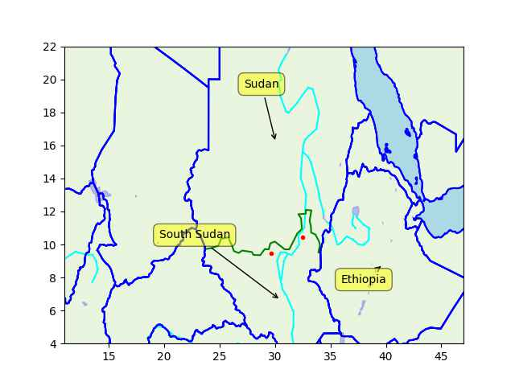

# Week 22

H2 Central: "While many carbon capture technologies target a 90-96%
capture rate, the 8RH2 oxy-combustion process will eliminate virtually
all direct CO2 emissions. Unlike standard hydrogen production, 8RH2
uses natural gas and pure oxygen and then utilizes the CO2 produced in
the combustion process as a heat transfer medium in a proprietary
reformer before sequestering the CO2. 8RH2‘s advanced process
eliminates the need for costly amine or cryogenic-based CO2 separation
processes that are normally required to capture CO2, as carbon
separation is inherent to the process itself"

---

"Work requirement" for federal help - sounds like more wage supression.

---

Another case of that population - growth bullshit; it is all about
letting more people in so they create competition for wages which
fall, bosses are happy, they contribute money to politicians who made
it happen.

---

On migration most in the US right-wing are two-faced; they say they
are against it, but actually want the cheap labor it provides for the
bosses who pay for them, so they secretly aim to allow it.

---

The Ethiopian dam GERD final capacity will be >6 GW. It's six nuclear
power plant equivalent. Not bad. 

---

South Sudan border, and the oil fields, the big ones were in the
south.


```python
u.sm_plot_nile2()
```

 

---

Euractiv: "Employment commissioner favours EU-wide four-day work"

---

I remember one year '13 they finished a month early. like had so many
consecutive wins and enough points that even if they played no games
for weeks they'd still be the champion.

---

Bayern Munich wins again? How many has it been already? >10 times?

---

RU also has fifth gen aircraft tech

Politico: "F-16s won’t be a ‘magic weapon’ for Ukraine, Milley
warns.. 'The Russians have 1,000 fourth-generation fighters,' Joint
Chiefs Chair.. told reporters at the Pentagon"

---

Janes: "Inflatable Leopard 2A4 tank decoys are being supplied to
Ukraine, Janes learnt at the International Defence and Security
Technology Fair (IDET)"

---

TASS: "Brazil views BRICS bank as alternative to traditional financial
institutions — president [Lula]"

---

