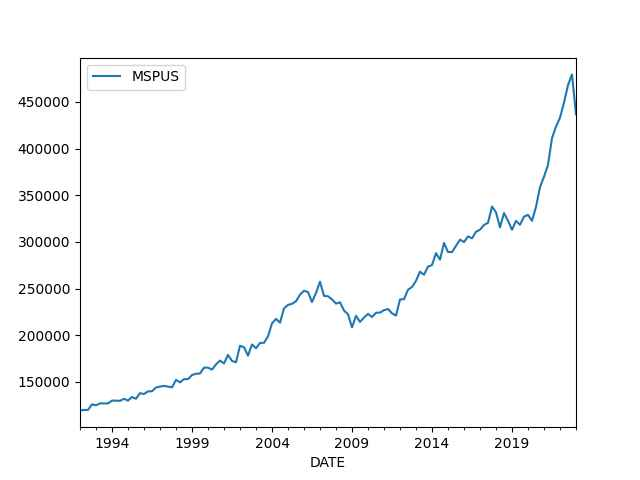

# Week 25


H2 Central: "PNNL researchers recently coauthored a paper that
investigates a baking soda solution as a means of storing
hydrogen... The efforts at PNNL are funded by the DOE"

---

They're just making shit up at this point. Whatever sounds "sciency"
just throw it in there.. Anything for clicks \#ScienceTube

[[-]](https://youtu.be/PjT85AxTmI0?t=94)

---

Wiki: "[Chindian] food is generally characterised by its ingredients:
Indian vegetables and spices are used, along with a heavy amount of
pungent Chinese sauces, thickening agents, and oil. Stir-fried in a
wok, Sino-Indian food takes Chinese culinary styles and adds spices
and flavours familiar to the Indian palate"

---

TASS: "Situation in arms control bad, no potential for negotiations —
Kremlin Spokesman"

---

Odd coincidence; that "20 times less" issue keeps [showing up](../../2022/11/battery-electric.html#reserves)
when the subject is lithium.

---

Eric Lerner: "[Answering the question 'can you save the Big Bang
Theory by tweaking it' outlines the problems with the approach an
listing gross mistakes of the BBT. First is] too little helium..  a
very basic prediction of The BBT which is that there should be a
certain amount of helium produced by Fusion reactions during the Big
Bang and there should be more helium and older in stars that have
processed hydrogen.. but observations have shown that in nearby stars
and even in planetary nebula.. where we can observe helium directly
the amount of helium is only half what's predicted by the [BBT]..

What's worrying.. Big Bang cosmologists is that the very basic
assumption of [the theory] is that the universe is homogeneous and
isotropic modulus.. Isotropic means the same in every direction.
Without those basic assumptions there would be no expanding universe
there would be no BB. General relativity only predicts an expanding or
contracting universe if the universe is homogeneous and isotropic
which has never been observed and today with even better observations
there are more and more anisotropies. When we look in different
directions in the sky we get different measurements, for example of
the Hubble constant, the constant that describes the relationship
between redshift and distance, we get different densities of radio
galaxies of X-ray galaxies of quasars. All of these are different in
different directions [leading to] lopsided star maps and therefore
again contradict the basic hypotheses of the BB...

[Another problem is] too little lithium; this again is the well-known
lithium problem, the BB makes predictions about three light elements,
helium, lithium and deuterium which is the heavy isotope of ordinary
hydrogen. The lithium it gets wrong entirely.. observations of lithium
are 20 times less than the predictions of the BB - a gross
contradiction...

If an airline advertises that out of the last 17 flights 16 crashed
and one got through would you fly on that airline? I think the answer
is obvious, and the answer to the question [of tweaking BB to save it]
is also obvious, with 16 wrong answers and one right answer this isn't
a theory that needs to be tweaked, this is a theory that needs to be
thrown away"

---

Gridded raw data is costly; any measure on earth surface, in a big
enough area can result in millions of data points. "Well see it is 6K
by 10K grid mate, chump change, just thousands!" But 2D grid requires
6K times 10K = 60 million data points. It can be handled, but not
frequently, any ol' time u need something from it.

---

*Extraction 2* written by a Russo, fine camera work. This one was
even better than the first. 

---

Wasn't the inspiration for SW Kurosawa? RLA, SW did not particularly
strike me as remakes but I guess some cld make the case...

"Most of the most popular movies released in 1973 trafficked in
twentieth-century nostalgia.. Even the one enduring new Hollywood
genre that arose in the mid-1970s and early 80s, what Lucas and Steven
Spielberg created with Star Wars and Raiders of the Lost Ark, was
actually just a big-budget revival of an old genre, forgettable
action-adventure B movies and serials from the 1930s and 40s and 50s"

---

Al Jazeera: "Russian leader says no need for new round of mobilisation
for now, claims Ukraine has suffered 'catastrophic' losses"

---

Al-Monitor: "Putin, MBZ meet in St. Petersburg, vow to boost Russia-UAE
ties"

---

\#Florida \#BEV

[[-]](https://youtu.be/X5NiWJcyrwI?t=2)

---

H2 Central: "Switzerland - Hydrogen Trains are to Roll Between Stade
and Bremervorde"

---

Median house prices finally fell thanks to higher rates. Rents should
follow. At one point it reached 480 thousand bloody
dollars.. unbelievable.

```python
df = u.get_fred(1992,"MSPUS")
print (df.tail(4))
print (df.max())
df.plot()
```

```text
               MSPUS
DATE                
2022-04-01  449300.0
2022-07-01  468000.0
2022-10-01  479500.0
2023-01-01  436800.0
MSPUS    479500.0
dtype: float64
```

 

---

More U.S.!

Arab News: "Two ballistic missiles fired by North Korea landed in
waters within Japan's exclusive economic zone"

---

S&P Global: "California transit agencies establishing road map for
hydrogen fuel cell use in buses"

---

"@Hy_Economy@mastodon.social

Big hydrogen alliance has been formed: 

RWE, BP Europa, Open Grid Europe, Thyssengas, Vonovia and Thyssenkrupp
form an alliance to turn the German Ruhr Area (located in West
Germany) into an model region for hydrogen"

---

Good audience score.. haven't seen it yet, looks like it isn't Woke. 


```python
u.rottentomatoes3("The Flash 2023")
```

```text
Out[1]: {'tomatometer score': 68, 'audience score': 87}
```

---

"@Hy_Economy@mastodon.social

Berlin plans a local hydrogen pipeline network: 

- First step 2030: Connect the 5 Berlin heating (CHP) plants. 

- Later on: Connect the industry and living quarters.

\#Wasserstoff #Hydrogen #GreenHydrogen #Energiewende #EnergyTransition"

---

The inhabitants of Israel were pushed there, as part of [strategery](../../2020/06/10-myths-israel.html#uk)
to turn it into an Anglo outpost. Their "heritage" was weaponized and
unleashed on the Arabs. They were outsiders, [not](../../2020/06/10-myths-israel.html#samejew)
descendants of people who used to live at the place during the biblical times.
Those people never left, they could not have descendants who could later
come back and reclaim the land they had "left behind". It is all smoke and
mirrors (and a land grab). 

---

"@eunews@fedieuropa.eu

Europe pushes ahead with hydrogen pipelines to meet energy
demand.. Companies aim to transport the gas over long distances as
countries cut back on fossil fuels"

---

\#Florida \#BEV

[[-]](https://youtu.be/X5NiWJcyrwI?t=2)

---

"Ivan make basket" is obvously a line from '96 movie *Eddie*

[[-]](https://youtu.be/iUUZxIgykOg?t=2213)

---

A Chinese annex attempt is in the works? Some claim the main reason Xi
stayed for a third term was Taiwan.

Daily Express: "Amid mounting tensions, U.S. Government reported to
be working on evacuation plans for Americans in Taiwan"

---

Al-Monitor: "China's Xi hosts Abbas, vows support for Palestinian
state on 1967 borders"

---

One degree of latitude/longitude roughly corresponds to 110
kilometers, so each 0.01 degree change can be interpreted as 1
kilometer distance. Looking at the previous frontline map if there is
an advance from 47.50 to 47.45 in latitude that is roughly a 5
kilometer advance.

---

