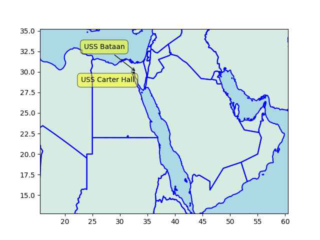

# Week 32

Hartmann: "Before Reagan, ... CEOs who executed share buybacks just to
artificially inflate stock prices could go to prison. FDR criminalized
share buybacks in the early 1930s because they’re simply a form of
stock price manipulation and were one of the main reasons for the
stock market crash of 1929 that kicked off the Republican Great
Depression...

[T]here’s nothing magical, normal, or 'natural' about national
economies. They’re not the result of immutable laws, any more than the
NFL’s rules for football are. The rules of marketplaces are created by
governments, and governments decide who will benefit from those rules.

Today’s personal and corporate tax situation is very intentional,
including its outcomes of massive inequality, mind-boggling riches in
a few hands, and widespread poverty across the land"

---

"@dmoser@mastodon.social

🌳Before Vs. After in Vitoria-Gasteiz 🇪🇸"

[[-]](https://files.mastodon.social/media_attachments/files/110/852/749/547/643/712/original/89383931ef39a985.png)

---

JW: "If a Cactus Can't Survive This, Neither Can You.. You might’ve
seen recent headlines about saguaro cacti [keeling over](https://substackcdn.com/image/fetch/w_1456,c_limit,f_webp,q_auto:good,fl_progressive:steep/https%3A%2F%2Fsubstack-post-media.s3.amazonaws.com%2Fpublic%2Fimages%2Fbbf3a9df-a09b-44e9-9372-774735a5bb5d_5184x3456.jpeg) 
in Arizona after spending nearly a month above 110 degrees Fahrenheit.
Not even a week later, The Washington Post ran this absurd story:
'Your body can build up tolerance to heat. Here’s how'"

[[-]](https://jessicawildfire.substack.com/p/if-a-cactus-cant-survive-this-neither)

---

Maybe this is why the Chinese are interested in Alaska along with
Russians. RU-CH want to invade Alaska so their people can move there,
esp. the Chinese. Alaska is sparsely populated.

---

That confirms the earlier wet-bulb temparature map (the research below
uses WBT as well). SE Asia already has it bad, it will probably get
worse.

---

Earth.com: "China’s most populated region may become uninhabitable by
2070.. According to the study, China’s most populated and
agriculturally significant region, known as the known as the North
China Plain, could experience a repeated pattern of heat and humidity
that people cannot survive for extended periods of time"

 

---

If you count Clooney *The Flash* had not one, not two, but three
bleeping Bruce Wayne's. And a fourth in the whole DCU if we count
Pattinson. They could not have enough of this jagoff billionaire,
pre-reboot at least.

---

Movie did well it looks like.. 

```python
u.boxofficemojo("Guardians of the Galaxy Vol. 3")
```

```text
Out[1]: 
{'Domestic Opening': '$118,414,021',
 'Domestic': '$358,974,799',
 'International': '$486,340,207',
 'Worldwide Total': '$845,315,006',
 'Release Date': 'April 13, 2023'}
```

---

What an half assed system.. With neighbor India being a democracy
having same institutional heritage there is more expected of you - yet
no cigar.. Either be China or India, make up your mind. Paki system is
bizarre, military is not officially in control but tries to manipulate
from behind the scenes all the time. Politicians have to look behind
their shoulders constantly which makes them less of a politician. Same
for Thailand.. Even Egypt is better off.. Their military makes a coup,
the top general becomes civilian president, done. None of this part-in
part-out behind-the-scenes bitch manipulation of bitch kabuki
politics.

NYT: "Imran Khan Sentenced to Prison in Pakistan"

---

"@sru@mastodon.social

For the first time since 2018, I no longer hold \#crypto. Made some
gains on #BTC, but suffered large losses on #ETH and #SOL. These are
some of the worst investments I ever made, and in hindsight, they were
motivated mostly by FOMO. Lesson learned"

---

"@molly0xfff@hachyderm.io

pretty remarkable to see Coinbase making the argument that crypto is
not like stocks, it's like baseball cards, American Girl dolls, or
Beanie Babies

it's the future of finance! except when the SEC comes knocking, then
it's just a harmless little toy, your honor"

[[-]](https://hachyderm.io/@molly0xfff/110843572797342849)

---

"@kottke@botsin.space

When this species of water beetle gets eaten by a frog, rather than
accepting its fate to be digested, it crawls through the frog's bowels
and emerges through its butt. 'The quickest run from mouth to anus was
just six minutes.'"

---

There were rumors MCU was a slavedriver when it came to VFX work - so
now there is a backlash. It's a bitch. You can't Woke your way out of
this one.

---

Variety: "Marvel VFX Artists Vote to Unionize"

---

Reuters: "Judge allows key US antitrust Google search claims to go trial"

---

The Walrus: "There Is No Housing Crisis.. Supply alone will not solve
a problem that large sections of the population don’t want to
fix.. Canada’s 'housing crisis' is a permanent state of affairs that
harms people in, or in need of, rental housing; roughly one-third of
the country’s households... Even 2020... was a good year for the
industry. Banks and other mortgage providers create money, lend it,
and charge interest on it. If that wasn’t already a sweet deal, the
federal government assumes a share of the risk of these mortgages..

A housing system that serves all but one group is not in a state of
crisis; it is one based on structural inequality and economic
exploitation... Why, then, are 'housing crisis' and 'supply-side'
arguments so prevalent?.. If we believe lack of supply is the cause of
lack of housing affordability, the solution is building
more... The.. argument serves a clear purpose: to sweeten the deal for
developers and landlords... 

There are many reasons for not treating housing as a market that
arrives at an optimal balance. The most important is that land, on
which housing is built, is a fixed resource. We cannot produce more of
it"

[[-]](https://thewalrus.ca/there-is-no-housing-crisis/)

---

The Guardian: "The number of outsourced government services that are
failing to meet standards has risen sharply..  In what critics said
was evidence of ministers failing to deliver high-quality public
services, the number of contractors providing work judged to be
'inadequate' or 'requires improvement' jumped from 119 to 207 in a
year – a 73% rise. That means 6.5% of all the targets set for
government contracts were being missed"

---

"@The_Tim@mastodon.social

Personally I'm tired of billionaires.

'Billionaire Mike Bloomberg is tired of remote work excuses: "this has
gone on too long"'"

---

Thanks to A. Hidalgo, the mayor of Paris (Socialist Party)

"@dmoser@mastodon.social

🌳Before Vs. After in Paris 🇫🇷"

[Before, After](https://files.mastodon.social/media_attachments/files/110/847/477/636/417/178/original/5637ef4cc0896017.png)

---

"rob pike@robpike@hachyderm.io

No, guys, they have not achieved 'net energy gain' because you're only
counting the energy IN the laser, not the energy it takes to FIRE the
laser, which is hundreds, maybe thousands of times more.

'US scientists achieve net energy gain for second time in nuclear
fusion reaction The Guardian'"

---

US individualism seems to be a carefully managed endeavor - you are
either guided towards a consumption domain where you "express" your
individuality, identity through the things you buy, or sometimes
-oddly enough- towards sects that are actually non-existent
sub-cultures, ethnic or otherwise, where you could be further
divided-and-ruled by the apparatus. A first generation
"Lithuanian-American" could say he is proudly Lithuanian, expressing a
differentiating factor about himself, an individuality when in fact
[culture code](../../0119/2014/06/the-culture-code.html#imprint) would suggest he
is no different from anyone else, heritage being meaningless.

---

Gopal: "Is Barbie feminist? Not for all women.. The film’s a marketing
success, but its limited vision doesn’t apply to most women, for whom
the world is grim, not pink... At the end of the day, Barbie the
movie, like the 240 types of Barbie made by Mattel, gives us little
other than that American holy grail: individualism"

[[-]](https://www.aljazeera.com/opinions/2023/8/4/sorry-american-liberals-barbies-feminism-isnt-for-all-women#movies)

---

"A wind turbine without blades - Vortex wind turbines"

[[-]](https://youtu.be/qb6NWB5Hb4A?t=59)

---

CNBC: "In June, Siemens Energy scrapped its profit forecast and warned
that costly [$2.4 billion] failures at wind turbine subsidiary Siemens
Gamesa could drag on for years, sending shares tumbling"

---

*Face the Nation* is pretty good.. the vibe is different than these
angertainment, hipster cable shows. Good guests.

---

Ars Technica: "Angry Tesla customers sue firm over 'grossly'
exaggerated EV range.. Three Tesla drivers launch class action,
alleging fraud and false advertising"

---

"@TCatInReality@mastodon.social

Again, the UK public need to ask ... Why have for-profit healthcare
companies built excess capacity in a 100% free, universal healthcare
system? It can ONLY be with foreknowledge that the Tories would
underfund the \#NHS and shift demand to private profiteers"

---

Increased US naval activity in the Red Sea, sup. These two ships are
rushing that way.

```python
u.sm_usnavy(clat=24, clon=38, zoom=2.5)
```

 

---

Janes: "Russian, Chinese military vessels operate near Alaskan
Aleutian Islands again"

---

First Post: "Indian Navy extends sphere of influence, joins crucial
collaboration with Royal Saudi Navy"

---

TASS: "Russia wants to control territories fixed in its constitution —
Kremlin spokesman.. [DPR, LPR, Zaporozhye, Kherson]"

---

Quick reminder Chile is in the Southern Hemisphere ie in its winter.

CGTN: "Chile sees heat wave in the middle of winter, temperatures
reach 37 C"

---

CNBC: "Global ocean temperatures are now hotter than ever — with
far-reaching consequences for the planet"

---

The deadline came and went - where is Ecowas? \#Niger 

---

"@mimsical@mastodon.social

.. Jeep just introduced a 19-foot [5.8 m] long vehicle with a built-in
mini fridge that gets 16 miles to the gallon [3.8 liter]"

---

Banning cars, green corridors reduce city temperatures - good idea,
concrete collects too much heat, greenery does not

[[-]](https://youtu.be/sKbEOMCsqaI?t=245)

---

H2 Central: "INEOS Welcomes UK Government Support for Acorn Carbon
Capture and Storage.. The INEOS Grangemouth Net Zero Road Map includes
investment in low-carbon hydrogen production to allow fuel switching
and reduce emissions by more than one million tonnes each year"

---

H2 Central: "Shell is launching Hydrogen Pay-Per-Use, an affordable
way for the heavy-duty mobility sector to explore hydrogen as a
fuel. Customers get exclusive use of hydrogen fuel cell electric
vehicles (FCEVs) for a monthly fee. This makes it easier for customers
to explore transitioning their fleet to hydrogen-fuelled trucks with
reduced investment, complexity and risk"

---

Less globalism

CNBC: "Shipping giant Maersk warns of sharp slowdown in global trade
as it reports profit plunge"

---

"'If It Sounds Like Sci-Fi, It Probably Is'.. Linguistics professor Emily
M. Bender separates fact from the hype surrounding Large Language
Model AI"

[[-]](https://journal.getabstract.com/en/2023/08/03/if-it-sounds-like-sci-fi-it-probably-is/)

---

Apparently a 60s US report recommended "nuclear excavation", using
buried nukes to flatten the landscape. 

---

As an alternative to Suez.. There are bunch of mountains on the way though.

[[-]](https://upload.wikimedia.org/wikipedia/commons/thumb/c/cf/Ben_Gurion_Canal_topographic_map.webp/424px-Ben_Gurion_Canal_topographic_map.webp.png)

---

The Ben Gurion Canal.. Always talked about nothing happens there

---

RU has likely been working on a contiguous path in Africa consisting
of friendly countries starting from the Red Sea towards West Africa
reaching the Atlantic. It makes sense as a naval / alliance goal,
passage through Suez should be ok, Egypt is on good terms with RU, and
they are "working" on their Black Sea access. The countries on this
Sahel path would have something to gain, security / trade among them
and with friendly nations could improve. Others can tag along, Saudis,
Egypt, UAE hell even Iran.

---

\#StrangeNewWorlds I only watch sporadically, some fine moments, but
overall it's clunky and not good. Maybe somewhat better than ST
Discovery "STD" - but that's a pretty low bar. Jumping the shark on
your second season?  TNG was getting to 10x at this point. Did Ibrahim
screw this one up too, or was it his posse?

---

"@josephgruber@josephgruber.space

Did Star Trek just jump the shark? \#SubspaceRhapsody \#StrangeNewWorlds"

---

Lebanon is such a dump - I dont think it deserves to be called a
country

Al Monitor: Still no answers three years after Beirut mega-explosion"

---

Informed Comment: "Progressives Unveil OLIGARCH Act to Combat
‘Existential Threat’ of Extreme Wealth Inequality.. A group of
progressive U.S. lawmakers on Wednesday proposed a wealth tax that
would automatically rise during periods of surging inequality and fall
once inequality moderates. The tax is at the heart of new legislation
called the Oppose Limitless Inequality Growth and Reverse Community
Harms (OLIGARCH) Act, which was introduced by Reps. Barbara Lee
(D-Calif.), Summer Lee (D-Pa.), Rashida Tlaib (D-Mich.), and Jamaal
Bowman (D-N.Y.)...

'Inequality in the United States is worse in 2023 than it was during
the Gilded Age,' Lee of California said in a statement. 'It is
unacceptable that millions of hardworking people remain impoverished,
while the top 0.1% hold over 20% of the nation’s wealth. The OLIGARCH
Act is the solution we need to close the exorbitant wealth gap in
America and create a tax system where everyone pays their fair share,'
she added. 'This level of wealth is not just a source of economic
injustice, but a major threat to democracy.'"

---

Euractiv: "Berlin hopeful Brussels will greenlight large-scale
hydrogen subsidies.. According to Habeck, the ministry's talks with
the European Commission over the past months have ?achieved important
progress on the framework for future hydrogen power plants.?"

---

TechCrunch: "BBC is testing being on Mastodon, says fediverse better
fit for public purposes than Twitter or Threads"

---

'A return to purity' - as if that's a new idea. This unrestrained
free-marketism started such a long time ago people forgot how it began
(exactly like this, appeals to purity, return to a nostalgic rugged,
frontier individualism, and striking a bargain with the
left). Neophytes might find it new and amusing bcz they are ignorant
fools.

---

I see online political shows w/ a leftist, and there is always a
libertarian in there .. inserted by Thiel money?  Libertard is likely
tasked with 'man-marking' - keeping Reps close, the left closer.

---

A certain lightweight web framework supports functional programming,
as opposed to OOP. Back in the day OO was the shit, ppl thought
everything one day would be coded that way. FP changed the game, or
reverted back to the existing paradigm. There are objects in this
framework you create one for the central app, but then the rest is
function centric, user's custom web functions are marked with
`@app.route` web calls are routed to them.

---

'Abolition of distance', 'disappearance of frontiers' - this is pillow
talk for capital... Maybe as a rule we can say if such chatter
increases, they are doing well, by definition regular people are not,
and that angst will blow up somewhere, a regional war, or a World War.

---

"[2022/10] Rio Tinto is testing a new processing method called “blue
smelting,” which could replace coking coal with biochar and hydrogen
gas"

---

Nobody seems to like this Commonwealth... Where is the Global Britain?

The Guardian: "Alberta withdraws support for 2030 Commonwealth Games
bid due to cost.. Announcement comes weeks after the Australian state
of Victoria pulled out of hosting the 2026 Games"

---

"@dansup@mastodon.social

sup. is an open source encrypted fediverse instant messenger, similar
to whatsapp, made by pixelfed.

The beta will be launching later this month, and btw most fediverse
accounts will work, not just Pixelfed 😉"

 

---
