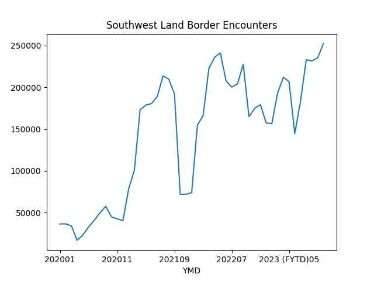

# Week 39


"jmtixhon@jmtixhon@mastodon.world

Major Global Truck OEM To Expand Fueling Network With PowerTap And Its
Unique On-Site Hydrogen Production And Dispensing Unit In A Strategic
Partnership - FuelCellsWorks"

 

---

\#Patreon \#Subtitute

[[-]](https://universeodon.com/@siderea/111122855587210647)

---

\#Socialism

[[-]](https://files.mastodonapp.uk/media_attachments/files/111/120/949/078/295/275/original/66f724fe3cd14e91.png)

---

Reshare

Musavuli: "[In Congo the killing civilians by groups such as M23] is a
tactic of displacement. Whenever you are massacring civilians in
public.. those things are to terrorize the population. When it happens
in your community tomorrow you are not going to be in the same area
because you are afraid. We have mass displacement over [about] five
million internally displaced Congolose..  [and right after ppl leave a
place] you see development of mining concessions in that same
area. Not only that, there is the dispossession of land"

---

"This paper contributes to several debates in political
economy. First, for the last twenty years, civil wars have rightfully
topped the research agendas of scholars working on conflict in
Africa... The number of protests and riots doubled between 1997 and
2010.. this paper identifies one determinant of this increase in
social conflict: mining areas make up just 0.3 percent of the rural
population in Africa (localities with less than 100,000 people) but
accounted for 22 percent of rural protests in 2009"

[[-]](https://eiti.org/sites/default/files/attachments/concession-stands-feb2018_1.pdf)

---

"@jmtixhon@mastodon.world

Daimler Truck #HydrogenRecordRun Milestone: Mercedes-Benz GenH2 Truck
Cracks 1,000 Kilometer Mark With One Fill Of Liquid Hydrogen"

 

---

Emmerich's *10,000 BC* was ok.. I could see some Stargate-ish concepts
in it. 

---

Dayen, *Monopolized*: "Six companies—cable providers Comcast and
Charter, and former telephone companies AT&T, CenturyLink, Frontier,
and Verizon—provide nearly all the broadband internet service in
America, and anyone who has ever moved into a new house or apartment
knows that it’s never the case that all six are an option. The
telecoms have carved up the country, giving the impression of many
nationwide players while running a near-monopoly virtually
everywhere. According to a comprehensive 2018 study of the telecom
industry’s broadband deployment, Comcast and Charter.. are the only
internet service providers for 68 million people in their networks.
Meanwhile, internet service providers like AT&T and Verizon have
effectively stopped running fiber to homes"

---

"@ben@werd.social

Parenting in the age of the internet brings a whole new set of
responsibilities and worries. I want my son to be a creator, not a
consumer. How can I achieve this when our devices are designed to be
addiction machines?"

---

\#Ecycles

[[-]](https://files.botsin.space/media_attachments/files/111/126/235/325/341/680/small/f998ca6de67c20f5.jpeg)

---

Nice [upside down emoji]

"@chaser@mastodon.au

British Museum completely empty after demand that all stolen items be
returned"

---

FTC Chair is Lina Khan, a Warren protege apparently, and WSJ already
published over a dozen hit pieces on her. She must be doing something
right.

---

Ars Technica: "FTC files 'the big one,' a lawsuit alleging Amazon
illegally maintains monopoly"

---

NBC News: "Biden makes history by joining striking autoworkers on the picket line"

---

"@br00t4c@mastodon.social

Strike actions by 75,000 Kaiser Permanente healthcare workers to begin
in early October"

---

"@gerrymcgovern@mastodon.green

Nobody would ever want to live beside a data center. They are big ugly
warehouses. They are very noisy. There are air pollution dangers. They
take huge quantities of water and electricity. They bring very few
jobs. 'Just a dozen people, or two dozen people, run a facility that
is consuming as much electricity as a small city,' Steven Gonzalez
says. 'A data center life is between five and twenty years. This is
not a permanent industry. It is extractive, like mines'"

---

😂 😂 😂 

Futurism: "Google’s new GMail tool is hallucinating emails that don’t
exist.. According to New York Times columnist Kevin Roose, Bard isn't
the helpful inbox assistant that Google apparently wants it to be.. In
his testing.. the AI hallucinated entire email correspondences that
never took place"

---

"@danirabbit@mastodon.online

When people say shit like 'But if we had UBI people would just sit at
home and smoke weed all day!', like. Okay? Dope. What the fuck do you
do at work that is really creating more value than smoking weed at
home all day"

---

Fleet Owner: "In Germany and elsewhere in Europe, dozens of hydrogen
refueling stations are coming online, supporting municipal fuel-cell
fleets, passenger cars, and emerging FCEV trucks, giving a glimpse
into U.S. transportation's zero-emission future"

---

"@andrewdessler@mastodon.world

I went to the AGU meeting in New Orleans in 2021 and one thing was
absolutely clear: New Orleans is doomed, largely because of climate
change.

If I lived there, I would be trying to get out as quickly as possible"

---

I understand developing countries being excited about more
industrialization, development as many had little of it. I grew up
near an agro-business, if not polluting they can be nice to have,
know-how is built around them, it's good to see what people can
achieve with proper organization. But, esp in US, there's been
excesses. US "way of life" has been badly damaged from over-business,
over-corporatization.  The rise of the uniparty, the Business Party
wreaked havoc on America.

---

Free and Open Source Software (FOSS) world has a lot to teach to the
rest of the economy.

"@TerryHancock@realsocial.life

The absolute best thing we could do to make everything more
sustainable is to eliminate barriers to reuse, repair, and study and
improvement.

Basically, the 'Four Freedoms' of 'free software', applied to
everything. An open hardware world"

---

By implication if the balance sheet even reaches 2020 levels imagine
what kind of an SP fall that would mean.

---

Looking at the FED balance sheet, its [trend](../../2021/01/stats.html#fedbalance)
is obvious, any SP move above that (in a properly scaled graph) would be
fools chasing FOMO, some people could've made good money shorting that mean
reversion, bcz it all went back to the level suggested by the FED balance
sheet.

 

---

Nasdaq is back to where it was in June. Its like the last three months
did not happen

---

I see some Indian channels are loving it, they maintained India was
unfairly attacked by Canada during the Khalistani row, now the Nazi
event looks like a "second faux pas".

---

Some in the West truly lost their shit with Putin derangement. This
is where 'enemy of my enemy' chain of thought leads.

BBC News: "Canada's House Speaker apologises for praising Ukrainian
who fought for Nazis.. Yaroslav Hunka, 98, was sitting in the gallery
and got a standing ovation in parliament after Mr Rota said he was a
'hero' during a visit by Ukrainian President"

---

"@divinto

It's easy to say with hindsight that NFTs are a stupid scam but it was
also easy at the beginning to say that and through the middle too"

---

ProPublica: "For the past quarter century, Intuit, the maker of
TurboTax, has worked to thwart one clear threat to its profits: a
free, publicly funded tool to file taxes online. The company's success
at preventing that threat was near total - until earlier this year,
when the IRS announced a plan to test such an approach"

---

Green Car Congress: "Rheinkraft International takes delivery of KEYOU
18t truck with hydrogen combustion engine"

---

"@Gjallarhornet@mastodon.nu

\#India's 1st green #hydrogen fuel cell public bus to run from Monday
at Kartavya Path"

---

Green Car Congress: "[2023/04] At this year’s demopark open-air
exhibition, Mercedes-Benz is presenting a prototype of the Unimog
based on the U 430 with hydrogen-powered combustion engine as part of
the publicly funded “WaVe” project. The project, funded by Germany
Federal Ministry for Economic Affairs and Climate Action, is being
implemented jointly by 18 partners from industry and science and began
in July 2021"

---

Gary Marcus: "Elegant and powerful new result that seriously
undermines large language models.. [Researches] Lukas Berglund and
others.. asked a simple, powerful, elegant question: can LLMs trained
on A is B infer automatically that B is A?  The shocking.. answer is
no"

[[-]](https://garymarcus.substack.com/p/elegant-and-powerful-new-result-that)

---

JS is fast as shit these days.. near C++ performance. 

---

Matrix computation libs on Javascript? Writing some bleeping `for`
loops is not a big deal.

---

"@lcamtuf@infosec.exchange

It still blows my mind that in just three short decades of dirt-cheap
imports from China, we've gotten so used to the idea that a Nerf gun,
a small computer, or a set of automotive wrenches 'ought to' cost less
than a lunch"

---

NYT: "Gold Mining Is Poisoning the Planet With Mercury.. Mining is the
leading source of mercury emissions, ahead of coal-fired power plants"

---

"@rbreich@masto.ai

Here's the truth about tax cuts for the rich.

They explode the federal debt, fuel giant profits at the biggest firms
and financial institutions, and stoke a surge in billionaire wealth
but do nothing for average working people.

Nothing trickles down"

---

"@ZachWeinersmith@mastodon.social

There should be a reverse Indiana Jones film where a South American
tribe sneaks into the Vatican, steals some relics, and gets away on a
boat while a bunch of men in golden robes shake their fists and shout
their strange language"

---

Over 250K people arrived in August alone. Insane numbers \#immigration

```python
u.sw_border_encounter('2023-Sep/sbo-encounters-fy20-fy23-aug.csv')
```

```text
YMD
2023 (FYTD)08    232972
2023 (FYTD)10    231538
2023 (FYTD)11    235198
2023 (FYTD)12    252320
Name: Encounter Count, dtype: int64
```

 

---

Yes all that S-400 drama.. After months of "will they, won't they"
S-400 was bought, but then was sent to a depot never to be used again,
because the subsequent punishment for the act would be
severe. Pedestrian watcher of the drama remembers the drama, not the
aftermath, which might have been the purpose from the
start. "Rebelliousness" was on display for as long as possible, but
led nowhere. This is poodle territory.

---

Homie was kicked out of the F-35 program, looking at this situation maybe
that was not so bad.

---

It sounds like the fault lies with the private sector again.

Defense News: "In March 2023, [Government Accountability Office] said,
the mission-capable rate for all F-35s was at 55%. That's well below
the 70% mission-capable goal the Air Force..

The backlog of broken spare parts that need fixed has more than
doubled since spring 2019, GAO said, from 4,300 to more than
10,000... Rather than wait nearly five months for a repaired
part.. the F-35 Joint Program Office often buys new parts at a higher
cost. This helps get the fighter back in the air faster.. but it
drives up sustainment costs..

[S]upport equipment frequently breaks.. and because it is proprietary,
contractors must come in to fix it — a process that can take
months. In the last few years, the F-35 program has grown to conclude
it can’t afford the current strategy of contractor-led sustainment of
the jet. By 2036, GAO wrote in a 2021 report, contractor-led
sustainment of the jet will be $6 billion more than the military can
afford in that year alone..

Decisions made at the dawn of the F-35 are.. coming back to haunt it —
particularly the Pentagon’s early decision not to obtain technical
data on the fighter from Lockheed Martin"

---

USA Today: "Debris from a Marine Corps F-35 stealth fighter jet that
crashed in South Carolina after the pilot ejected and parachuted to
safety was found Monday.. the third costly accident in recent weeks"

---

Al Monitor: "New York trip gave Netanyahu no escape from Israel's
reality.. The Israeli prime minister’s coalition partners were careful
to remind him, even when he visited the United Nations, that his
political fate is in their hands, and that they won’t allow any
concessions to the Palestinians"

---

"@thomasfuchs@hachyderm.io

Can’t wait for the 'actually LLMs are a worthless scam' articles in
2025 and all the people that pretend they never fell for it"

---

This is from a guy who is worth $17.4 billion BTW.

---

There is that word again. 

"@casseagull@mstdn.social

LOL Rupert Murdoch's resignation letter rails against 'the elites.'"

---

Notice the frequent use of "the elites" label in right-wing media,
they are trying to create that feudal connection perhaps, elite =
government = ruler = king so you ask them to "stay out of your room".

---

I'm sure the post-70s grand bargain, neoliberal agenda and its
planners preyed upon such base feelings when they pushed their
anti-government message. You can always equate government = ruler =
king, therefore gov would be told "stay out of my room"

---

Rapaille, *TCC*: "Our adolescence stems from one essential point: we
never had to kill the king in order to become who we are.  Every adult
was once a child, small and anxious. Then they go through stages of
adolescence and rebellion. In the American culture, however, our
rebellion took an unusual form. Many cultures act out their rebellion
by killing their leaders (for example, the French rebelled by
beheading Louis XVI), after which their period of rebellion ends and
adulthood begins. We never killed our king because we never actually
had one. We rebelled against the only king who ever tried to rule us
and threw him out of 'our room,' but we didn’t behead him. We simply
told him to stay out.

For this reason, our rebellious period never really ended. Rather than
moving on from it, we hold on to it and reinforce it when we welcome
immigrants to our shores. These immigrants have left the country that
was forced upon them at birth.  Coming here is a huge act of
rebellion. Like the American revolutionaries, they leave their old
cultures behind rather than “finishing the job” by killing the
king. Therefore, they remain rebels, and this constant influx of new
adolescents helps keep our entire culture adolescent"

---

America has a bizarre relationship with its government. Some reactions
to it are downright childish.. Clotaire Rapaille hints it could be due
to how America dealt with its former feudal ruler. See above.

---

Being able to transact fast, easily was certainly lacking then, and it
still does now (FED is finally rolling out a solution), but the reason
for that backwardness *again* had to do with finance, business
community itself who never wanted government to be involved in
anything other than keeping the banking system solvent (read: bail me
out when I need it) and frowned upon actions that looked remotely
innovative by the government, bcz like, that was "their turf". Gov on
its part frowned upon money transfer outside its bailiwick bcz of the
need to deal with money laundering, crime (that's why they killed
Libra). The result: deadlock, and the freak shitcoins emerged out of
that lull in policymaking.

In China, and India, where corporatism (fascism) is not as strong as
in US, governments could innovate, lead others to implement a fast
money transfer solution. Have no doubt, Indian UPI is ten times better
and reliable than any of these fuckcoins, it likely provided a good
example for US FED to follow as well. US was late in the game, wasting
time with "fintech", while India steamed ahead.

---

Quick reminder Bitcoin started during the aftermath of GFC, along with
the "Tea Party" movement who thought the solution for unfettered
capitalism was more unfettered capitalism (you can transact without
government fiat bro). That's why they kept the money base to be finite
as they were mimicking gold, a "politics free money" bcz they are
bufoons without any shred of econ knowledge.

---

"@lcamtuf@infosec.exchange

I don't understand, I added blockchain to it but I'm still not rich"

---


