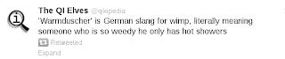
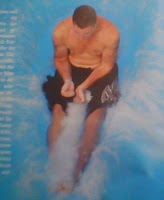

# Week 28

"Three years ago Mr Erdogan promised to address Kurdish demands but has
done little other than lift some restrictions on the use of the
Kurdish language. These gestures have been outweighed by the arrest of
several thousand Kurdish activists, politicians and academics, often
for the flimsiest of links to the PKK. The arrests mean that the
rebels retain strong support and a steady flow of recruits from the
country's 15 million Kurds. Many observers fear hopes for a political
settlement are fading. The younger generation of Kurds, embittered by
growing up in the midst of a 28-year-old conflict, are more radical
than their elders"

---

---

Diving ass-first into pool / sea and splashing the maximum amount of
water towards the by-standers, or just up in the air apparently has a
name in Germany -- Arschbombe (ass bomb). :) We used to do this when
in our youth (well ok, I still do this sometimes) and I thought my
technique was perfect. Someone at Universitat Beyreuth did some
research, and the best Arschbombe form, optimizing for the most amount
of splash is seen to the left. Awesome.

---

While learning a new skill, a new profession, there is almost no
substitute to watching another expert while he works. PhD process
tries to foster this by having teacher / student work side by
side. Student sees how teacher approaches problems, how they
think. Perhaps most importantly -and the teacher does not have to say
many words for this kind of transmission- student sees how much time
teacher spends on what, what kind of tools is used, and his overall
attitude. Does teacher scribble something on paper, ponder, than go to
some tool, look at results, ponder some more (or not), and say "F@#$k!
?? He was expecting __certain approach__ to work? Why did he pick that
approach first? He cursed, was he frustrated? Why? Tool's shortcoming,
or the teacher's? On and on..

These are all micro messages that student can absorb like a sponge, if
he is standing next to the teacher and watching. This is a very
important part of learning, and teaching.

But obviously, since one has to be there physically, this approach
cannot scale, or we want it to scale better. Maybe a new tool can be
created to have people transmit their work habits; a combination of
self video recording, desktop and keyboard capture, etc. I saw
recently a venture capitalist (whose background is in tech) enabled
his editor so all his previous drafts for his writings can be seen,
along with all mistakes, trials, do-overs. This is nice. It gives
people access to his thinking process.

---

Call me a converted skeptic. Three years ago I identified problems in
previous climate studies that, in my mind, threw doubt on the very
existence of global warming. Last year, following an intensive
research effort involving a dozen scientists, I concluded that global
warming was real and that the prior estimates of the rate of warming
were correct. I’m now going a step further: Humans are almost entirely
the cause.

My total turnaround, in such a short time, is the result of careful
and objective analysis by the Berkeley Earth Surface Temperature
project, which I founded with my daughter Elizabeth. Our results show
that the average temperature of the earth’s land has risen by two and
a half degrees Fahrenheit over the past 250 years, including an
increase of one and a half degrees over the most recent 50
years. Moreover, it appears likely that essentially all of this
increase results from the human emission of greenhouse gases.

---

Data journalism has been around as long as there's been data -
certainly at least since Florence Nightingale's famous graphics and
report into the conditions faced by British soldiers of 1858. The
first ever edition of the Guardian's news coverage was dominated by a
large (leaked) table listing every school in Manchester, its costs and
pupil numbers.

The big difference? Data was published in books, very expensive books
where graphics are referred to as 'figures'. Now we have spreadsheets
and files formatted for computers. Which means we can make the
computers ask the questions.

But now statistics have become democratised, no longer the preserve of
the few but of everyone who has a spreadsheet package on their laptop,
desktop or even their mobile and tablet. Anyone can take on a fearsome
set of data now and wrangle it into shape.

---

People in Colorado went to see the new installment of Batman, Dark
Night Rises, waiting to watch violence, mayhem, shootings, and that is
exactly what they got, physically, in their own movie theather,
LIVE. It is hard to miss the irony here -- the perp who senselessly
killed so many people was dressed up in tactical suit, wore tactical
gloves, planned the whole thing down to smoke canisters, was armed for
combat exactly like.. Batman (or Joker).

As we wrote in Covering the Distance, aggressive behaviour is a
communication mechanism in America. People's way of acting is a
function of distance that are in between indiiduals who had to
populate a vast landscape. Why are Americans so loud? Because there is
a lot of distance to cover. Why throw keys, other things from to one
person to another? It's not only done in movies because it looks
cool. Behaviour is a function of distance.There's also the
"prohibition / letting go" cultural fault line of course. Perp wanted
to "let go", and be cool.

But there is more.

Nowadays, everyone wants to be a knight. And for better or worse, they
now have the tools to do it. Gun laws, outlawing this or that is not
the issue. 21st century technology favors the individuals, in America
you may get shootings because of bullshit culture codes, in other
places, you might get hackers, or other forms of outbursts. But it is
all different sides of the same coin.

We need a different form of art, different way of societal structures,
different forms of community. This is just crazy shit. It cant be
wished away, overlooked, ignored. Even the mass media picked up on the
fact that Batman shooting took place 20 miles away from Columbine High
School. Come on! Where is the penetrating analysis that can explain
both events in one swoop? Where are the thinkers?

---

