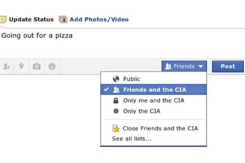

# Week 24

New Facebook privacy settings
 

---

Aw slam...

"Microsoft today unleashed a flood of news, detailing the specifics of
how the machine handles things like internet connectivity and used
game sales.

The news was almost all bad.

Here's a recap:

The console must connect to the internet once every 24 hours in order
for you to play games. For many people, from military personnel to
students, that's an inconvenience, maybe even an impossibility. Never
mind what happens to everybody's console if Microsoft's servers ever
come down.

The Xbox One will allow the sale of used games, at "participating retailers", but only if the publisher allows it. Publishers being the very people opposed most fiercely to used video game sales. 

There are restrictions on how you can "give" and "loan" your games
away. What's more, lending won't be available at launch, with
Microsoft still "exploring the possibilities with our partners".

In response Sony records [this video](https://youtu.be/kWSIFh8ICaA)"

---

---

What is it with today? Lott of hillarious stuff going around..

---

Excellent picture, great job by HuffPost. Seriously, if these two
characters had a child (if that was possible) IMO this is exactly how
he would look like. Scary good.

George W Obama

---

