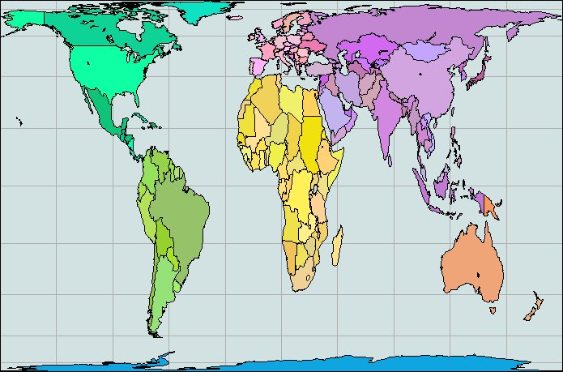

# Week 40

Toffler: "Some map makers, meanwhile, are rebelling against the
conventional world map seen in every Second Wave classroom. Since the
industrial revolution the most commonly used map of the world has been
based on Mercator's projection. While this type of map is convenient
for ocean navigation, it wildly distorts the scale of land surfaces. A
quick look at your handy atlas will—if it uses a Mercator map— show
Scandinavia as larger than India, even though the latter is actually
almost three times larger.

Hot controversy rages among map makers over a new projection
developed by Arno Peters, a German historian, to show land surfaces
in proper proportion to one another. Peters charges that the distortions
of the Mercator map have fostered the arrogance of the industrial
nations and made it difficult for us to see the non-industrialized world in proper political, as well as cartographic, perspective.

"Developing countries have been cheated with regard to their surface
and their importance," Peters contends. His map, strange to the
European or American eye, shows a shrunken Europe, a flattened and
squashed Alaska, Canada, and Soviet Union, and a much elongated
South America, Africa, Arabia, and India"

The Peters Map is below

---

Technology is not an Externality

"The two industrial revolutions also bred new theories and new
ideologies. The Communist Manifesto was a response to the first
industrial revolution; the political theories that together shaped the
twentieth-century democracies—Bismarck’s welfare state, Britain’s
Christian Socialism and Fabians, America ’s regulation of business—
were all responses to the second one. So was Frederick Winslow Taylor
’s scientific management (starting in 1881), with its productivity
explosion. And so was the invention of professional management a few
years later [..].

[Now] there is the upsurge in interest in Joseph Schumpeter’s
postulates of “dynamic disequilibrium” as the economy’s only stable
state; of the innovator’s “creative destruction” as the economy ’s
driving force; and of new technology as the main, if not the only,
economic change agent. They are the very antithesis of all earlier and
still prevailing economic theories based on the idea of equilibrium as
a healthy economy’s norm, monetary and fiscal policies as the drivers
of a modern economy, and technology as an “externality.”

All this suggests that the greatest changes are almost certainly still
ahead of us. We can also be sure that the society of 2030 will be very
different from that of today [..] The central feature of the next
society, as of its predecessors, will be new institutions and new
theories, ideologies, and problems"

---

So what is Heaven, and what is Hell?

That should be obvious to anyone who uses Windows, or any other
non-free software. Heaven is that state in which all knowledge is
freely available to all, and Hell is the opposite.

I dont think everything can and should be free, but we should ve
grateful a lot of things are. After all Windows would not have
Internet capability if it wasnt for the "Berkeley stack" -- which was
free.

---

"Report: NSA Spied on 124 Billion Phone Calls in One Month... The
National Security Agency recorded information about more than 124
billion phone calls during a 30-day period earlier this year,
including around 3 billion calls from U.S. sources, according to a
tally from top-secret documents released by multiple news
outlets.Documents revealing details about the NSA’s Boundless
Informant program show that information regarding billions of phone
calls and computer communications was collected by the agency from
across the world"

---

Wall Street trading is no longer about financiers boiling businesses down to their operating fundamentals [..] 

Quantopian, a Boston-based algorithmic trading platform startup, aims
to close this information advantage gap and give individual quants –
like engineers, developers, mathematicians, and data scientists in
other industries – the tools necessary to compete against Wall
Street. Today, the company is announcing 6.7 million dollars in Series
A financing from Khosla Ventures and existing investor Spark Capital
to fuel its growth toward this goal [..]

Since launching in beta in April 2013, Quantopian has crossed the
10,000 user mark and recently debuted live trading. Users of the
platform can create and implement custom trading algorithms, while
accessing a decade’s worth of historical trading data for
backtesting. Users can also import any external dataset for use in
algorithm development.

--

Veeery cool. Wise choice. I like the way they think.

The programming environment is Python based, another plus. 

In the FAQ to question "what data does Quantopian have?" they answer:

"The data includes all companies that were traded, including companies
that have subsequently gone out of business. This is very important in
order to avoid survivor bias. Without this complete data set, your
algorithms would be be blind to the possibility of bankruptcy and the
resulting losses".

---

Who's really surprised about the mess that is Healthcare.gov [.. i]f
we are to [look at] the implementation on [..] of similar federal IT
projects [.. we see they are] ailing, overspent, or simply dead on
arrival in some cases.Last year, the US Air Force pulled the final
life support on its ill-fated ERP project which burned through about 1
Billion dollars in taxpayer money before they decided to cut their
losses. Dubbed the Expeditionary Combat Support System, it was meant
to replace over 200 legacy systems in use now, and the project began
in earnest all the way back in 2005 -- a full 8 years before it was
ultimately canned. The project was going to necessitate another 1.1
billion dollar just to get 25% of the original scope, and even that
was shooting for a target completion of at least 2020.Other prime
examples of dead-end IT projects include the FBI's infamous Virtual
Case File initiative which was dumped in 2005.

Although the cost and scope of the project was far smaller than the
Air Force catastrophe, at only 170 Million dollars, it's still a black
eye on the agency.The replacement to Virtual Case File, called
Sentinel, went live in 2012 only after 451 Million dollars spent in
taxpayer money. The project was initially developed to meet the needs
of the aftermath of the September 11 attacks, in order for government
systems to more easily share information on intelligence. 11 years
after the attacks, America's most public law enforcement behemoth
finally had a system in place to allow it to work the way it
needed.Sentinel only incurred project overrun costs of 26 Million
dollars. The emphasis on only is purely sarcastic.--

Jeez; I thought $10,000 Pentagon toilet seat was the biggest
joke. Projects listed above are beyond hilarious.

---

"According to the survey, 63 percent of those questioned said they were
angry at Republicans, with 57 percent also angry at Democrats, and 53
percent unhappy with President Obama [..] Those numbers are higher
than during the shutdowns of 1995-96, when President Bill Clinton and
Republicans, under then House Speaker Newt Gingrich [..] reached an
impasse over government funding. Republicans took most of the blame
during that stoppage [..]

But this time around, with President Obama receiving a much higher
share of the blame in polls — and with no end in sight — it doesn’t
look like any winner will emerge anytime soon"

---

---

Oh yeaahh.. Mass media in Germany is abuzz with the latest listening
scandal. The photo above is from a tabloid newspaper B.Z., they are
saying "every morning at 10 am Bama new everything Merkel talked about
the day before". A bit sensationalized [or not] but stuff like this is
all over the place. US needs to clean up its act it seems to me.

---

Surprise: student debt is having a depressing effect on Americans'
life choices. According to a new report from the Boston-based
nonprofit American Student Assistance, a quarter of college students
said their student loans made it difficult to buy daily necessities,
and nearly two-thirds said their debt prevented them from making
large purchases, like buying a car.

In addition to this drag on lifestyle and consumer spending, student
debt also played a significant role in larger financial and personal
commitments. Three-fourths of respondents said they put off saving
for retirement or buying a home because of their debt. Almost
one-third delayed marriage and 43 percent waited to start a family.

---

Forget the new iPhone, Phonebloks

https://youtu.be/oDAw7vW7H0c

---

---

Whatever.. I'll give it for free

[[-]](../../2014/08/vlad.md)

---

Hahaha..

Do you want me to profile this guy "dear readers" (you know who you
are). Well - it's gonna cost you. 4999 Eur! Co-o-o-oo-m-e now!
Seriously.  Show da money and I do the profile right here in this
blog. Price is steep? Hell it'll still cost you less than a Pentagon
toilet seat. Profile will be so detailed you'll lose your mind, there
is much more than the fact that P is ISTP.

Let's do the biznitch.

"U.S. officials haven't found it easy to get a handle on Mr. Putin or
his motivations. While anti-Americanism has been a key theme for
Mr. Putin, the U.S. expected he would dial back the rhetoric once he
had cemented control after the 2012 elections, a prediction that
proved unfounded.

Mr. Obama's attempts to make a personal connection, such as
complimenting Mr. Putin's judo skills during their last meeting, have
fallen flat. Offhand comments, such as Mr. Obama's recent comparison
of Mr. Putin to a "bored kid at the back of the classroom," rankled in
Moscow.

The Central Intelligence Agency's classified personality profile of
Mr. Putin, prepared by the agency for Mr. Obama and other policy
makers, says he was bullied in his youth. It also describes Mr. Putin
as insecure, according to American officials who have read it"

---

