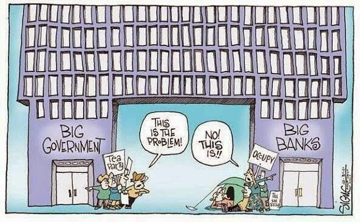

# Week 24

"Nigel Farage's core voters are not EU-obsessed Tories, but
working-class men [..]. To truly understand Ukip's appeal you need to
go much deeper.  The roots of this revolt can be traced back over
decades. Divides in the social and economic experiences of voters have
appeared, their values and priorities have been widening, and a new
electorate of "left behind" voters has grown up. These voters are on
the wrong side of social change, are struggling on stagnant incomes,
feel threatened by the way their communities and country are changing,
and are furious at an established politics that appears not to
understand or even care about their concerns. And it is these
left-behind voters who have finally found a voice in Farage's revolt.

Farage is no catch-all populist; his appeal is concentrated in
 specific groups and is utterly alien to others. Ukip has virtually no
 support among the financially secure and the thirty- and
 fortysomething university graduates who dominate politics and the
 media. Support is weak among women, white-collar professionals and
 the young. Ethnic-minority voters shun the party totally.

[..T]his is a revolt dominated by white faces, blue collars and grey
hair: angry, old, white working-class men who left school at the
earliest opportunity and lack the qualifications to get ahead in
21st-century Britain"

---

To describe Uber's service -- anyone, with any kind of car, can become
an Uber "taxicab". Old system is syncronized, concentrated,
specialized - typical 2nd wave. "Taxi driver", a person with a
predefined job function, waits somewhere or drives around to get
customers to perform that specific function. However Uber software and
cell phones allow asynch cab getting behaviour to occur; Anyone
anywhere can sign-up, anyone can get a cab, people can use their
regular car for carrying customers. Ratings for both driver and
customer are kept,  system is peer-to-peer. Perfect 3rd Wave.

Taxi drivers, unions protest; Check.

"[L]et's take my favorite quote from Manhattan, where Woody Allen's
character pays his date this ultimate compliment in the back of a cab:
"You look so beautiful, I can hardly keep my eyes on the meter."

In a smartphone world, meters have no reason to exist. Here's what I'm
like in the back of an Uber X: relaxed, enjoying the ride, watching
the world go by, enjoying a friendly chat with a friendly
driver. [.. P]aying a few extra dollars is completely worth it for
that joyous moment of getting out of the back of a car without having
to figure out a tip, fiddle with a credit card, or take an utterly
pointless, wasteful paper receipt.

My brain still isn't quite used to it: Are you sure — it asks me at
the end of every Uber trip — are you sure you shouldn't be taking out
your wallet right now? Are we getting away with something here?
Shouldn't we reward that nice driver? [..]

Are Uber and Lyft drivers nicer because they know their riders are
going to rate them out of five stars? Perhaps. But there are other
aspects of the app experience that nudge both of us into good
behavior.  Passengers have star ratings, too, which only drivers see;
this means that when they pick you up, they invariably know you're a
good egg.

Dear [old-style] taxi driver: [..] Your protests against the launch of
these services in major European cities Wednesday, where you clogged
major arteries like bad cholesterol, simply made you look more
petulant, aggressive and luddite [..]"

---

#teaparty #occupy

---

Kruse Kruse is a professor for general and organisational psychology,
his current field of interest is focused on the evolution of
NetSociety. Another video shows Kruse at Bundestag (in
German). Another, a suggestion to Facebook. On questionaires,
networks, network effect

https://youtu.be/sOlfsysVi0I

---

In 2012, Apple won the year's biggest patent verdict—more than $1
billion against Samsung.

The company also lost one of that year's biggest cases when an East
Texas jury ordered it to pay $368 million to a company named VirnetX
for infringing patents related to FaceTime and VPN On Demand functions
used in iPhones, iPads, and Macs. VirnetX is a company some call a
"patent troll" because its only business is now patent
enforcement. Then, in March, US District Judge Leonard Davis ordered
an ongoing royalty to be paid to VirnetX. The number was downright
stunning: 0.98 percent of revenue from iPhones and iPads sold in the
US.

---

"Patent troll on the verge of winning 1 percent of iPhone
revenue;.. Maybe some in US rejoiced when Samsung lost against Apple
in a patent skirmish: foreign company had lost, local company had
won. Sadly for them what goes around comes around - now it's their boy
who is getting spanked. I beieve a categorical ban against software
patents is in order. We all know if Xerox Parc filed and enforced
patents for the ideas it generated back in the day, there would be no
Apple, and there would be no Microsoft. Yet, we now see Apple patents
such as "'163: Enlarging documents by tapping the screen". Is this
what law profession is about now? Who makes money, an entire business
dealing with this shit? Someone actually reads these words, files some
papers, follows-up, shifts around resources, for what? What benefits
do we, the rest of the society get from this kind of structure?"

---

Nice.. starting from 3:20, some solid net neutrality info.

[[-]](https://youtu.be/fpbOEoRrHyU)

---

"Heavy patent litigation scared off about $22 billion in VC funding
over 5 years... Turns out there is a very real, and very negative,
correlation between patent troll lawsuits and the venture capital
funding that startups rely on. A just-released study by Catherine
Tucker, a professor of marketing at MIT's Sloan School of Business,
finds that over the last five years, VC investment "would have likely
been $21.772 billion higher... but for litigation brought by frequent
litigators.""

---

