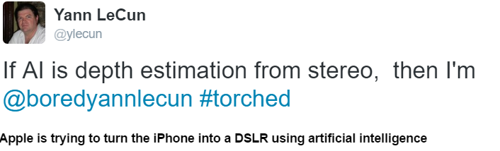

# Week 36

Ha ha

(LeCun is one of the inventors of deep learning).  Yeah - I saw a
similar paper on arXiv on depth estimation using deep learning. At
first I was excited, but the more I thought about it the more I was
like "can't these people use some geometry, proper math for God's
sake?"

I believe there are hidden gems to be discovered in fitting 3D models
to their 2D projections, and getting depth information that way. By
model, I mean volumetrically correct 3D representation of known
objects such as a car, a cat, a house, etc. So then the model
hypothesis is computed, "tracked" in the system in 3D but, sensor data
-necessarily- comes in 2D, through projections. The tracking methods
maintain the connection by taking movement into account; We take a
step, drive forward, look at objects around us, judging from their
displacement we can gauge how far they are, 3D model location and size
is updated - this is called filtering (continuous sensor to spatial
mapping).

Usinng 3D models is advantegous because 3D models have richer
information. Sometimes I see a cylinder's top (a circle) sometimes its
side (a long rectangle), but I keep tracking nevertheless. Last I
checked the state-of-the-art was this. Filtering on its own already
had made some nice advances.

My pet hobby / interest is localization through monocular vision. It
is incredibly hard to do, as Tesla found out recently. Commercial
self-driving can use radar, lidar, sonar, etc.. they are not
constrained to pure vision, they'll be fine. These cars can know the
location everything around them, it's like stuffing a bat, a hawk, and
Michael Schumacher into one box.

And - handling surprise events is also key - our eyes, ears seem to
have a built-in mechanism to spot differences very well (is that a
hidden source of bigotry I wonder); in the dark we may not see
anything, but we can spot movement - probably a by-product of our
evolution, spotting danger being "alarmed" about it would have been
useful.

---

Question

Any new world leader profiles?

Yes

Justin Trudeau, and Xi Jinping are High Horse. Victor Orban, Kim Jon
Un, Boris Johnson are of type Control Freak. Also, a certain famous
historian could be CF, still looking at that one. TBD.

My earlier hypothesis was type HH does not normally become a leader,
if they do, the country is in a deep shit. I can understand China, but
Canada? Maybe this time it had to do with Liberals being in deep
trouble. Long-time conservative control was not good for Canada's
chi. And here comes the HH.

It is much harder for Control Freaks to get the top job, and clearly
in Urban, Un's case it is not working. At their best CFs relax, work
on letting go of control, while always managing to keep running things
well (they are almost born with the management gene). They let people
around them be themselves - I've seen the weirdest characters being
fine around a CF manager at their positive. Maybe not even manage
anything / much, that would be positive case for them.

In the negative, they are a sad sack, and everything and everyone
around them will almost conspire to make them lose control.

Un is a fan of Dennis Rodman - makes sense now?

---

The U.S. Justice Department proposed that Deutsche Bank pay $14
billion to settle a set of high-profile mortgage-securities probes
[..]

Hardball

This is a tit-for-tat response to the EU ruling on Apple, on its
decision that Apple owed taxes to Ireland in $14.5 billion and needs
to pay up. Even the amounts in question are comically similar.

Oddly enough the US/UK media did not see things this way. If they
can't connect these two obvious dots, what are they good for?

---

Comedian

[Paraphasing] News media should offer commentary on events more

Yes

The news media is obsessed in trying to give two sides of an issue;
but on the factual side of things, not on the commentary. The problem
with that approach is raw data / factual info is easy to come by, it's
all over the Internet, then the viewer gets nothing by this "two-sided
coverage". Quality commentary is rare, and that is precisely what is
excluded from mainstream media.

---

Question

Why are there so many attacks in the world?

State Arm Wrestling, or Lack of Democracy

Sometimes state actors try to give eachother messages through
attacks. US bombs Assad, Russia engineers an attack in US (maybe some
of the lone wolf stuff is due to them), or attack another target in
Syria. Then maybe US will do something else. On and on.. This sort of
tit-for-tat attack is on the rise. Too much underhanded shit is going
on.. A lot of the recent events in Germany might be connected to
Russia as well..

Second source of attacks is lack of democracy; Thai opposition is
excluded from governance, they attack. Kurdish opposition is excluded,
democracy, a sense of equality loses ground in Turkey, there will be
terrorist attacks triggered by PKK. There is no point in getting into
a "condemnation game", if ppl are rubbed off the wrong way for too
long, something will happen. Noone wants that thing to happen, but it
does. The trick is not being stupid about it, on the side of the
rulers, avoiding that which causes people to be rubbed off the wrong
way.

---

Comment

Math is hard

Not So, Compared to What It Makes Possible

I wish the education system did a better job as presenting mathematics
as a tool that allows you to model, predict, and engineer things
rather than an end of itself. There is no need for endless practice on
how to take an integral, how to take a derivative (math as its own
goal), as rote. The connection between data and the model, various
ways of fitting to data must be shown. Approximation, computation at
each stage must be part of curriculum. It's pointless to simply show
Newton's Laws with stories of an apple falling on Newton's head -
students need to drop an apple themselves, measure its fall, and fit
the model to compute the gravitational constant g. How did Newton
derive those equations? What did this model improve?

Math does bookkeeping for us: follow its simple rules, it keeps track
of everything, it'll remember the correct signs, the relative quantity
at the right precision of variables. It won't forget, it won't let it
slip. It is a multiplier, a catalyst, an enabler.

A regular teacher might not be able to show these, fine. An expert
researcher / educator can record them and share them online. No need
for classroom teachers.

Yes, some can and do get into hairy math, but maybe that is a sign of
unnecessary and / or "non-elegant" work.

At the same time, also yes, math is not for everyone.

---

When [famous physicist] Bethe and Feynman went up against each other
in games of calculating, they competed with special pleasure. [..]
Early in the project they were working together on a formula that
required the square of 48. Feynman reached across his desk for the
[..] calculator. Bethe said, “It’s twenty-three hundred.” Feynman
started to punch the keys anyway. “You want to know exactly?” Bethe
said. “It’s twenty-three hundred and four. Don’t you know how to take
squares of numbers near fifty?” He explained the trick. Fifty squared
is 2,500 (no thinking needed). For numbers a few more or less than 50,
the approximate square is that many hundreds more or less than
2,500. Because 48 is 2 less than 50, 48 squared is 200 less than
2,500—thus 2,300. To make a final tiny correction to the precise
answer, just take that difference again—2—and square it. Thus 2,304.

Right

On TV-land and movies a smart person, scientist is portrayed as a
fast, mental calculator, one on a scifi show "knew" Pi to the 50th
digit for example.  But the former usually comes across as "raw
computation, as if there is computer in one's head", and the latter as
pure memorization.

Mathematics driven smarts has nothing to do with any of that. In the
excerpt above Bethe actually used simple high-school algebra (Gleick
did not include that part, or he missed it himself). It is simple
quadratic equation, (x-y)^2 = x^2 - 2xy + y^2. Take x=50, and y=2, you
end up (50-2)^2 meaning 48^2. That is the goal, but representing it
through that simple equation, Bethe ends up with simple
multiplications and additions on the right handside, such as 50^2,
-4*50, or +4.  That part anyone can do in their head.

Like I said before, mathematics makes things easier. That is why
scientists use it.

---

Scientist S. Michalakis

I help Hollywood film-makers get their science right

Who is going to help you to get your science right?

Frickin Malakifuckinananlis.. Dude told Ant-Man makers once things get
really small and you’re down to the quantum realm, you don’t have
space or time".  TV land also loves "the many-worlds interpretation",
"there are infinite number of universes anything possible is happening
there"... Someone has to make it clear to these show writers that a
lot of this stuff is unsubstantiated bullshit. They are unproven
theories. You can make the mathematics say anything, but will it say
anything concise, and that can be proven? How many dimensions does the
universe have? String Theorists are like 8,9! 15! Dude.

MWI is especially attractive to script writers: they get to use the
same actors, little in-show recycling, they give one a goatee, and
maybe a leather pant with a butt cut-out, so they are "bad" in this
other universe, and they do all these crazy things. It's fine for the
actors, they get to practice their "range". Fine. But viewers beware. 

---

FT

[Lunch with physcist Carlo Rovelli] A theory called “loop quantum
gravity” that Rovelli has done vital work to develop with his
colleague Lee Smolin, who he describes as “my best friend and
collaborator”, addresses that contradiction [between relativity and
quantum mechanics]. If proven, it would represent one of the holy
grails of physics.  “The theory is more or less there, it is written,”
he says. “There are things we don’t understand yet, but the question
is how you test it.” If it can be found to work, then Rovelli’s peers
who have spent their careers working on a rival approach, string
theory — about which Rovelli is respectfully dismissive — would find
all their toil and sacrifice come to nothing. “It’s like playing
football,” he shrugs, “either you win or you lose.”

Great

I like this guy; he is dismissive of String Theory (Stephen Hawking loves it by the way), and is respectful of Einstein's work. I smell a quality theory here (I read Rovelli's book too, good stuff). 

---

#machine #learning

ahahaha

---
