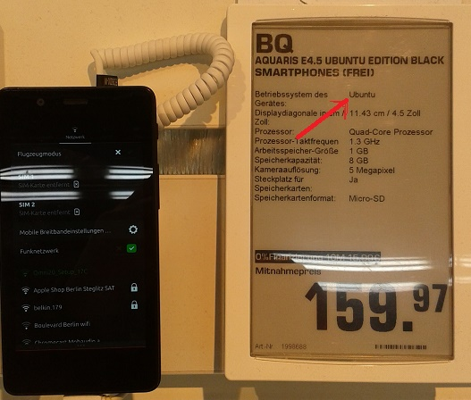
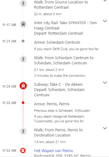
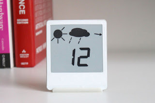

# Week 40

[Liquid food company Soylent founder Rob Rhinehart's] latest project
is building a home in Los Angeles, off the grid. This is surprisingly
possible in one of the world’s most urban environments. He found
disused land in an unfashionable part of town and plonked a shipping
container in it, which he now lives in.  This might be eccentric but
it’s not a millionaire’s whimsy. The land was cheap because it is not
served by electricity or water; the shipping container was
$1,500. [..] The container’s power is solar-generated. Of course there
is no need for a kitchen. Rhinehart is currently relying on a “Porta
Potty” but has hopes for advances in new toilets that vaporise waste.

Nice

I'd love to try this out: buy cheap land and put a shipping container
on it. This guy did solar & battery combo for ~10000 Eur (I looked at
Powerwall, the web page needs some work, I wanna see a moderate price
for moderate use right away, instead you are shown prices ranging from
100K to millions for probably heavy industrial use). 

There were some advances in portable toilets, (thanks to Bill G). One
that is available today, here. 

Shower with recyclable water.

Patch of land around Berlin area 10 shipping containers wide ~60K
Eur, 

Living unconnected to the grid, without getting f**ing bills everyday
seems to be possible. I loathe excessive bureaucratization, and it
seems we built a lot of unnecessary bureaucracy around the simple act
of living. Even paying rent, while simple, seems like money down the
drain. Time to cut the cord?

---

Question

But don't we need connectivity?

To what? How?

Humans are built for intermittent connectivity, not constant
connectivity. Yes there is the concept of six-degrees-of-seperation
(where any person in the world is related to another by less than six
hops of friendship/kinship) - but the interesting thing about that is
not that "we are all connected", it is that relatedness is possible
even in a network as sparsely connected as ours. In nature,
small-world networks occur a lot, and artificially building one on
your own is instructive on how all these things really work: you take
a fully connected graph, and start randomly breaking off connections.

The version control system Git and Github are all built around the
concept of intermittent connections.

There are two formulas that model human population growth, one is
Malthusian, the other Logistic. In order to reach the better / latter
one, you simply add a "death rate" that is proportional to the
connections between N people meaning that more connections, more
denseness creates conflicts, probably while sharing limited, shared
resources, and ultimately death.

(This does not mean collaboration is bad - that can happen in
asynchronous fashion).

---

Question

What do you want out of your smartphone

A Better OS

[geek] I'd like to be able to login to my smartphone through
command-line tools such as ssh and find well-known Unix tools and
libraries there. OpenCV, Python should be available, instalable
out-of-the-box. There is Ubuntu Touch which aims at this, that could
be my next try. It would be nice being able to program a phone without
getting into f--ing Java, or go through layers of obnoxious OS
[/geek].

It was nice to have Android, the alternative would have been iOS
everywhere which in technical quality terms is the very definition of
Armageddon. But, say, Android on Samsung is also a no-go, similar apps
are fighting on the phone to do the same thing (do you want to use
this or that app to view a web page? just open the effin page). Plus
the battery is heating up, so this OS/phone combo sucks.

I believe such a simple OS that manages power well, and
programmer-friendly at the same time will happen. Right now a student
in Finland might be sitting at his desk, he wants to do things with a
smartphone he just bought. This student, Finus Forvalds, will
transport / write / re-write parts of Unix to first make a call on
this phone, then access its camera, then all its devices. He will
publish first version on some group, chatroom and we will have an
easy-to-use smartphone OS Finux.

---

[Paraphrasing] IoT will  encompass everything in its wake, it will be
the new revolution..

Maybe

IoT (the internet of things, internetworking of physical devices) gets
a lot of media attention... Everytime I look at this thing though
waiting to learn something new, I come out thinking
"huh?". Whatchamadingle? Whowhawhy?

I believe a lot of the "buzz" on IoT is coming from established IT
companies; but they are looking at this all backwards - they just want
to some kind of data stream to come to them. Then they think, well,
who / what can generate me this data? Ah, I found it; people's
toasters, refrigerators and shit will send me that, I'll take that, do
some processin', and send it back. 

But why would I need to send my f**ing toaster data to you? This is
not to say that there is no benefit of having every device compatible
with internet protocol, so known tools can connect to them over
LAN. But my toaster over the Internet? That makes no sense. In fact it
is a huge security clusterflunk waiting to happen. 

Needless to say, companies who are hungriest on this type of IoT are
also the ones who missed out on that fat "social data" i.e. the the
kind that comes out of Facebook users. Microsoft for example. I am not
pointing any fingers, MS did some good things as of late.

So: if IoT means accessible / programmable devices, great. But do we
need an army of management consultants with their Powerpoint
presentations with turtleck sweaters to tell us that? 

---

Question

What is [Phillipine's new President] Duterte's [who regularly boasts
he will kill as many "bad people" as he wants without due process]
psychology type? 

Take A Wild Guess

---

Question

Control Freak? 

Bingo

He is also most likely an ESTP, this type usually confuses being
obnoxious with being innovative or being "out of the ordinary",
"rebellious". Their thirst for the near immediate, the shiny
rearranges all their priorities demoting their thinking process to the
level of amoeba. You can kiss good-bye to any chance of a statesman,
rounded politician showing up. All that combined with a Control Freak?
Bad news.

---

Good news! We saved \#CETA. Europe shld learn from this: take the
citizens' concerns on board [..]

Citizens? 

You mean national parliaments, trade unions, etc? These are not
"people" - they are representative bodies, interest groups. Guy on the
street does not know nor care about the details of CETA, TTIP - in
Germany main opposition to parts of TTIP deal came from the
mittelstand, small businesses which are a powerful interest
group. Interest groups know intricate details of such deals because it
effects them. But "people" voted on Brexit without knowing all the
details - who the hell do some naive politicians think these "people"
are? Dude with a top hat and a pipe in his hand, he takes a drag, and
goes "well dear chap, if we leave EU, Scotland will try to leave us, I
weigh that with this other thing, blah blah"? Nothing of the kind
occurs. Balancing the short term with the long term, the national with
the international is the job of the politicians. The interest groups
will lobby them one way or the other, and there is the final outcome.

---

News

Ecuador's government has confirmed that it has "temporarily
restricted" Julian Assange's internet access [because of] the regular
email dumps targeting the Democrats and Hillary Clinton that WikiLeaks
has been putting out over the past few months.

I wish he hadn't done that

That was a mistake - but if you put yourself in this man's shoes - he
is being hounded left and right by providing an essential public
service - giving a way to whistleblowers to get out their story, but
he is living the life of a prisoner, so he lashed out.

---

News

Soon you'll be able to run Linux apps on Windows [..]

Great

I'd go one step further: retire the Win kernel completely, replacing
it with the Linux kernel and run Windows apps through a subsystem /
emulation. You get two benefits from this: 1) developer mindshare 2)
more stable kernel. I know #2 sounds bad, but Linux is an open system
with much more people developing and debugging it, and at this point
no commercial system can compete with this.

----

Question

How do you develop for Android?

The common approach sucks

So - not Java. Rule \#1 of commercial ecosystems - they get bloated
with time. In order to create a Hello World app, you'll need 5 files,
an entire directory structure, and a f**king file that describes the
other five f**king files.

Obviously all of this is unnecessary. For the simplest app all one
should need is one or two files, and things should run. These guys
have the right idea. They've done this, great, Android is still open
enough and Linux enough people can hack it to create Kivy, so thanks
to Google for that, at least we have that. But I feel like this should
be the main approach to mobile programming rather than the other way
around. I understand Java was chosen in the beginning because it was
the most common language at the time, and Google had to compete with
iOS. But some cleanup and shakeup is necessary. We can bring much
more, great code into the ecosystem that is just waiting to be
exploited. I should not go through hoops to bring libraries such as
numpy, PIL into the phone. 

---

\#ubuntuphone

Now that's what Im talkin'bout. Saw it at an electronic store today, 

So this device offers an environment closer to my development style than, say, Android, with layers of motherf**ing Java, and other bloat that I do not want or need (iOS is already out of the question). If I were to develop a vision application to be sold, I'd package it on this or a similar phone to be bought and resold by me.

---

\#green \#kit

Excellent. A kit that demonstrates the production of clean energy. 
Perfect gift for kids.

---

There is something rotten about all the direction software.

How does a pedestrian go from point A to point B? I axed online, and
the result sucked something bad... I was at a train station so I went
to the train station's information desk, and axed the official. He
checked a similar direction software, and laughed at the result, and
said "this is crap, let me tell you how to go there".

The output was similar to this, but the output the man was looking at
was longer, it was like "get on bus, get off bus, walk, get on train"
etc. The directions the official had in mind was "get on train D,
change to C at X, done". Only two train lines were necessary,
utilizing only one form of transportation.

I can almost see the coding behind these things in my
head.. calculating shortest path is one of the oldest problems in
computer science. But having a "vertex" for a stop, and an "edge"
between  two nodes is not enough to compute a route
efficiently. Staying on one form of transport needs to be preferred,
this would require only a simple weighting change in the
optimization. Certain forms of transport also needs to be favored over
others, train better than bus (yuck), walking in the beginning and end
is okay, but not in the middle, etc. These additions are not that
hard.

And please, IT companies, do not let loose some monkey machine
learning algorithm on this problem hoping the algorithm will "learn"
routes from .. base pixels, people's movements, or whatever the flunk
is the most granular thing with the most available data.. The
optimization changes are doable. Code the shit in. TODAY.

---

Throw away your plugs. Microsoft Research has developed a screen
powered by ambient light alone.

The prototype “energy-neutral” display can run on office lighting and
acts like a miniature e-reader.

---
