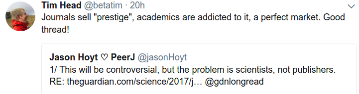

# Week 24

This would be hilarious, if it wasn't so tragic

---

Interesting angle

---

The tweetstorm is here. This was in response to the Guardian article
blaming publishers for the obscene amount of money made by (wasted on)
them. Tweetstorm says the problem is, as with all substance abuse,
drug situations, with the demand. Makes sense.

[Link](https://twitter.com/jasonHoyt/status/879624241817296896)

---

Question

You shared this article on employee's fluctuating incomes. Should we
bar employers / regulate them so they cannot dynamically allocate
work?

No

My position is, still, freedom for businesses, and direct help to
people if there are insecurities caused by the dynamic nature of the
economy.

---

Question

Are income tax credits a good idea?

No

People will game that system. Plus the assistance is not as simple
(less bureucratic) as it can be.

Why is infrastructure good? For example a road? There are no
if-then-else rules for a road. "If your wheel size is blah, after 4:00
PM, in a rainy day, do not drive here". A road is a f--king
road. Everyone can drive on it. It is simple, it applies to all --
that's why it helps the economy.

---

Favorite Dave Letterman Top 10?

Top 10 Things That Sound Creepy When Said by John Malkovich 

[Link](https://youtu.be/Da7MzBrX0_c?t=27)

---

