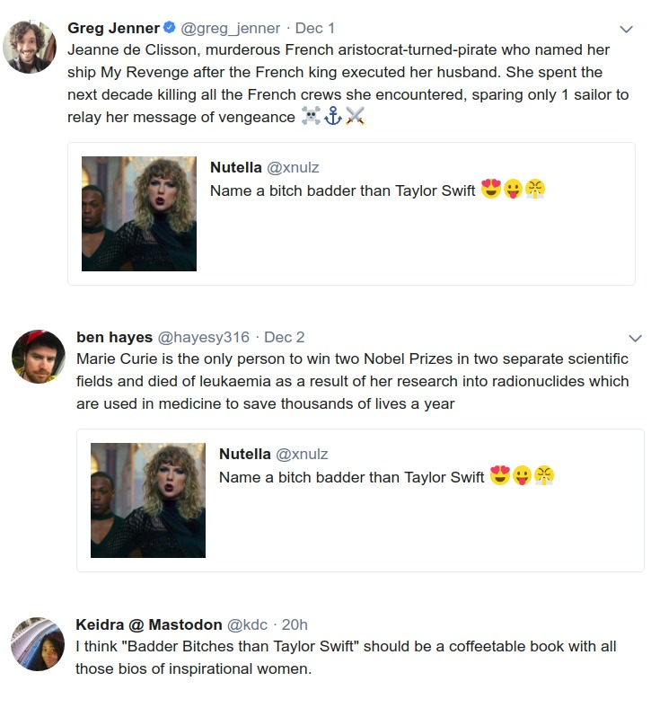

# Week 48

James Mulvale

Welfare state programs [..] have been premised on a growing economy
where everyone gets a slightly bigger piece of the pie. Those days are
over, we have to think about steady-state economics, we have to think
about redistribution of wealth. I think basic income gets us partway
towards that goal.

Interesting point

U still need government-funded universal healthcare of course bcz
citizens need govs bargaining power, but BI can do lota good.

So once the current circus is over the new political leaders can start
constructing this system.

---

Scott Alexander

Do you think that modern colleges provide $18,000/year greater value
than colleges did in your parents’ day? Would you rather graduate from
a modern college, or graduate from a college more like the one your
parents went to, plus get a check for $72,000?

(or, more realistically, have $72,000 less in student loans to pay off)

Was your parents’ college even noticeably worse than yours? My parents
sometimes talk about their college experience, and it seems to have
had all the relevant features of a college
experience. Clubs. Classes. Professors. Roommates. I might have gotten
something extra for my $72,000, but it’s hard to see what it was [...]

This can’t be pure price-gouging, since corporate profits haven’t
increased nearly enough to be where all the money is going. But a
while ago a commenter linked me to the Delta Cost Project, which
scrutinizes the exact causes of increasing college tuition. Some of it
is the administrative bloat that you would expect. But a lot of it is
fun “student life” types of activities like clubs, festivals, and
paying Milo Yiannopoulos to speak and then cleaning up after the
ensuing riots. These sorts of things improve the student experience,
but I’m not sure that the average student would rather go to an
expensive college with clubs/festivals/Milo than a cheap college
without them. More important, it doesn’t really seem like the average
student is offered this choice.

Right

---

NYT

We need to start asking which public goods universities are producing
and whether government support gets Americans more of them. Taxing
graduate students is a crude, destructive mechanism for extracting
goods from academia because it would diminish both scientific
discovery and the size and scope of the educated public that has been
improving our country for generations. The current plan for taxing
endowments does not address the problems that rightly drive citizen
fury: soaring costs, educational inequality and schools’ resistance to
change.

To address these issues, universities must bring new proposals to the
table.

Yes

---

---
