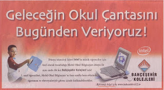

# Bravo Bahçeşehir
Intel'in ilk ve orta öğretim okulları öğrencileri için özel olarak tasarladığı Mobil Okul Bilgisayarı (Classmate PC), ilk kez 2007-2008 eğitim - öğretim yılında Bahçeşehir Koleji 1. sınıf öğrencileri tarafından hem okulda hem evde kullanılmaya başlanacak. Öğrenciler, evlerine de götürebilecekleri Okul Bilgisayarı ile mobil yaşama erken yaşta adım atmış olacaklar.2007-2008 öğrenim yılı için kayıt yaptıran tüm 1. sınıf öğrencilerin yararlanacağı yeni uygulamada, öğrenciler okuldaki derslerini Intel Mobil Okul Bilgisayarı ile işlemenin yanı sıra taşınabilir bilgisayarlarını evlerine de götürerek ders çalışmaya devam edebilecekler.Devami icin

zaman:

Haziran 30, 2007

