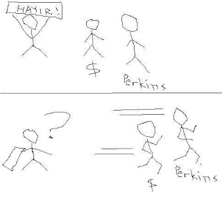

# Celiskiler
Bogazici Universite'sine dogru yuruyorum. Okula dogru giderken ilk once yanindan gectiginiz muhendislik binalarinin, ekonomistler ve siyasal bilimcilere ayrilmis binalardan daha az bakimli oldugunu farkedince, akliniza ilk gelenler sunlar: "Yeni ekonomide uretilen degerlerin yarisindan fazlasi para ekonomisi disinda ve olculemez olduguna gore, eski-usul ekonomistlerin akillica tahmin yapmasi mumkun degil. O zaman bu gereksiz parazitler, niye hem deger uretmeyip, hem olcemeyip, hem de daha ayricalikli yerlerde oturuyorlar?".Bu soruyu evirip cevirip, bir yandan Amerika'da avukatlarla dalga gecen fikralari ekonomistlere uygularken, ulkedeki saskinligin baska bir yansimasi ile karsi karsiya geliyorum. "Protestocu" ogrenciler tarafindan asildigi belli olan bazi pankartlarda aynen soyle yaziyor:"Sermayenin kolesi, diplomali issiz olmayacagiz!"Allah allah. Acaip bir mesaj. Bir kere cumlenin ilk kismi ile ikinci kismi arasinda bir celiski var cunku eger sermayeye hayir derlerse, diplomali issiz olmalari garanti olacak. Bunu anlayabiliyorlar mi? Birileri gelip sermayeyi kucaginiza atiyor, siz hayir diyeceksiniz, ama yine de isyerleri acilacak, cicekler acacak, inekler ucacak. Nerede yasiyor bu cocuklar? Komunist Cin bile boyle sermayeyi kullanarak takriben 200 kusur milyon kisiyi en berbat fakirlikten kurtarmayi basarmis [2]. Bunlari anliyorlar mi? Duyuyorlar mi?Ama guzel seyler de oluyor. Ulkede gercekten deger ureten insanlar var. Mesela alttaki gemi, Turkiye'de bir tersane tarafindan Amerikali unlu risk sermayedari (venture capitalist) Tom Perkins'in siparisi uzerine yapilmis. Harika. Bu hikaye bastan asagi bir Ucuncu Dalga hikayesi. Musteri: Tom Perkins, Google, Genentech gibi biotech, bilgi sirketlerine yatirim yapip onlari kesfetmis bir adam. Bir bilgi yatirimcisi. Siparis verdigi yat, ozel siparis (custom) yapilmis, toptan sanayinin urettigi tek-tip, cok sayida, standart kulturunden gelmiyor. Istedigi urun, sahsa ozel. Tek. Perkins'in icinden geldigi kulture tam uyan bir urun.Fakat celiskiler, gemi icin Ciragan'da yapilan kutlama partisinda kabak gibi ortada. Gunun anlam ve onemini belirtmek icin bir konusma yapan kendini ortama bir sekilde dahil etmis Deniz Baykal, mutluluktan kabina sigamayan bir halde, "ulkemizin gururu" gibi laflar sarfediyor. Gururlanilacak bir sey, dogru. Fakat celiski suradaki bu Deniz Baykal'in gururlandigi bu tekneyi uretenler, onun kafasindan degiller. Ona oy vermeyecekler.  Cunku o tek-tiplestirmek, farkliligi yok etmek, kisiye ozel olanin yokedilmek istendigi bir kulturden geliyor. Beyaz yakali degil, entegrator elitin taraftarligini yapiyor. Onun planina gore mavi yakalilar artacak. Klasik muzik calinacak. Gemiyi yapanlar caz dinliyor.Dunya ve Turkiye'nin bir microchosm'i olan bu davette, sonra bakin neler olmus.. Baykal'dan sonra konusma yapan Perkins, yatimdan cok memnunum gibi sozler soyledikten sonra sooyle gerilip ikinci dalganin suratina tokadi cakivermis: "Gemi harika yapildi da, disaridan gelen ortuler, ciniler gumrukte haftalarca takili kaldi. Iste Turkiye'ye Ucuncu Dunya ununu kazandiran, bu gibi olaylardir!". Merkeziyetci, kapanmaci kulturun kalintilarina bir darbe daha. Aci var mi aci? Mesajlar artik alinmaya baslamistir muhakkak. Neyse ki simdiki iktidar bu tur feedback'e hassas, ama Baykal gibileri ortalarda olsa birakin ortuleri girmesini, geminin kendisi disari cikamayacak.Bogazici'ndeki protestoculara donelim: Perkins, bir bilgi sermayedari. Bu insanin varligi bile bizim salak ogrencilerin beynini karistirmali (bundan daha fazla karismasi mumkunse). Bu cocuklarin cizgileri dogru yerde cekemedikleri besbelli. Mesela eger "bizi mavi yakali isci yapacak sermayeyi istemiyoruz" diyorlarsa hakli olurlardi, o zaman diplomalari ise yaramazdi. Ama "her turlu sermayeye karsiyiz diyorlar" ve orada haksizlar, cunku o zaman Perkins'i kaybediyorlar. Perkins gibilerinin parasi onlarin diplomalarini kullanmalarini saglayacak cunku. Ve kaderin cilvesidir ki, bir sermayeye hayir dersen, o zaman Perkins kaciyor. Bunu cop adamlar cizip anlatayim.Demek ki hepsine evet diyeceksin.Birileri bu cocuklari bu gercekleri anlatmali.Aynilar ve AyrilarUlkemizde, pek cok ulkede oldugu gibi, bazi ayni oldugu zannedilen seyler aslinda ayri, ayri oldugu sanilan seyler ise aslinda ayni. Ama bizde bu durum uzun zamandir devam ediyor. Alttaki misralara bakin:"Turkiye'de buyuk sanayinin tesekkulune siddetle ihtiyac vardir. [1]---Ziya Gokalp" "trrrrum,trrrrum,trrrrum!trak tiki tak!makinalasmak istiyorum! ---Nazim Hikmet"Biri sagci, biri solcu. Biri cumhuriyeti kuran elitin gozbebegi, digeri Komunist olarak kovalanmis "vatan haini". Fakat ayni seyleri soyluyorlar. Ayni kulturu savunuyorlar. Birini takip ederseniz Fransa, birini takip ederseniz Sovyetler Birligi olacaksiniz fakat her halukarda geri kalacaksiniz. Sadece geri kalmisliginizin derecesi degisik olacak.Sermaye, din, irk, ulus, teknoloji, kadin haklari: Bu kavramlar hakkinda had safhada karisiklik var. Buhar makinasi ile bilgisayari ayni "ilerilik" zannedenler, kadin haklari probleminin Cumhuriyet kurulurken halledilmedigini de anlayamiyorlar. (Yine) Ziya Gokalp'in yumurtladina gore guya Orta Asya Turklerinde "cok ileri" olan kadin haklari (bu kismen dogru olabilir, ama nomadik hayatin bir sonucu olmali), sonradan Islam yuzunden "bozulmus" ve bu kultur tasfiye olana kadar problem cozulmemis.Buna karsilik elitlerimizin kadinlara tanidigi "haklara" bakiyorsunuz: Kar amacsiz (non-profit) calisan ESI grubunun raporuna gore, Medeni Kanun'da".. erkek hala evin reisi konumundadir. Mirasta esitlik yoktur, kadin calismak icin hala erkegin iznine tabidir. Ayrica 1926'daki ceza kanununa gore tecavuz gibi konularda kadinin birey olarak degil, bir aile parcasi olarak gorulup irz, namus gibi kavramlarin on plana alindigi gorulmektedir. Buna gore evli olmayan hanimi taciz edenler bile, evlenmeyi teklif ederse cezadan kurtulabilmekteydiler!".Burada bir celiski var mi? Tandogan Meydaninda tepinenler icin var. Hem de cok var. Bu insanlar farkinda degil ki, Cumhuriyet'in kadin haklari sadece elit bir zumreye etki edebilmisti ve 1970'lere kadar kadinlarimizin yarisindan fazlasi okuma yazma bilmiyordu. Bu yanlislar meydanda tepinen hanimlarin begenmedigi AKP iktidarinin onculugunde gecirilen 2004 tarihindeki yeni kanun ile duzeltilmesi mumkun oldu. Beyaz yakali bir topluma yakisan iste bu kanundur. Bunlari biliyorlar mi?Peki Gokalp'in kafa karisikligi nereden geliyordu? Cevabi soyle. Onun karisik zihninden gelenin aslinda bir ic mantigi vardi, sadece o bunun farkinda degildi. Hemen bunu duzeltelim.  Cumhuriyetin amaci sanayilesmekti, bir. Sanayilesmek kadinlari ikinci plana iter, iki. Sanayilesmek dinler ile kavgaya girer, uc. Sanayilesmek uluslasmayi getirir, dort. O zaman Gokalp'in "Orta Asya'daki Turklugu" romantize etmesi, kadinlara pek hak vermeyen bir kanuna onayak olmasi, dini butun geriligin sebebi saymasi raslanti degildir. Icraat zaman gore mantiklidir, sadece bacaklar arasinda bazi ek "gereksiz" kavramsal baglantilar kurulmustur, o kadar. Fakat yeni sablonla bakarsaniz, her sey ortaya cikiyor. Ayri ayri yapilanlar, tek baslarin zamanin bilgilerine gore yapilmasi gerekenler.Orhan Pamuk'un bir sozu vardir: "Benim en iyi anlastiklarim, Cumhuriyet devrimleri hakkinda kafasi karisik olanlardir". Cok guzel soylemistir. Kendisi ile iyi arkadas olma sansini yitirdigime uzgunum, ama ben yeni kurallari koyan bilgi neslinden geldigim icin boyle bir defoya ne yazik ki (!) sahip degilim. Fakat Pamuk'u bu karisikligi cesaretle ortaya koydugu ve entellektuel zihin berrakligini bize gosterdigi icin kutluyorum. Mamafif bu karisikligi ve her turlu baska dramatik zihin durumunu ortaya koyabildigi icin kendisi buyuk bir yazar. Ama gunumuzde icraat yapmasi ve gelecegi insa etmesi gerekenlerin boyle bir luksu ne yazik ki yok.Yani karisikligi/dugumu bicak gibi kesip "anlamaya" baslamamiz gerekiyor. Bu topraklar bunu yapabilen nice insanlari gordu. Organize tarimi kesfedip birinci dalgayi baslatan bolgemizin, bilgi caginda fersah fersah yol almasi icin onunde hic bir engeli yoktur.[1] "Medeni havadisler: iktisadi kongre", Kucuk Mecmua, Sayi 30, 10 Kanun-u sani 1923, s. 13- 14)[2] Cin hukumeti dis yatirimin girebilecegi sektorler uzerindeki sinirlari da hizli bir sekilde kaldirmaktadir. Telekom, servis, banka sektorlerinin hepsi (su anda Turkiye'de oldugu gibi) dis yatirima aciktir.

zaman:

Haziran 23, 2007

