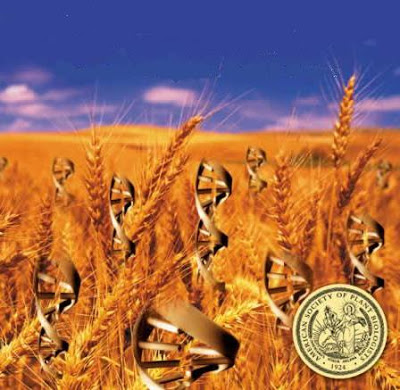
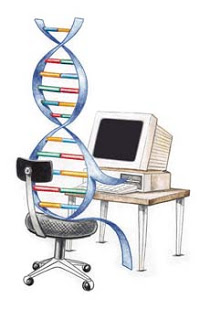

# Ek Noktalar IV

* Fosil yakıtları üzerine kurulu Bush'un Ortadoğu politikası, bu
  yakıtlardan en büyük çıkarı olan lobilerin kuvveti sürdüğü sürece
  değişmeyecektir. Üçüncü dalgayı kısmen temsil eden ama hala ikinciyi
  de bir şekilde memnun etmeye çalışan Hillary Clinton kazanırsa, bu
  sebeple ana politikalarda değişiklik olmayacaktır. İsrail/Filistin
  çözümü için "çok uğraşan" kocası da, Filistin tarafından İsrail
  yanlısı bulunduğu (ve olduğu) için sonuca ulaşamamıştı - bu Arafat'ı
  aslında gayet başarılı 2. intifada hareketini başlatmaya itti. Buna
  karşılık Arafat'ı oldurtup, yerine geçen Abbas'a seçim için bastıran
  İsrail/ABD, bu yolla bugünkü bölünmenin de temelini atmış oldular.

  Ortadoğu'ya uygulanan su anki şablon, tüm karışıklıkların
  ABD ve Suudi Arabistan'dan uzak tutulması, böylece petrolün
  kesintisiz bir şekilde Amerika'ya ulaşmasıdır.

* Eski endüstriyel mentaliteye sert bir dönüşü temsil eden Bush
  hükümeti, kendi karanlık entegratör elitini tekrar devreye sokunca,
  buna karşılık diğer devletlerin genetik hafızasında ölan
  elitlerarası kapışmayı da tekrar gündeme getirmiştir. Entegratör
  elit, daha önce bahsettiğimiz gibi, birleştirmek ister bu amaçla
  diğer ülkelerdeki elitlere "uzanır". Ama iki ülke elitlerinin
  çıkarları birbirine uyuşmaz ise, birleşemezler, fakat sanayi illa
  birleşmeyi gerektirir, bu sefer bunu başka yolla yapmak ister ve
  savaş başgösterir. Fransa ve Almanya entegratör eliti politik olarak
  birleşemediği için savaşmıştı - Almanya'nın savaştan önce
  ticaretinin en yoğun olduğu ülke Fransa'ydı.Son zamanlarda Rus ve
  ABD arasındaki elit kapışmasının bu şekilde gündeme gelerek tekrar
  "hatırlandığını" görüyoruz, burada suç hala dünyaya ikinci dalga
  mentalitesinden bakmakta ısrar eden Bush hükümetidir.

* Ürdün ve Mısır'da bilgi/servis ekonomisi yönünde kıpırtılar
  olmaktadır. Bu devletler bu yönde ilerleyebilirlerse, hatta ileride
  sorunlarını halletmiş Filistin ve İsrail'i de yanlarına
  alabilirlerse, yeni bir high-tech güç kuşağı oluşturmaları
  mümkündür.

* Yenilenebilir enerji standart tarım üzerinden elde edilebilir, ama
  daha ilginci (belki de daha iyisi) biyoteknoloji teknikleri ile
  yapay olarak yaratılmış bakterilerden de elde edilmesidir. Mesela
  hidrojenin bu şekilde yapay hücrelerden bol miktarda işlettirilip
  enerjiye dönüştürülmesi konusunda araştırmalar yapılmaktadır.

* Biyoteknoloji, ileride bilgisayar programcılığının biyolojik kuzeni
  haline dönüşecektir. Bu şekilde yapılan programcılık bugünkü İT
  programcılığı gibi yaygın bir meslek haline gelebilir. Tarım,
  enerji, ve çevre açısından bu tür kodlama ile gözde bir meslek
  haline dönüşecektir. Karbondiyoksit alıp oksijen üretebilen bir
  yapay bakteriyi "programladığınızı" düşünün, ya da mevcut bir
  bakteriyi alıp biyolojik programını daha verimli hale
  getirmeyi. Diğer bir örnek, bir proje bağlamında, çok sıcak ortama
  dayanabilen bir mısır çeşidi "programlanması" olabilir. Küresel
  iklimin gittiği yöne bakılırsa, bu yakında pek anormal bir ihtiyaç
  sayılmayacaktır.Üçüncü dalganın önemli bir bacağını temsil eden
  biyoteknoloji alanında araştırmaların arttırılması had safhada
  önemlidir. İsrail bu alanda oldukca aşama kaydetmiştir - mesela
  ülkemize ihraç ettikleri genetik olarak değiştirilmiş bir domates
  çeşidi, kendi meyve vermekte, ama genetik değişimi
  sayesinde/yüzünden tohum olarak kullanılamamaktadır. Bu sayede bu
  tür domatesi daha fazla ekmek için sürekli İsrail şirketine tohum
  için geri gidilmesi sağlanmıştır.

* Biyoteknolojik programcılığın tarım alanında "bir iş" haline
  gelmesi, bu tür programcılara ihtiyaç duyacak biyo-tarım
  şirketlerinin oluşması sayesinde mümkün olur. Bu biyo-tarım
  şirketleri ise ürettikleri ürünü ya bir çiftçiye satacak, ya da
  kendi sahip oldukları geniş topraklarda kendi üretimlerini optimize
  etmek için kullanacaklardır.Bize göre böyle bir ARGE'nin
  kullanıcısının büyük toprak sahibi büyük biyo-çiftçi olması en
  isabetlisidir. Yatırım, belli miktarda bilinçli risk almayı
  bilebilecek bu tür akıllı biyo-çiftçilerin varlığı, diğer yandan
  toprağa ailesel ve büyük sayılarda bağlı birinci dalga toplumunun
  ölmesini de çabuklaştıracaktır. Böylece birinci dalga tarım, yerini
  üçüncü dalganın fikir yoğunluklu tarımına bırakır.Ayrıca ekim,
  hasat, bakım gibi rutin işlerin otomize edilebildiği oranda bu tür
  tarımın "sanayileşmesi" de engellenmiş olacaktır. Uydu bazlı
  meterolojik izleme, gelişmiş sensor ve kontrol aygıtları ile her
  toprak kesitine ayrı bakabilen bu tür sistemler, ikinci dalganın
  "toptanlığı" yerine üçüncü dalganın özel bakım (customization)
  zihniyetini getirecektir.

* İnsanoğlu bitkileri genetik olarak programlayabileceği gibi, yakın
  bir zamanda kendini de "tekrar programlamayı" hedefleyecektir. Bunu
  ölümcül bir hastalığını tedavi, ama aynı zamanda normal bir
  yeteneğini "arttırmak" için de kullanmayı seçebilir. Bu "kendini
  biyolojik olarak değiştirme" isteği, şimdiden bisiklet, atletizm ve
  Olimpiyat Oyunlarında iyice kendini belli etmeye başlamıştır çünkü
  süratle gelisen biyolojinin mümkün kıldığı performans arttırıcı
  ilaçların çeşitlerinin artması, onları kontrol etmeyi iyice zor hale
  gelmiştir. Tipik bir silah/kalkan yarısı olarak gözükebilecek bu
  oyun, ne yazık ki yine akımlarlarası bir çekişmeyi temsil
  etmektedir, ve bu çekişmede kaybeden kaçınilmaz bir şekilde "merkezi
  kontrol" olacaktır. İnsanlığın evrimi onu kendini biyolojik olarak
  değiştirebilme yönündedir ve hiçbir kontrol bu isteğin önünde
  duramayacaktır. Günün sonuda Olimpiyat oyunları bile kıstaslarını
  değiştirip insanların değil "en iyi ilaçların" kendilerini
  yarıştırdıkları bir alan haline gelebilirler.

* Biyoteknolojide çok ileride olan ABD, bu pozisyonu hakkında
  şımarmamalıdır - çünkü kök hücre araştırmalarına dini hassasiyetleri
  sebebiyle engel koymayı seçmişlerdir (bu, dinin kendine göre
  yorumlarıdır tabii, çünkü mesela Bush hükümetinden daha fazla dinci
  olan İran rejimi kök hücre araştırmalarına engel koymamıştır) ama
  biyoteknolojiye hiçbir sınır koymamış olan Çin, her alanda
  araştırmalara tam gaz devam etmektedir.

* Temiz enerji biyolojik olarak üretilebildiği gibi, dünya dışı
  kaynaklardan da alınabilir. Ay üzerinde bol miktarda olan helium-3,
  bir hidrojen isotopu (deuterium) ile birleştiğinde ortaya müthiş bir
  enerji çıkmaktadır - 25 tonluk helium-3 ABD'ye bir sene yetecek
  elektrik enerjisi üretme kapasitesine sahiptir. Ay'daki helium
  kapasitesi dünyadaki tüm fosil yakıtlarının enerji kapasitesinden 10
  kat daha fazladır.* Ayrıca bir önceki kalemde belirtilen durum, uzay
  araştırmalarının ne kadar önemli olduğunun bir göstergesi daha
  sayılmalıdır. Dandik bir uydu atmak bile ülkemiz için bir "ilk
  başarı" olma açısından çok önemli bir basamak olacaktır
  (Türkiye'deki bir istasyon ve Türkiye'de imal edilmiş bir roket ile)

