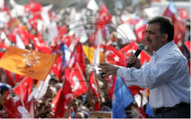

# Cumhurbaskanligi
Apollo 13 filminin analizinde genelde soyle bir sey soylenir: Seyircinin filme dahil olmasi icin direktorler ne yaptilar? Dunyaya gercekten "donmesini" ve "kurtulmasini" istenilecek kisinin basrolde koydular ki ABD'de bu kisi o zaman Tom Hanks idi. Yapimcilar tum Amerika'nin, herkesin sevdigi Hanks'i o uzak kapsulu icine koyarak, filmin sonunda dunyaya donmesi icin izleyicinin duygusal katilimini (emotionally vested) garanti etmis oldular.Sn. Abdullah Gul Cumhurbaskanligi icin benzer yorumlari yapabiliriz. Fakat tum yari-manipulatif (ustteki gibi -ki bunlar gercekte olmamis ta olabilir-) analizleri gecseniz bile, gunun sonunda Sn. Gul'un iyi bir insan, tolerans sahibi, bilgili ve tecrubeli bir siyasetci oldugu gunbegun ortadadir. Bizim sahsen AKP'ye oy verisimizin en onemli faktorlerinden biri de aslinda indirekt olarak onunla alakalidir, kendisi Sn. Dr. Ahmet Davutoglu'nu disislerine getiren ve onu kollamis olan kisidir. Ek olarak ayni zamanda icraat adami ve halktan bir kisidir. Gonul isterdi ki  Sn. Gul'den iki tane (!) olsun, o zaman biri disisleri bakani digeri Cumhurbaskani olabilirdi, fakat  bu mumkun degil. Velhasil Sn. Gul'un Cumhurbaskanligini hala destekliyoruz. Entegrator elitin uzerindeki genisleme baskisini daha once bu blog'da isledik, ve bu genislemenin sonra yerine once olmasi ulkemizin kabuk degistirmesi icin anlamli olacaktir.  AKP'ye verilen oylarda Sn.  Gul'un onemli bir faktor oldugu gozonune alinirsa, Gul'un secimi yonunde bir temenni belirtmek fazla olmasa gerek.Bu olmazsa halkin secimi yonunde bir adim da kabul edilir olacaktir. Bu olmazsa esinin basi turbanli baska birisi, ya da kuşa döndürülmüş bir Cumhurbaskanligina herhangi birisi kabul edilebilir olabilir (su anda Yunanistan'da boyle)Olan Biten Blog

zaman:

Temmuz 23, 2007

