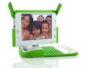

# Her Cocuga $200'lık Laptop
Yeni kapital artik bilgi olduguna gore, gelirin adaletsiz dagitimindan bahseden "gelir ucurumu" kavrami artik yerini "dijital ucurum"a birakiyor. Bu yeni dunyada paraya sahip olanlar ve olmayanlardan degil, bilgiye sahip olanlar ve olmayanlardan bahsediyoruz.Gelismis ve gelismekte olan ulkeler arasinda hizla buyuyen bu ucurumu kapatmak icin, Nicholas Negroponte "Her Cocuga bir Laptop" dernegini ve kampanyasini baslatti. Negroponte bilgisayar ureticileri ile anlasarak (simdilik) $200'lik bir laptop imal ettirmeyi basardi. Bu laptop oldukca kuvvetli bir makina, hatta ekran teknolojisi bazi acilardan normal laptop'larda daha iyi. Fiyati dusuk tutmak icin parali olan Windows yerine parasiz olan Linux isletim sistemi kullaniliyor.Negroponte'nin degindigi en onemli konu ise su: "Niye bilgisayar merkezleri kurmak yerine, her cocuga bir sahsi bilgisayar vermiyoruz?". Cunku artik bilgisayar aynen kalem kagit gibi vazgecilmez bir arac haline geldi. Ortak "kalem" ve "defter" kullanmadigimiza gore, ortak bilgisayar da kullanmamiz anlamsiz olur. Ayrica cocuk okulda iken kullandigi bilgisayari eve goturup calismasina evde devam etme sansina kavusacaktir.Not:  $200 'lik laptop'larin gorsel tasarimi babasi Turkiyeli annesi Dogu Almanyali olan ve su anda California'da yasamakta olan tasarimci Yves Béhar tarafindan gerceklestirilmistir.

zaman:

Temmuz 01, 2007

