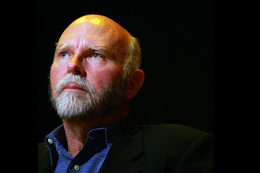

# CO2 -> Biyoteknoloji -> Yakit
Unlu genetikci Craig Venter, bitmesine yaklasik 18 ay kaldigini duyurdugu 4. nesil yakit projesini Monterey, California'daki bir konferansta acikladi. Bu projenin kapsaminda biyo-muhendislik teknikleri ile yapay olarak tasarlanan bir organizma CO2 isleyip/tuketecek ve  karsiliginda motorlarda kullanilabilecek turden yakit uretecek. CO2 bilindigi gibi yaygin bulunan bir atik ayrica kuresel isinmanin bas sorumlularindan biri.Venter, "tum petrol endustrisinin yerine gecip dunyaya enerji saglayan en ana enerji kaynagi olmak gibi "mutevazi" amaclarimiz var" diye aciklamasini surdurdu. Konusmasini yaparken dinleyicilerin arasinda Google sirketinin kurucusu Larry Page ve Al Gore goze carpti.Venter en buyuk problemin organizmayi tasarlamak degil, ticari baglamda anlamli olacak sekilde havadan cok yogun konsantrasyonda CO2 cekebilmek oldugunu belirtti. Venter, "elimizde 20 milyon gen var, bu genler gelecekte isimize yarayacak pek cok organizmanin tasarim bilesenleri olacak. Bu alanda sinirimiz sadece hayallerimizdir" dedi.Venter'in takimi sentetik kromozomlar kullanarak zaten mevcut olan organizmalari degistiriyor, bastan yeni canli yaratmiyorlar. Aslinda su anda bile motorlarda yakit olarak kullanilabilecek oktan (octane) ureten organizmalar var, fakat urettikleri miktar yeterli degil. Takimin yapmaya ugrastigi bu organizmalari genetik olarak degistirerek, tuketilen CO2'nun ve uretilen oktanin artmasini saglamak.Haberin asli surada.

zaman:

Mart 10, 2008

