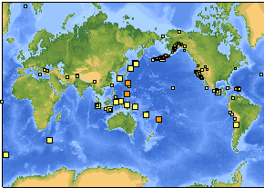

# Depremler
Dunya capinda olan depremleri izlemek icin guzel bir site:http://earthquake.usgs.gov/eqcenterSite deprem verisini RSS uzerinden paylasma kabiliyetine de sahip. Mesela dun meydana gelen Richter 2.5 uzerindeki depremleri RSS okuyunuzda gormek isterseniz, alttaki link kullanilabilir.http://earthquake.usgs.gov/eqcenter/catalogs/1day-M2.5.xmlDunya capinda ne kadar cok deprem oldugu sasirtici gelebilir. Alttaki resim sadece gecen hafta olan depremlerin bir listesi:

zaman:

Mart 15, 2008

