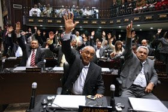

# Guclu Parlamento
Foreign Policy dergisindeki bir yaziya gore, guclu baskan ya da guclu hukumet'ten ziyade kanun koyucularin, yani parlamento'nun kuvvetli oldugu ulkelerin demokrasisi daha saglam/dayanikli oluyor. Afrika'nin en stabil ulkesi olarak bilinen Kenya birdenbire karisinca, pek cok kisi sasirdi, fakat Steven Fish and Matthew Kroenig'in yaptigi arastirma gozden kacan bir faktore isaret ediyordu: Zayif bir parlamento. Kenya'da baskanin rakibi olan parti onunkine gore iki kat daha vekil kazanmis olmasina ragmen, yine sokaklarda kargasa oldu. Niye? Cunku rakip partiye oy verenler Kenya'da dogru durust kuvvet sahibi olan tek makamin hangisi oldugunu biliyorlardi: Baskanlik.Fish ve Kroenig arastirmalarinda dunyadaki 158 parlamento'yu guclerine gore siraladilar. Parlamento gucu 4 kriter uzerinden olculdu: Hukumet uzerindeki etki gucu (power over executive), hukumeten ayri bir kuvvet olabilmek (autonomy), hangi yetkilere sahip oldugu (savas ilan edebilmek gibi), ve kismen icra kabiliyet (is yapabilmek icin eleman ise alabilecek parasi olup olmadigi gibi).Bu faktorleri Turkiye'ye uygularsak, meclisimizin son zamanlarda guclendigini ve buna mukabil demokrasimizin daha kuvvetlendigini goruyoruz. Meclis ABD tezkeresine hayir, turban, sosyal guvenlik, Kuzey Irak harekatina izin gibi konularda zor bazi kararlari alabilerek son zamanlarda bir etki merkezi olabildigini ispatladi. Bu durum halk arasinda da hissediliyor - insanlar problemleri oldugunda muhtar, belediye baskani, kaymakamlik gibi mercilere gitmek yerine bolgelerinden sectikleri vekillere daha cok gitmekteler.

zaman:

Mart 12, 2008

