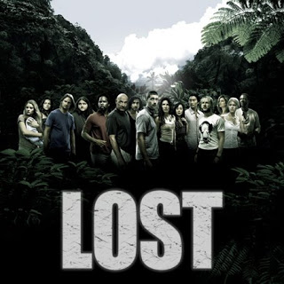

# Lost
Bu dizi hakkinda yapilan yaygin elestirilerden biri cozulmeden cok fazla "gizemi" ortada birakmasi... Simdiye kadar iyi ilginc hikaye anlatim teknikleri seyrettik - eskiyi hatirlama (flashback) ile guncel zamani parca parca, ayni bolumde seyrettik. Simdi, 4. sezonda, ileriyi hatirlama (flash forward) teknigi basladi. Buna gore 4. sezon bitmemis olsa bile sonucunu biliyoruz, ama tam degil, ve o sonuca nasil gelinecegini yavas yavas "simdiyi" seyrederek ogreniyoruz. Jack, Kate adadan kurtuldu, ama tabuttaki kimdi? .. Vs.Fakat cok fazla sonuca baglanmamis ve cok eski sezonlardan gelen bosluklar var.. Walt ne oldu? Waaaaaalt! :) Siyah bulut neyin nesiydi? Ben, iyi mi mi kotu mu? Kotu ise 4. sezon ileri hatirlamari arasinda niye Said onunla beraber?En azindan adanin dis dunya ile baglantilarini biraz daha iyi anlamaya basladik - fakat isler cok yavas ilerliyor. Artik eminim ki Lost her hafta yeni bir dizi usulu seyredilecek bir sey degil - bir sezonu, hatta bittikten sonra kut diye tum sezonlarini seyredilecek bir sey. DVD, Bluray ve "diger" teknikler ile bunu yapmak mumkun, ki aslinda teknoloji ile hasir nesir cogu insanin olagan (default) seyredim usulu buna yaklasmaya basladi.Bu arada, yapimcilar karakterlere uygun filozof isimleri bulmak icin Wikipedia'ya bakiyorlarmis.

zaman:

Mart 07, 2008

