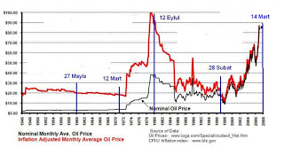

# Ham Petrol ve Darbeler
 Darbeler ile ham petrol fiyatları arasında korelasyon var mıdır? Üstteki grafikte bunu irdelemeye çalıştık. 27 Mayıs ve 12 Mart'ta korelasyon yok, 12 Eylül'de ciddi bir korelasyon var. 28 Şubat'ta bir ham petrol fiyat zıplaması var, fakat esas zıplama olan 1991'de bir şey olmamış. Neyse, iddianame zamanı 14 Mart'ta kesin bir korelasyon var. 2 yok, 2 var, bir tane ortada.. Gerçi "1980'e kadar ülke petrole fazla bağımlı değildi ve çıkış inişler o zaman zaten etki etmeyecekti" gibi bir mantık zinciri de kurulabilir.. Bu yazıyı final analize varmadan bırakacağız, veriyi ortaya koyduk, bazı egzersizler, "beyin fırtınası" yaptık.

zaman:

Nisan 22, 2008

