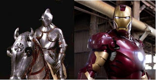
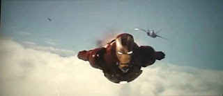
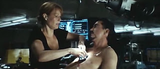
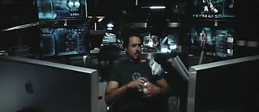
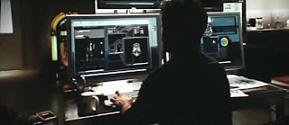
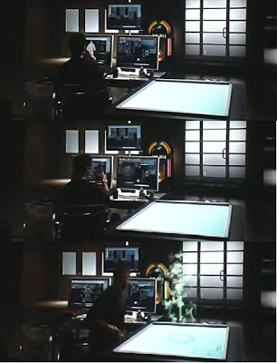
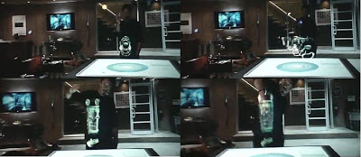
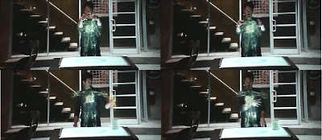

# Iron Man
Cogulculuk hakkindaki ilk yazimizda bu akimin en son 1000 sene oncesine kadar sovalyelerin zamaninda yasandigini belirtmistik. Bunun sebebi sovalyenin merkezden bagimsiz, zamaninin en mukemmel savascisi ve bir guc merkezi olmasiydi. Daha sonra barut, uzun yay ve en son endustriyel devrimin kuvvetlendirdigi merkez, bu kuvveti asindirip cogulculugun kuvvetini azaltmayi basaracakti.Fakat yeni bireysel teknolojilerin kuvvetlendirdigi tekil kisi, tarih sahnesinde yavas yavas tekrar one cikmaktadir. Bu gercek durumun semboller uzerinden perde uzerine aktarildigi en son film Iron Man olarak addedilebilir.Bundan da ote, bu film o kadar bariz 2. ve 3. dalgalar arasindaki bir gecisi gostermektedir ki, bu blog'da konu olarak almamak kayip olurdu. Ama filmin gosterdigi dalgalararasi gecisler ve referanslardan bahsetmeden once, daha ufak, tarihsel ve konjektruel konulara once hemen deginelim.Iron Man oncelikle ABD'nin icinde oldugu bazi donemsel ihtiyaclara ve halkinin hissiyatlarina cevap veriyor. Afganistan ve Irak'ta binlerce askerini kaybeden bir ulke icin su anda kursun gecirmez bir adam mit'inden daha cekici ne olabilir? Iron Man cikis hikayesinin (origin story) -cizgi romaninda- yer olarak aslen Vietnam'i referans almasi bu acidan katiyen bir raslanti degildir. Bu ulke de tarihsel olarak diger bir yanlis savas, ve yanlis secimleri temsil eden bir yer olarak Tony Stark'i bugun donusturen Afganistan gibi hikayeye gerekecek arka plana ve trajediye sahipti.Insanlarin bosuna hayatini kaybettigi, 2 kusur milyon Vietnam'linin ve onbinlerce Amerikan askerinin oldugu bu yer, "oldurme bantinin" ne derece iyi calistigini da gostermekteydi. Iron Man filminde metaforlar uzerinden surekli bu konulara dokundurmalar yapildigini goruyoruz: Insanlarin buyuk sayilarla olumune sebep olacak kitle imha silahlari ureten Stark, en sonunda kendi bombasi ile yaralanacaktir. Kotu kalpli bir kisi olarak betimlenen bu silah tuccari, kendi kalbinden yaralanacaktir. Yaralanmadan sonra artik sadece bir jenerator sayesinde kalbini isler halde tutabilecektir - ki bu yeni elektronik "kalbin" filmde Gwenneth Paltrow'un harika bir sekilde oynadigi Pepper Potts tarafindan Stark'a takildigi an aslinda bu metaforu sadece kuvvetlendirmektedir. Stark degisim gecirdikten, playboy gunlerini kismen geride biraktiktan sonra eskiden beri yaninda olan Potts'a daha bir yakinlik hissetmektedir. Metafora gore  "kalp artik Potts'un elindedir".Ayrica, Stark'in kalbine ve zirhina enerji veren teknoloji Ark Reaktoru, fosil yakitlarin dunya iklimini tehdit ettigi, ham petrol fiyatlarinin asiri yukseldigi gunumuzde "temiz enerji" alternatifi olarak kurgulanmis ve cevreci hissiyata hitap etmektedir.Yeni SovalyeFakat esas kapsamli analizi, endustriyellesme -> innovasyon/bilgi cercevesinde yapmak lazim ve cogulculugun geri gelisi tum bu faktorler ile yakinda alakali. Stark, Iron Man zirhini yarattiktan ve gerekli gordugu yerde bu silahi kullanmaya basladiktan sonra, alttaki ucuncu dalgaya ait karakteristikleri sergilemektedir.Ure-ketim (prosuming): Teknolojinin kabiliyetlerini (capability) arttirdigi bireyler, kendi tuketimi icin uretim yapabilmeye baslarlar, mesela yazilimda open source kavrami bu fikriyatin bir ornegidir. Herhangi bir alanda bir ihtiyac hisseden bir beyaz yakali profosyonel, istedigini bulamazsa, bu icati kendi yapiverir. Stark, Iron Man zirhini uretirken ciddi bir ure-ketim ornegi sergilemistir. Dahi bir mucit, bilim adami ve tasarimci olan Stark bunu yapmistir cunku yapabilecek durumdadir. Innovasyon kapasitesi ve birikimi bunu mumkun kilmaktadir. Ayrica Stark icin tasarimdan imalata gitmenin bedeli sifirdir. Bunu altta irdeliyoruz.Ev merkezde: Sanayi toplumlarinda calisanlar fabrikaya yakin durmak zorundadir. Iscilerin cogu vasifsizdir. Aileler cekirdektir. Kiyasla beyaz yakali toplumlarda bilgi iscileri fikir yogunluklu islerde calistiklari icin istedikleri yerde olabilir, yasayabilirler. Stark orneginde daha ilginc bir durum goruyoruz, Stark'in evinin icinde bir fabrika vardir! Stark'in fabrikaya gitmesine gerek yoktur, fabrika ona gelmistir.Filmin kurgusu icinde Stark'in cok zengin olmasi ile aciklanan bu durum, ileride norm haline gelebilecektir. Ayrica bir diger faktor, Stark'in yaralandiktan sonra kalbini isleten enerji birimi, Ark Reaktorununun daha buyuk bir versiyonu evinde calismasidir, yani tasarim->imalat gecisi bir diger acidan temiz ve ucuz enerjinin yayginlasmasina baglanmistir.. Gercek dunyada, imalat yontemi olarak nanoteknolojinin yayginlasmasi 3-boyutlu yazici kavramini one cikartabilir ve daha dusuk enerjiyle bile her tasarimcinin ayni zamanda imalatci olabilmesine imkan saglayabilir. Stark bu hayati kurgusal alemde onceden beyaz perdede gosteren bir ornektir.Bilgi teknolojileri: Iron Man zirhi tasarlanirken kullanilan teknolojilere bakarsak, tasarim, yapay zeka konularinda gelecegin nasil olacagina dair ipuclari gorebiliriz. Stark, evini, ofisini idare eden bilgisayar Jarvis ile neredeyse bir insanla konusur gibi konusabilmektedir. Ayrica tasarim sirasinda Jarvis ile beraber calismaktadir. "Al, oradan tut, o vidayi sIkIstir, tamam, oldu.. " gibi... Hasar raporlarini, tasarim iyilestirmelerini bir arkadasa anlatir gibi anlatabilmektedir.Ustteki resimde goruldugu gibi Stark'in tasarim icin kullandigi teknolojiler gorunmez / hissedilmez (seamless) bir sekilde birbirine bagli, pek cok farkli ortam (medium) uzerinde manipule edilebilir haldedir. Tasarim islemi icin ilk taslak klasik klavyeli bilgisayar ortamindadir, fakat kullanici bu tasarimi oldugu gibi yeni bir ortama tasiyabilmektedir.Filmin kurgusuna gore, bir 3 boyutlu tasarim, tasinan yeni ortamda 3. boyutlu manipulasyon uzerinden, direk eller kullanilarak degistirilebilmektedir. Burada cok ciddi insan / makina arayuzu (human/machine interface) ilerlemeleri kurgulanmistir.Stark modeli evirip, cevirip, istemedigi kisimlari eliyle alip cope atabilmektedir (sag alttaki kutu).Endustriyellesmeden Kacis ve Cogulculuk: Stark'in degisimi aslinda gelismis ulkelerde insanlarin yasadiginin renkli olarak ekranlara yansimasidir. Kitle imha ile ugrasan, militer/endustriyel kompleks (military/industrial complex) ile dirsek temasinda olan, "organizasyon" adami Stark, degisimden sonra bir sovalye haline gelmis ve kendi innovasyonu ile kendi icin urettigi bir silahi "noktasal" sekilde kendi sectigi yardim amaclari dogrultusunda kullanmaktadir. "Endustriyellesmeden kacis" temasina vurgu Stark rolunu oynayan Robert Downey Jr. tarafindan da bir roportajda yapilmistir.Stark degisim gecirmeden once de ikinci dalganin kurumlarinin ve sosyal hayatinin cokmus olmasindan meydana gelen karisik dunyada yasamaktadir. Hedonizm ile mesguldur, "dagitmaktadir" ama bunun yaninda hala dahi bir mucittir, sadece dehasini eski endustriyel amaclar icin heba etmektedir. Arada sirada ismen atif yapilan ayni sekilde dahi mucit (artik vefat etmis) baba Howard Stark, belli ki ayni inis cikisli hayati yasamamistir. Fakat Tony'nin bilmedigi, kismen romantize ettigi babasinin kendisinkinden daha basit bir zamanda yasamis olmasidir [1]. Howard Stark, Nazi'leri yenmek icin silah uretmistir, Manhattan Projesinde (ilk nukleer silahin uretildigi proje) calismistir. Ama onun zamani daha lineer,  yani endustriyel'dir. Hatlar, roller, yerler bellidir: Onlar  Bizler. Nazi=kotu, ABD=iyi. Baba, anne, cocuk, aile. Kitle, kitle, kitle. Yoket, yoket, yoket.Iron Man filmi bu temalari tam bam telinden yakaladigi icin cok ilgi gordu. Ilk acilis yaptigi haftasonu bilet satislari 100 milyon dolari asti ve satislar tirmaniyor. Holywood tarihinde en iyi acilis yapan filmlerden biri seviyesine geldi ve bu basarisini ustte anlatilan zamanin ruhunu cok iyi yakalamis olmasina borcludur.---[1] ABD'de bu nesile, yani II. Dunya Savasi sirasinda genc olan nesle biraz gipta ile "En Buyuk Nesil (The Greatest Generation)" denir, bunun sebebi daha oturakli, ve dogru/yanlisi (guya) daha iyi bilmis olan bir nesil olmalaridir. Bu tanim kismen dogru olsa da, final tahlilde cok haksizdir. Basit bir zamanda, ABD gibi duzeni oturmus bir ulkede yasayan insanlarin fazla yanlis yapmasi zaten zordur. Turbulans ile beraber yasamak zorunda olan onlarin cocuklari olmustur fakat bu, onlarin cabalarinin daha az degerli oldugu anlamina gelmez.

zaman:

Mayıs 10, 2008

