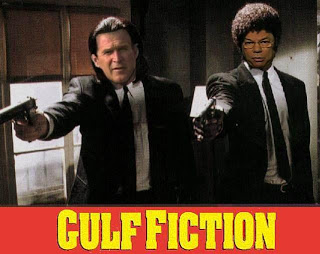

# Irak İşgali Sonrası ve Petrol
Irak Savaşı'nın ana amacının petrol şirketlerinin "kaynağa" erişme kavgalarının olduğunu belirtmiştik. Muhakkak bir ülkeyi işgal gibi önemli bir kararda diğer faktörler de rol oynayabilir: ABD'nin önde gelen stratejisyenleri, farklı açılardan da Irak'ın işgaline yeşil ışık yakmışlardır. Osmanlı uzmanı ünlü Bernard Lewis Beyaz Ev'e "11 Eylül sonrası Irak'ın işgali müslüman dünyasının gözünü açacak ve modernizasyonu için onu kamçılayacak" tavsiyesini yaptığında bu analizi yapabiliriz. Neo-con tipler İsrail'in güvenliğini düşünüyorlardı, diğer yandan Amerikanın uzun süredir stratejisi olan "savaşı kendi kıtasından uzakta tutmak" yöntemi ışığında, Irak'ta Amerikan varlığı Al Kaide'yi Amerikan toprakları yerine Irak'ta savaşmaya zorlayacak, bir "bal" yaratıp "ayıları" kendine doğru çekecekti. Bunların hepsi değişik derecelerde Bush'un kararında rol oynamış olabilir. Her halükarda, işgalin başladığı 2003 yılında tüm oklar Irak'ı gösteriyordu.  En önemli işgal konusu olan petrolün güvenliği Bush hükümetini düşündürüyordu. Acaba Saddam yenilirken (ki bu kesindi) petrol kuyularını ateşe verir miydi? Bu durumda ABD dışişleri Irak'ın petrol altyapısını yenilemek için $7-$8 milyar dolarlık ek bir yatırım gereceğini hesapladı. 20 Mart 2003'te işgal kuvvetleri Bağdat'a girdiklerinde petrol kuyularını ateşe sarılmış halde bulacaklarını düşünüyorlardı, fakat durum böyle olmadı. Mahalle kabadayısından ülke liderliğine geçmiş Saddam, bu sırada belli ki milliyetçiliği öğrenmişti, tarihin gözünde halkının doğal kaynaklarını heba etmiş adam olarak geçmeyi demek ki istememişti. Bu iyi haberdi. 9 Nisan'da işgal kuvvetleri Bağdat'a girdiler. Ardından anarşi cikti. Birlikler bu anarşiye karışmadan uzaktan seyrettiler - müzeler, dükkanlar yağmalanıp ofisler yıkılırken, birlikler sadece "Petrol Bakanlığı" binasını ve petrol altyapısını korumakla yetindi. Petrol Bakanlığı binasında ileride petrol aramasında ise yarayacak çok önemli sismik haritalar bulunmaktaydı.  İşgal sonrası Irak'ın devlet petrol sektörünün dağıtılması, ve kaynakların ABD/İngiltere şirketlerine geçirilmesi birinci hedefti. Irak'ı yönetmek için atanan ilk işgal valisi emekli general Jay Garner, bu "önemli" amaç yerine "yerel seçimlere" odaklanmayı seçince, alelacele sepetlendi. Yerine Paul Bremer iş başına getirildi. Bremer başa geldiğinde kendini Royal Dutch Shell adlı petrol şirketinin eski CEO'su Philip Carroll ile çalışma durumunda buldu - bu kişi, Irak'ın petrol endüstrisinin başına getirilmişti. Her ne kadar Caroll şonradan "ben iş başındayken katiyen özelleştirme yapılmayacaktı" demiş olsa da, Bush hükümetinin bunu geciktirmesindeki sebep başkaydı. Beyaz Ev farketmişti ki bu kadar önemli bir sektörün bu kadar süratle özelleştirilmesi "işgal altındaki bir devletin ekonomik yapısında büyük değişiklikler yapılmasını yasaklayan" Geneva Anlaşması'na aykırıydı! Ama belki de bundan daha önemlisi, Iraklı Şiiler için önemli bir dini figür olan Ali Sistanı'nın özelleştirmeye net bir şekilde karşı çıkmasıydı. Özelleştirme ve yabancı sermaye bağımsız bir ülke için muhakkak önemlidir, fakat işgal altındaki bir ülke için Sistanı alabileceği tek direniş kararını almış gözüküyordu.  Zaten halk ta, özellikle petrol endüstrisinde çalışanlar bu şekildeki bir özelleştirmeye karşı gözüküyorlardı. Sadece özelleştirmenin "dedikodusu" bile karışıklık çıkarmaya yetmişti - petrol boru hatları, rafineriler ve diğer petrol yapıları bombalanmış, sabote edilmeye uğraşılmıştı. Daha sonra kuşkusuz devlet petrolcülerinin (İran, Rusya) bölgeye müdahil olmasından sonra alevlenen direniş, petrol altyapısının tam kapasiteside kullanılmasına darbe vuracaktı. Amerika planlamacıların petrol üretiminin 2010 tarihinde senede 6 milyar varile çıkması planı artık hayal gibi gözüküyordu. Bu arada güvenliği kalmamış ve herkesin kendi başının çaresini baktığı bir ortamın oluştuğu Irakta yolsuzluk had safhaya vardı. Ocak 2005'te Stuart Bowen adlı bir ABD müfettişi Irak bakanlıklarına dağıtılmış olan $9 milyar doların ortadan yokolduğunu rapor etti.   Bu ortamda Ekim 2005 referendumla kabul edilen yeni bir anayasa tam tekmilli bir petrol özelleştirmesine ağır bir darbe vurdu. Mart 2006'da petrol ihracı işgal öncesinin yarısına bile gelememişti. Şii/Sünni çatışması bu sıralarda başladı (22 Şubat 2006), burada ABD petrol şirketlerinin parmağını aramak gerekir. İstediklerini alamayınca, "birbirine kırdırma" politikasının devreye girmesi bir sonraki raundda güçlü şekilde masaya oturmak için kullanılmış olabilir. Irak'ta rehin alınan Amerikalı Jill Caroll, o sırada rehin olarak Sünnilerle beraberdir ve Şiiler için kutsal Altın Cami bombalandıktan sonra onu rehin tutan Iraklılardan birinin ona şöyle söylediğini aktarir: "Artık birinci düşmanımız Şiiler. Amerikalılar ikinci".  Şubat 2007'de anayasa'nın belirttiği üzere detayların belirleneceği bir "hidrokarbon yasası" devreye girecektir. Bu yasada tek bir Irak Milli Petrol şirketi yaratılması öngörülüyordu. Bu şirketin karlarının dağıtımı için ayrı bir yasa gerecekti. Fakat yasada yine de yabancı şirketlerin yatırım yapabilmesi için yeterince kaldıraç noktaları bulunuyordu.  Olayın bütününe bakarsak, Bush'un ve petrol şirketlerinin kısa vade çıkarlarını elde edemediklerini görüyoruz. Plana göre Irak işgal edecek, halk onları ellerinde çiçekler ile karşılayacak, Irak petrol şirketleri özelleştirilip ABD/İngiltere şirketleri tatlı karları elde etmeye başlayacaktı. Durum böyle olmadı. Bush ve Blair dünya çapında müthiş bir direnişe muhatap oldular - ele geçirdikleri ülke sosyal ve ekonomik olarak çalkantıya battı ve çok ölümcül bir direniş harekatı yarattı.  Fakat ABD/İngiliz petrol şirketlerinin çok acele ettiklerini de söyleyemeyiz. Bu tür şirketlerin plan ve aksiyonları onyıllık dönemlerle yapılır, ve şu anki karışıklığın geçmesini bekleyip, Irak petrol alanlarının önlerindeki yıllarda ellerine bir şekilde düşmesini bekleyeceklerdir. Fakat kesin bir şey var ki, Irak'ta sözlerini Washington'da olduğu kadar rahat geçiremiyorlar. Bu sebeple deniyor ki Irak'ın Osmanlı'dan alınıp İngiltere'ye geçtiği savaş dahil olmak üzere Irak'ta 7 savaş yapılmıştır - belki 8. savaş çoktan yol çıkmıştır bile.  ---
[1] Oil Companies in Iraq: A Century of Rivalry and War  [2] How the Bush Administration's Iraqi Oil Grab Went Awry [3] Oil in Iraq: the heart of the Crisis

zaman:

Mayıs 26, 2008

