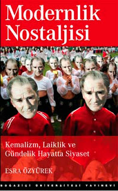
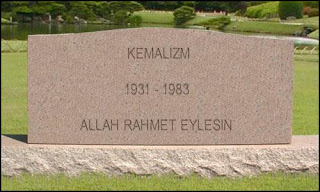

# Cumhuriyetin Temelleri
Cumhuriyetin karmasik teorik yapisinin incelemek icin, bu seklin olusmasinda bas rol oynayan insanlari incelemek gerekiyor. Bu isimlerin basinda hic suphesiz Durkheim'in sosyal fikirlerinden cok etkilenmis Ziya Gokalp gelir. Gokalp, Durkheim'in dayanisma (solidarity) fikrini atesli bir sekilde savunmus, ve Cumhuriyetin kollektivist ve otoriter bir yapiya donusmesinde etkili olmustur. Zamaninin gozde ideolojilerini inceleyen Gokalp, liberalizmden ziyade devlet merkezli dayanisma ideolojisine yakin durdugunu farketti; Ona gore liberalizm bireyciligi tesvik ediyor, ve bireycilik ise devletin butunlugune zarar verecek bir kavram gibi duruyordu [3]. Aslinda bu secimi yaparken Gokalp, kendinden once gelmis Osmanli elitinin secimlerini aynen yansitmaktaydi - Dr. Serif Mardin'in 1962 tarihli arastirmasina gore Osmanli eliti de, aynen Gokalp gibi, modernlesme onlemlerini Batili olmak icin degil, devletin gucunu muhafaza etmek icin benimsemisti [5].Durkheim, sosyalist egilimleri olan Fransiz bir bilim adamiydi. Toplumu incelemek icin birey disinda, onun haricinde, onun davranislarinin disinda bazi "degismezlerin" olduguna karar kilmis, ve "sosyal gercekler" denen kavrami literature sokmayi basarmisti. Onunla ayni cagda yasamis olan Weber ise, Durkheim'in zitti bir sekilde toplumu incelemek icin bireylerin eylemlerine, onlari motive eden kavramlar seviyesine inmek gerektigini savunuyordu.Durkheim'den etkilenen Gokalp'in, ve ondan etkilenen Mustafa Kemal'in Cumhuriyeti niye bir "dayanisma" modeli uzerine kurduklari iste bu temelde gizlidir. Bu modele gore insanlar bireysel isteklerini birakip, bir merkez tarafindan belirlenen "ortak hedeflere" bir "dayanisma" icinde kendilerini adayarak, toplumun dinamigini belirlemis oluyorlardi. Ilk Cumhuriyet neslini arastirdigi Modernlik Nostaljisi adli kitabinda Esra Ozyurek, bu nesilden gelen insanlarin kendi hayat hikayelerini anlattiklarinda nasil kendi ozel hayatlarini hizla gecistirip, hemen "ulkenin tarihini anlatmaya" basladiklarini aktarir [1, sf. 63]. Bu kisilerin kimligi, ozel hayati adeta yok gibidir. Varliklari, biat edilen, baskasinin tanimladigi bir "dayanisma" icinde eritilmistir.Cumhuriyet, "dayanisma" miti cercevesinde bu dayanismanin vuku buldugu kamu alani ile ozel alan arasinda cok kesin cizgiler cekmistir. Mesela bu nesilde buyumus ve egitimden gecmis bir kadin icin, kamu, gozonune cikmak, bu "dayanisma alanina" girmis olmaktir ve bu sebeple bir Cumhuriyet kadini, bu alana cikarken adeta bir hedefe hizmet eder, bir defileye cikar gibi sahneye cikar. Cunku "ornek olmakta" ve "dayanismayi yaymaktadir". Mulakatlari sirasinda Esra Ozyurek, bu nesildeki tum bayanlarin mulakatlari icin onu makyajli, resmiye yakin giyimli ve evinin Avrupai dosenmis [Kemalist] misafir odasinda karsiladigini anlatir. Bu oda, onun icin kamuya donuk bir merasim alanidir.Ilginc olan, bu dayanisma hissiyati isiginda guvenlige donuk yapilan totaliterligi cagristiran bazi uygulamalarin, o devirde yasamis olanlar tarafindan nostaljik bir sekilde ozlenmesidir. Bu asiri kontrol yontemleri bu nesle "ideal olan" gibi gozukmekte ve yokluklari adeta aranmaktadir. Bu durumu yansitan hikayelerin birinde mulakat yapilan Ismet Bey, arkadasi ile bir gece muhabbetten sonra eve donerken bir polis memurunun kendilerini durdurup boyle gec bir saatte ne yaptiklarini sordugunu aktarir. Ismet Bey memura yaz icin bir spor etkinligi planladiklarini soyledikten sonra, memur "bir daha bu saate kadar gec kalmamalarini" nasihat eder ve gitmelerine izin verir. Fakat bu olurken, oradan gecmekte olan bir sarhos adami da polis durdurur ve ona evli olup olmadigini sorar. Sonra bir daha geceleri disari cikip karisini, colugunu cocugunu evde yanliz birakmamalarini tembih eder [1, sf. 80] ve oradaki herkesi "sizi bir daha boyle gormeyeyim" uyarisiyla biat alanina cekmis olur. Hikayeyi aktaran Ismet Bey'in bu durum hakkinda yorumu sudur: "O gunlerde boyle dikkatlilerdi. Her sey daha disiplinliydi; insanlar korku nedir bilirdi". Bu uygulamalarin, bir polis devleti cagrisimi yaptiklari zamane insanlari tarafindan kavranamamaktadir.Ne yazik ki bu dayanisma ve "birbirine benzer" insanlar goruntusu de, aslinda, bir utopya ve cam kavanozda yasayan bir gerceklikten ibarettir. Diger bir Kemaliste gore, kendisi gibi elit sehir sakinlerinin kendilerini emniyette hissetmelerinin bir [diger] nedeni, etrafinda benzer kokenlerden gelen insanlarin olmasiydi. Demek ki bu kisi, Cumhuriyetci ideolojinin zerk edilmedigi "avam"'in Ankara'nin elit yurttaslari arasindaki birlik beraberlik hissiyatini zedeleyeceginin cok iyi farkindaydi. Ve bu durum, aslinda kaynasmanin ne kadar olmadiginin da bir gostergesiydi zira anlatilan kaynasma, Ankara'nin yeni elitlerle pek kaynasamayacak "fazlaliklardan" temizlenmesi sayesinde elde edilebilmisti.Bu elit tabakanin elitligi hakkinda ise sunu eklemek gerekir: Bu tabaka, muhakkak basarisi, bilgi seviyesi, icraati sayesinde bu pozisyona gelmis degildi. Rejim onlara aslinda siyasi bir rusvet vermekteydi, bu rusvet karsiliginda istedigi gibi olmasini, ve ideolojisini yaymasini bekliyordu. Bu kesimin urettigi tek sey, kendisi gibi olan daha fazla insandi. Cumhuriyetin ilk yillarinda ozellikle ogretmenlik (cunku dayanismayi yaymak -gayet Durkheimci bir sekilde- en iyi egitim ile mumkun olacakti) diger meslek alanlarina gore maas olarak cok daha imtiyazli bir durumdadir, ve imtiyazli kesim bu durumun cok farkinda olmasa da, 80'li yillarda gundeme gelen ihracata donuk gelisme ile bu duruma uyanacaktir.  Ozal, devletin kaynaklarini isadamlarini tesvik ve ihracata donuk uretim icin kullanmisti, ve eski imtiyazlariyla beraber statulerini kaybeden Kemalistler ilk kez radikallesip etraflarinda degismekte olan dunyanin aci gerceklerini anlamaya basladilar. Sahsi tanidigimiz olan bazi Kemalistler 80'li yillarin neredeyse tamamini Ozal'in "Icraatin Icinden" programi sirasinda televizyona bagirip cagirarak gecirmistir.Bu Kemalist travma, kendini cok degisik sekillerde de disari vurabilmektedir. Mesela "Cumhuriyetin Uc Kusagi" adli bir sergiyi ornek verirsek: Bu sergide Cumhuriyet tarihi farkli bolumlere ayrilmis, ve en son bolum Ekonomik Uyanis olarak Ozal'in liberal politikalarina ayrilmistir. Bu bolumde ekonomik liberallesmenin faili sifatiyla Ozal'in sozlerinin ve onde gelen isadamlarinin kendi piyasa gudumlu felsefeleri hakkindaki beyanlarinin oldugu parcalar duvara yapistirilmistir. Bu sergide calisan Kemalist rehberlerin istasnasiz tamami bu bolumden nefret etmektedir. Hatta bu hazzetmeme oyle boyutlardadir ki, gezdirdikleri ogrencileri bu bolume goturmeden etrafindan dolandirip bir sonraki panele yonlendirmektedirler!  Rehberlere bunu niye yaptiklari soruldugunda, su cevabi vermislerdi: "Cunku bunlarin Cumhuriyetle bir alakasi yok [1, sf. 122]"Nostaljik KemalizmFakat gunumuzde durdurulamayacak dinamikler, serbest piyasayi kuvvetlendirirken, bu ideolojinin zitti konumundaki Kemalizm'i ilginc bir sekilde degisime ugratmaktadir. Oyle ki kurulus yillarinda kamu alani ile sinirli olan bu felsefenin sembolleri, piyasa ekonomisinin etkisiyle ona aidiyet hissi tasiyanlarin, sembollerini kamu alanindan kendi ozel alanlarina tasimalarina sebebiyet vermistir. Zamanin diger bir dinamigi olan sivil toplum orgutleri Kemalizm icin de olusmus, fakat yine zamanin dinamiklerine uygun sekilde bu gruplarin aralarinda fikir ayriliklari basgostermistir. Bu durumda "tek bir ulku" ve "karinca dayanismasi" ruhunu tasiyan ideolojilerini devam ettirmeleri aslinda zorlasmistir.Ozyurek'in "Nostaljik Kemalizm" adi verdigi olgunun cikis noktasi ise, bize gore, bilgi ekonomisinin ortaya cikardigi bazi belirsizlikten korkan insanlarin siginmak icin aradigi "bir liman" gorevini goruyor olmasidir. Muhakkak bu yapilirken gercek Kemalizm'in idelojisinin takip edilemeyecegi gayet bariz ortadadir - bu yuzden geriye elde tek kalan yegane sabit olarak bir lider kultu etrafinda, o eski "dayanisma" olan "daha basit" gunler o kisi uzerinden anilmaktadir. Ataturkculugu Kemalizm'den ayirmaya ugrasan saf ve derinliksiz cabalarin temelinde yatan gercek te aslinda budur.Nostaljinin bizi goturdugu diger bir sonuc ise su olacaktir: Nostaljik sekilde anilan ve ozlem duyulan bu cag, artik bir daha geri gelmemek uzere kayiplara karismistir.-------[1] Ozyurek, E., Modernlik Nostaljisi, Bogazici Universitesi Yayinevi, 2008[2] Gokalp, Z., Turkculugun Esaslari, Bordo Siyah Klasik Yayinlar, 2004[3] Ziya Gokalp[4] Emile Durkheim[5] Mardin, S., The Genesis of Young Ottoman Thought: A Study in the Modernization of Turkish Political Ideas, Princeton University Press, Princeton, NJ, 1962

zaman:

Haziran 28, 2008

