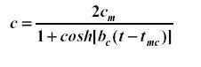

# Tepe Nokta Hesabı

Dünya petrol üretiminin tepe noktasını kendimiz de hesaplayabiliriz. Bunun için Hubbert Egrisi kavramını kullanmamız gerekecek. Bu eğri, lojistik dağılım eğrisi denilen bir fonksiyondur, ve aslen başka bir yazımızda nüfus hesabı için kullandığımız lojistik fonksiyonunun türevidir. Türevi olması normal, çünkü petrol üretim verişini "her sene üretilen yeni petrole (her sene doğan yeni çocuk gibi mesela)" bakarak hesaplayacağız, yani eklenenler, farkları (türev bir fonksiyonun iki noktasının arasındaki artışın sonsuz ufaklığa giderkenki değeridir) baz alacağız. Nüfus hesabı toplanarak giden bir rakamdır, yani kumulatiftir (cumulative).


Hubbert Eğri fonksiyonu neye benzer? Altta görüyoruz.





Burada sağ tarafta bazı sabitler var: Mesela cm, bc, tmc gibi. Bu sabitleri elimizdeki petrol üretim verişine bakarak kendimiz veriden çıkartacağız. O zaman üstteki fonksiyonu örnek veriye "uydurmamız (fitting)" gerekecek.


Bu uydurma, nüfus hesabı şartlarında daha rahat olmuştu, birkaç cebirsel takla atarak Python Numpy'in doğrusal fonksiyon uydurmasını kullanabilmiştik. Burada nonlineer bir fonksiyon var, o yüzden başka bir teknik kullanmak lazım. Python'un fmın fonksiyonu böyle kara günler için var. Program altta:

```
from scipy.optimize import fmin
import pandas as pd
from numpy.linalg import *
df = pd.read_csv('[veri]',sep='\s*')

def hubbard(w):
    yfit = (2*w[0]) / (1+cosh( np.abs(w[1] * (df['year']-w[2])) ))
    diff = df['oil'] - yfit
    e=norm(diff)
    return e

v = fmin(hubbard, [2, 2, 1970], maxiter=100000, maxfun=10000)
print v
```

Programı işletince sabitlerin değerleri ekrana basılacak:

```
[   86.53318502    44.16668572  2004.00941195] 
```

En sağdaki sonuç/sabit, 2004 değeri, üretim tepe noktasını gösteren sabittir, yani dünya petrol üretiminin zirvede olacağı yıldır. Hubbard da benzer bir bu sonuca erişmişti (2001), hatta elinde daha az veri varken (hesabı 1956'da yaptı).

Gerçek petrol tepe tarihinin hata payıyla 2004 senesinin 10 yıl sonrası ya da öncesine düşebileceğini kabul edersek, önümüzdeki onyıl (decade) içinde bu tepe anının geleceğini görebiliriz. Ondan sonra gidişat sadece aşağı olabilir.

Veriyi, suradan indirdik (birim milyar varil/gun). CSV


http://www.earth-policy.org/Updates/2007/Update67_data2.htm#table1

https://www.dropbox.com/s/dx621ps2nb1akyz/world.csv?dl=1


