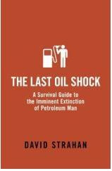

# Son Petrol Krizi
Last Oil Shock adli kitap petrol tepe noktası iddiası üzerine kuruludur, yani petrol üretimi en fazla önümüzdeki onyıl (decade) içinde tepe yapacak ve bu noktadan sonra üretim kaçınılmaz bir şekilde düşecektir. Not olarak düşelim, petrol üretim literatüründe "bitme tarihi"'nden değil tepe noktasından bahsedilir (hatta bitme tarihinden bahsedenler bu konulardan pek anlamadığını ifşa etmiş olur) - bitiş tarihi ekonomik/sosyal etkiler olarak anlamsız bir tarihtir, o noktaya vardığımız zaman ekonomi zaten kendini petrolün yokluğuna göre düzenlemiş olacaktır. Esas kritik nokta olan tepe noktasıdır çünkü büyük değişimler o tarihten sonra olmaya başlar.
 "Son petrol krizi" başlığı ve kitap ismi, küresel bağlamda yaşanacak tepe noktası durumunun vehametini vurgulamak için seçilmiş bir isimdir. Çünkü bu kriz, hakikaten son kriz olacaktır - ekonomide, sosyal yapıda değişimler eski petrol bazlı düzene geri dönülmez bir şekilde değişecektir.  Kitap, 2007 yılında yazılmıştır ve 2008 tarihi hakkında son derece isabetli gözlemler yapıldığını görüyoruz. Bu tarihlerin birbirine yakınlığı bizi yanıltmamalı - yazar "büyük değişim"'i tam başlamadan önce yakalamayı başarmış.  Neler olacak? Neler yapılabilir?  OPEC aradaki üretim farkını kapatabilir mi? Strahan'a göre fark artık kapanabilecek boyutta değildir. Cindistan tarafından gelen talep artmakta ve aynı anda kaynakların tepe yapma ani yaklaşmaktadır. Tarihsel olarak OPEC'in kendini piyasa şartlarından dışarı çekmiş olması sebebiyle (çünkü OPEC -eskiden- sürekli üretebildiğinin tamamını üretseydi, aşırı petrol arzı yüzünden fiyatlar düşerdi, bu OPEC üyesi ülkeler için ise yaramazdı, bu sebeple kartel oluşturup herkese kotalar atadılar) bir "acil durum üreticisi (swing prodücer)" haline gelmişti, o zaman boşluğu kapatabilirdi çünkü bunu yapmaya kapasitesi vardı, fakat artık bu rezerv kapasitesi kalmamıştır. OPEC ülkeleri de, diğer herkes (özel şirketler) gibi, çıkarabileceği petrolün tamamını son hızda çıkarmaya uğraşmaktadır.  Sonuçlar   Yüksek petrol fiyatları ulaşımı derinden etkileyecektir. Strahan, 2007'de "petrolvaril başına $150 olduğu zaman havayolu şirketleri sinekler gibi düşmeye başlayacağı (iflas etmek anlamında)" sözünü sarfetmişti. 2008'de $130'lik fiyatlarda bunların olmaya başladığını görüyoruz. Otomotiv sektörü aynı şekilde darbe yiyecektir, $200 noktası GM'in işini aktif olarak bitirecektir. Bu iki sektörün yakından bağlı olduğu seyahat sektörü (turlar, acentalar) darbe yiyeceklerdir.  Kriz buradan banka sektörüne zıplayabilir - bir sektör tahminine göre Çitigroup'un kredi kart bölümünden kazandığı paranın %40'ı American Airlines frequent flyer [1] programından gelmektedir. AA giderse, Çitigroup tehlikeye girer, ondan sonrası durgunluk yayılabilir.  ABD'de Walmart'in işi büyük tehlikeye girer. Bu şirketin kendini farklılaştırma/rekabet avantajı, çok ucuz, çok sayıda malları şehrin çok dışında, bazen kuşucmaz kervan geçmez yerlerde (in the middle of nowhere) müşterilerinin alımına sunmasıdır. Bu alışveriş şekli, sadece müşterilerin Walmart'a arabalarına binerek uzun yollar teperek gidebilmeleri ile mümkün olmaktadır. $150 ya da $200'lık petrol fiyatı ile Walmart'ın iş modeli tehlikeye girecektir. Wal-mart'ın ekonomideki devasa boyutları gözönüne alınırsa, neler olacağını düşünmek zor olmaz.  2007'deki projeksiyonun doların düşüşünü doğru şekilde tahmin edebildiğini görüyoruz. Doların düşüşü, "petrodollar" denen kavram ile açıklanabilir. 70'li yıllarda ABD dışişleri danışmanı Henry Kissenger'in Suudi Arabistan'da yaptığı bir anlaşma sonucu, Suudi'lerin sattığı petrol, dolar üzerinden satılmaktaydı. Bunun ABD için faydası şuydu: Herkese lazım olan petrol, dolar üzerinden satılınca tüm dünya dolara ihtiyaç duyuyor, ve dolarlar sonunda ABD ekonomisinde yatırılmak zorunda olduğu için bu ABD'ye iki yönlü bir avantaj sağlıyordu: Hem para basarak petrol alabiliyor, hem de ödediği dolarlar okyanus üzerinden uçarak kendine yatırım olarak geri dönüyordu.  Azalan petrol kaynaklar, ek olarak ABD'nin kendini batırdığı borç batağı doların hegemonyasına ağır bir darbe vurmuştur. Buna bağlı olarak, tüm petrol üreticileri dolardan yavaş yavaş çıkmaya başlamıştır (diversıfy out of it). ABD artık "dolar üreterek" kendi açıklarını kapatamayacaktır. Bu, indirekt olarak ABD'nin hegemonyasına vurulmuş bir darbe olacaktır.  Ulaşım fiyatlarının artması, nakliyat fiyatlarının artması demektir. O zaman yüksek petrol fiyatları, yüksek ihracat, ithalat, dağınık (distribüted) üretimi temel alan küreselleşmeye darbe anlamına gelir [2]. Fakat küreselleşme azalırken, bölgeselleşme (regionalism) artacaktır. Yani Latin Amerika'ya olan ihracatımızı sıfıra düşebilir, onun yerine Katar, Suudi Arabistan, Yunanistan'a (mesela) olan ihracat artacaktır.  Bizzat seyahat pahalılaşınca, bilgi teknolojilerinin önemi bir kez daha artar: Telekonferans'tan başlayıp diğer alternatif iletişim yöntemleri daha zengin bir iletişim sunmaya uğraşan ürünler gündeme gelmeye başlayacaktır.  Toplu taşımanın önemi artacaktır. Elektrikli arabanın gündeme gelmesi mümkündür. Toyota Prius bir hibrid olsa da bu bağlamda ciddi bir denemedir, ABD'de GM bu alanda arkada kalarak kendine bir darbe daha vurmuştur. Otomotiv şirketlerinin ABDlı politacılara baskı yaparak kanunlarında bıraktırdıkları açıklar sayesinde imtiyaz kazandırdıkları SUV üretimi [3], yükselen petrol fiyatları sebebiyle efektif olarak yokolacaktır.  Son petrol krizini kim başlatmıştır? Bunun için aptallığı artık destanlaşan W. Bush'u suçlamak mümkün müdür? Kısmen evet, fakat büyük oranda hayır. Bush, aptallığı sayesinde sadece krizin daha erken başlamasına sebep olmuştur. Çünkü son petrol krizi dönemine artık girmiş bulunuyoruz ama bu döneme 24 Şubat 2006 tarihinde de girmiş olabilirdik - bu tarihte Al Kaide'nin Suudi Arabistan'da dünyanın en büyük rafinerisi Abqaiq'e yönelik başarısız bir sabote denemesi olmuştur. Eğer bu deneme başarıyla sonuçlansaydı, arzdaki daralma petrolü bugün gördüğümüz fiyatlara zıplatacaktı. Diğer yönden, evet, Meksika Körfezi'nde Katrina olmasaydı, ABD'nin üretim/rafine kapasitesi bir darbe daha yememiş olurdu, fakat bunlarda Bush'un suçu yoktur (belki dolaylı olarak biraz, küresel ısınma hakkında bir şey yapmamak, ve bu sebeple güçlenen fırtaların kurbanı olmak haricinde). Fakat yükselen fiyatlar, piyasanın duruma "uyanmasından" başka bir şey değildir. Bu uyanış, erken ya da geç olabilirdi, fakat olacaktı.  Kimse petrol fiyatları yüzünden spekülatörleri filan suçlamamalıdır. Piyasa doğru kararı vermiştir. Azalan, belli (finite) miktarda olan ve herkesin istediği bir şeyin fiyatı artar.  ---
 [1] Frequent flyer programı, havayolu şirketlerinde uçtuğunuz milleri toplayıp, daha sonra bedava ek seyahatlar için kullanabilmenizi sağlayan bir programdır. Müşteriyi tek havayolu şirketine bağlamak için bulunmuş güzel bir yöntemdir.  [2] Küreselleşmenin yeni çağda en "başat" dinamik olmadığını söylemiştik. Küreselleşme azalabilir de, artabilir de. Yeni çağı gerçekten tanımlayan şey, bu sebeple bazen azalıp, bazen çoğalacak bir şey olmayan, değişmeyen, ve tutarlı bir şekilde büyüyen, herkesi sürekli derinden etkileyen faktör üretim yöntemiyle alakalıdır - bu da yeni vasıflı işçinin kafasını kullanarak türden yaptığı bilgi bazlı üretimdir.  [3] Evet, SUV araçları tamamen piyasa şartları dışında oluşturulmuş bir sektördür. Hem araba, hem petrol sektörünün ekmeğine yağ sürmek için tasarlanmıştır.  [4] Yaklasan Enerji Savaslari, Newsweek, 9 Haziran 2008 sayısı

zaman:

Haziran 07, 2008

