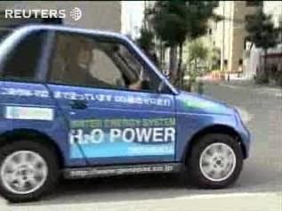

# Su -> Yakit
"İhtiyaç/gereklilik tüm buluşların anasıdır (necessity is mother of all inventions)" demişler - eğer, fosil yakıt yerine alternatif yakıt kullanabilen teknolojiye en çok hangi gelişmiş ülkenin ihtiyacı var deseniz, listenin başında herhalde Japonya olurdu. Bu uzakdoğu ülkesinin doğal kaynak miktarı nedir? Şu kadardır: Sıfır. Zip. Nada. Hiç. Japonya dışarıdan enerjiye o kadar muhtaçtır ki, süpertanker kavramını keşfeden ülke de bizzat kendileridir. Bu sebepledir ki, İ. Irak Savaşı sonrası ABD savaşın bedelini Japonlara ödetmek istediğinde, buna paşa paşa razı oldular. İhtiyaç, ya da muhtaçlık o seviyededir.Ve alternatif enerji konusunda bu yüzden en önde giden ülke onların olması anormal değil.Son haberlere göre Genepax adında bir Japon şirketi şu (H2O) ile çalışan bir araba icat ettiğini acikladi. Arabanın motoru, koyduğunuz bir litrelik herhangi bir su ile (herhangi kelimesi çok önemli, deniz, nehir, yağmur, suyu olabiliyor) taşıtı bir saat kadar ortalama 80 km/h yol götürebiliyor. Bu teknoloji şimdiye kadar büyük araba şirketleri tarafından kullanılan yakıt hücresi (fuel cell) teknolojisinden biraz değişik - öteki teknolojiler hidrojen "yakarak" egsözdan şu üretiyordu, bu yeni araba tam tersi, şu atmıyor, yakıt olarak kullanıyor.Genepax patent için başvurmuş ve ve büyük Japon araba üretici şirketleri ile ileride çalışabilmeyi umuyor. Bekleyip göreceğiz. İnşallah olurluğu (feasiblitity) ucuz ve seri üretime imkan verir, ve şu Allahın belası petrol konusundan ilelebet kurtuluruz (hem yazı bağlamında hem dünya kullanımı açısından).GAMBATTE KUDASAI !

zaman:

Haziran 13, 2008

