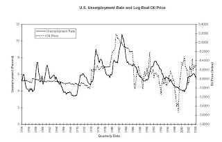
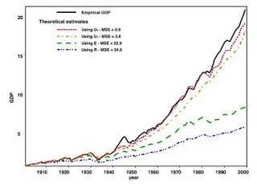

# Tepe Noktası
Petrol konularında irdeleme yapanlar önemli bir kavramla eninde sonunda karşılaşıyor: Bu kavram Petrol Tepe Noktası (peak oil) kavramıdır. Petrol tepe noktası, kısaca, bir ülkenin, dünyanın ya da şirketin petrol üretiminin gelebileceği en tepe noktadır. Bu noktadan sonra daha yukarı çıkmak imkansızdır, gidiş sadece aşağı olabilir. O noktadan sonra maliyetler, fiyatlar artar, ve geri dönülmez çöküş başlar.  Bu teoriye katılanlar ve katılmayanlar mevcuttur, mesela Peak Oil Debunked adli bir blog'da bu teoriye ateşli bir şekilde karşı çıkıldığını görebilirsiniz. Fakat genelde bu pozisyonda olanlar petrol endüstrisinden geliyor, sebebini anlamak ta zor değil - bir şirket/sektör sadece ve sadece büyüme kapasitesinin olduğunu iddia ederek hisse senet fiyatlarını canlı tutabilir. Fakat petrol şirketlerinde çalışmış insanlar ve endüstriye direk bağlı olmayıp yan danışmanlık yapan kuruluşlardan artan homurtular fazlalaşıyor, ve gittikçe tepe noktası teorisini açık bir şekilde destekleyenler artıyor. Destekçilerden bilinen bazı simalar Bill Clinton, Al Gore sayılabilir. Kapalı kapılar arkasında destekleyenlerin ise Bush, Cheney, Rumsfeld gibileri olduğu söylenmekte, ki zaten bunu bildikleri için vehametle "gerekenleri" yapmaya uğraşıyorlar, her ne kadar bunu kendi halklarına anlatmasalar da.. Yükselen petrol fiyatları teorinin doğruluğuna bariz ispat olarak kullanılıyor.  The Last Oil Shock adli kitapta David Strahan adlı yazarın bu argümanı desteklemek için ortaya koyduğu mantık zincirini ve çok değerli verileri ve grafikleri bulabilirsiniz. Strathan'a ve onun baz aldığı bilim adamlarına göre dünya petrol üretimi açısından tepe noktasına gelindi, hatta (bazı hesaplara göre) geçildi bile. Yazara göre Irak Savaşı, hatta şu anlarda İran'a planlanan muhtemel saldırılar, ABD/İngiliz petrol şirketlerinin karlarını arttırma isteği bir yana, aslında "enerji güvenliği" lafları altında gizlenen ve "azaldığı karar vericiler tarafından çok iyi bilenen ve o sebeple pastadan daha fazlasını kendilerine kotarma" amaçları ile daha iyi açıklanabilir. Özel/yabancı şirketlerin devletçi ülkelerin kaynaklarını çok daha iyi araştıracağı ve üretimi gelebileceği en üst noktada tutabileceği ve bu sayede "tepe noktasının" işgalci ülkeler için geciktirilebileceği umulmakta..  Petrol tepe noktası literatüründe önemli karakterlerden biri M. King Hubbert adlı bir bilim adamıdır. Hubbert, daha önce bu blog'da nüfus tahmini için kullandığımız lojistik denklemi tepe noktası tahmini için kullanmıştır ve 1956'da yayınladığı makalesinde ABD'nin petrol üretim tepe noktasının 1965-1970 tarih aralığında olacağını doğru tahmin etmiştir! Bu formülü dünya uretimine uyguladığında tepe noktası 2000 yılı olarak gözükmektedir (bu tarihi 2010 olarak hesaplayanlar da var). Lojistik denkleminin tamamen farklı bir ortamda işlemesinin sebebi aslında basit: Aynen artan nüfusta fazla yoğunluğa doğru oranda bir azalma oluşması gibi (ortak kaynaklara olan yarış, hastalıklar, vs), yeni petrol alanlarının keşfi de, kolay alanlar bittikten sonra daha zor alanların daha yavaş çıkarılması, ve hatta kolay alanlarda kalan petrolün şu ile karışıp daha zor çıkarılması gibi faktörler yüzünden yoğunluğa ters oranda bir lojistik bir azalma yaşamakta..  Strahan, bu kavramları kullanarak ABD'nin niye Irak Savaşı'nı başlattığını ve daha önemlisi kendi ülkesinin (İngiltere) başbakanı Tony Blair'in niye kendi partisinin (İşçi Partisi daha güvercindir) ve daha önemlisi halkının hissiyatına hiç uymayan bir şekilde bu savaşı niye desteklediğini açıklamaktadır. Çünkü ona göre Tony Blair, bu savaştan çok önce, enerji konusunda ateşle imtahandan geçmişti - başbakanlığının ilk krizini petrol yüzünden yaşamıştı! 2000 yılında çok fazla artan petrol fiyatlarını protesto için rafinerileri blok eden köylülerle başlayan ve hızla yayılan kriz, 7 gün içinde İngiltere ekonomisine diz çöktürecek boyutlara varmıştı. Krizin çıktığı hafta sonu gazetelerdeki "Erime Noktasına 48 Saat Kala" başlıkları bu teoriyi doğrular nitelikteydi. Petrolün bir ekonomi için ne kadar vazgeçilmez olduğunu o gün anlayan Blair hükümeti, enerji güvenliği konusunda artık yoğurdu üfleyerek yiyecekti. Ayrıca, İngiltere'nin petrol deposu olan Kuzey Denizi kuyuları 2000 yılı itibariyle tepe noktasına varmıştı.  Strahan, petrolün ülke ekonomisi için önemini ve klasik ekonomistlerin bu konuya eğilmemesinden duyduğu şaşkınlığı da kitap sayfalarına yansıtmış. Ona göre pek çok insan/ekonomi yorumcusu hala Solow adlı ekonomistin gelişimi sadece kapital ve işgücü girdisine göre tahmin etmeye uğraşan modelinde takılıp kalmıştır. Fakat Solow'un grafiğine bakılırsa, gerçek durum ve tahmin birbirinden açıklanamayacak kadar uzaktadır. Bu aradaki farka sanki okurla dalga geçilir gibi Solow artığı (residual) ismi verilmiştir, üstüne üstlük Solow'a bu araştırması sebebiyle Nobel ödülü verilmiştir.  Solow'un teorisinde eksikler olduguna inananlar, mesela Oswald, Hooker ve Carruth, ekonomik gelisimin baska faktorler ile korelasyonunun oldugundan suphe ettiler. Bahsedilen bilim adamlari gore issizlik verisi ile, faizler ama daha onemlisi petrol fiyatlari arasinda direk korelasyon vardi. Altta bu grafigi gorebiliyoruz.
 Muhakkak korelasyon, "sebep" demek değildir, yani petrol ekonomik büyümenin sebebidir demek mümkün olmayabilir. Diğer yandan sadece "gelişim petrol tüketime sebep oluyor" demek te yeterli olmayabilir. Grafiğin söylediği, innovasyon, verimlilik arttırımı gibi faktörler ile yön alan gelişimin, petrol ile beslenmesinin gerekliliğidir. Ucuz petrolün diğer her şeyi mümkün kılmasıdır. Eğer petrole çok para ödemiyorsanız, yatırım için daha çok para harcıyorsunuz demektir, daha çok arge yapabiliyorsunuz demektir.  Kummel ve Ayres adli araştırmacılar yukarıdaki teoriyi daha ileri götürmeyi başardılar - onlar, petrole ek olarak, tüm enerji kaynaklarını ve daha önemlisi bu kaynakların ne kadar verimli kullandığını modele eklediklerinde verinin neredeyse mükemmel bir şekilde büyümeyi açıkladığını gördüler (kırmızı çizgi).  Petrolun enerji kullanımında ne kadar büyük payının olduğu düşünülürse, tepe noktası geçildikten sonra ekonomik gelişimin nereye gideceğini tahmin etmek zor olmasa gerek. Ayres "ekonomi tamamen petrol üzerinde işliyor" yorumu sonrası mevcut kaynakların daha verimli kullanılmasının muhtemel ekonomik problemi azaltabilecei mümkün müdür sorusuna şu cevabı vermiş: "Tepe noktası sonrası yaşanacak sert düşüş hiçbir verimlilik ilerlemesi ile kapatılabilecek durumda olmayacaktır".  Bu durumda çözüm alternatif enerji kaynakları gibi gözüküyor. Strahan biyoyakıtlara pek sıcak bakmamış. Hidrojen bazlı yakıtta umutlu, fakat bu alanda daha fazla arge gerekiyor çünkü teknoloji hala çok pahalı bir alternatif olarak durmakta... Nükleer enerji kısa vadede en iyi çözüm gibi gözüküyor.  Dünyanın, ülkelerin tepe noktası analizi yapılabildiği gibi petrol şirketleri için de bu analiz yapılabilmekte... Buna göre şirketler ve tepe noktası yılları şöyle: Shell 2006, ConocoPhilips 2008, BP 2010, ExxonMobil, Chevron ve Total 2011. Eyvah.. ne yapacak bu petrol şirketleri?  Cevap:
 İran'a Hücum!  ---
 [1] Last Oil Shock, Strahan, D., 2007
[2] Peak Oil [3] Peak Oil Debunked

zaman:

Haziran 04, 2008

