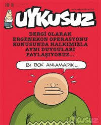

# Hiciv Denemeleri

Yeni bir kategori baslattik; Bu yeni "hiciv" kategorisi altinda
disarida The Onion geleneginde olan ciddi/saka havasinda bazi
yazilarimiz olacak.

Turkiye'deki bazi olaylar oyle sacma ve aptalca ki, bunlari elestirmek
ve kizmak yetersiz, bunun otesine gecmeniz gerekiyor, dalga gecmek ve
makaraya almak lazim ve gerekli. Su anda ulkemizde bir politik komedi
kitligi var; kimsenin burnundan kil aldirmamasi ayrica komedyenlerin
komedi yapabilmek icin gereken dogru politik goruste olmamalari burada
rol oynuyor.

Alttaki karikatur dergisi basligi, Ergenekon olayi patladiktan sonra
cikti ve Turkiye siyasi mizahinin icinde oldugu hazin durumu
yansitmaktadir.

Tam bir beyin durmasi durumunu gozluyoruz.Not: The Onion'in unutulmaz
basliklarindan bir tanesi "Suriye 15 Milyon Arap Barindiriyor"
basligidir. Burada kitle medyasi ve savas tamtamcilari ile dalga
geciliyor; Genelde bu haber "vs ulkesi .. tane terorist barindiriyor!"
havasinda cikar. The Onion'da terorist yerine Arap kelimesi
kullanmislar, ve "barindiriyor" demisler, o ulkede yasayan insanlardan
bahsediyorlar tabii. Tam makara..

