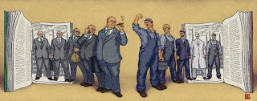
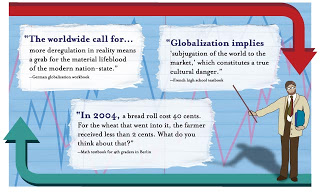
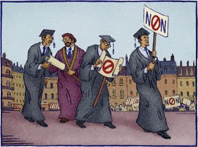

# Avrupa'nin Basarisizlik Felsefesi - I
Alttaki yazi Foreign Policy, Ocak/Subat 2008 sayisinda Stephen Theil'in yazisindan cevirilmistir.Ozet: Fransa ve Almanya'da ogrenciler cok tehlikeli bir endoktrinasyon surecinden gecmeye zorlaniyorlar; Kapitalizm, serbest piyasalar, girisimcilik gibi temel ekonomik kavramlarin barbarca, sagliksiz ve ahlaksiz oldugu ogretilen bu cocuklar, onyargili ve yanlis dusunceler ile doldurulmus oluyorlar. Bu ogretim sistemini kokunden degistirmek, Avrupa ekonomisinin gelecekte ileri ziplamasi ya da durgunlugunu devam ettirmesi arasindaki karar verici faktor olabilir.---Milyonlarca cocuk onyargi ve yanlis bilgi ile buyutuluyor. Tek tarafa dogru yonelten sekilde bir anlatimi goren bu cocuklar, tum diger Bati ulkelerinin paylastigi ortak inanislara tamamen zit bir dogmaya maruz kaliyorlar. Ders kitaplarinda gosterilen, ana Bati ideolojisiyle ihtilaf halindeki bir ideoloji, ve cocuklar dunyadaki iyi universitelerine gitmeden once bu gorusleri hatim etmek zorunda kaliyorlar. Cocuklari o ilk aldiklari onyarginin pencesinden kurtarmak, gelismek ya da kuresel kopus arasindaki farki belirleyebilir. Ve bunu yapmak hic kolay olmayacak; Cunku bu cocuklar Pakistan'da bir medresede ya da devlet kontrolundeki Suudi Arabistan okullarinda degil, tam tersine,  dunyanin en bilinen iki demokrasisinde yasiyorlar: Fransa ve Almanya'da.Bir ulkenin cocuklarina ne ogrettigi, o ulkenin milli inanislarini yansitir. Okullar, milletlerinin tarihi hikayesini bir sonraki nesile aktarmakla gorevlidir. Bu aktarimin nasil yapildigi hakkinda cok tartisma yapilmistir - Japon ders kitaplarinda Nanjing Katliam'ina vurgu yapilmamasi buna bir ornektir, Filistin ders kitaplarinda Israil'in haritada gosterilmemesi bir digeri, Rus ogretmenlere Stalin'in "iyi" sekilde gosterilmesinin yonetmelige koyulmasi baska bir ornektir. Fakat simdiye kadar ekonominin nasil ogretildigi nedense cok tartisilmamistir, halbuki bu kavram toplu kimligi olusturmakta tarihi olaylar kadar onemlidir, cunku bu kimlik eninde sonunda ortak ic ve dis politikalari belirleyecektir.Okullar tarihi hikayeyi aktardiklari gibi, ogrencilerine kapitalizm, sosyal devlet, ve diger ekonomik prensipler hakkinda dogrulugu apacik oldugu soylenen bazi "gercekler" aktarirlar. Mesela hem Fransa'da, hem Almanya'da okullar cok ciddi bir kapitalizm karsitligini ogrencilerine asilamislardir. 2005 yilinda yapilan bir ankete gore, Fransizlarin sadece %35'i serbest girisim temelli bir sistemi desteklediklerini soylemistir [3], ve ankete alinan 22 ulke arasinda, kuresel ticaretin temel taslarindan olan bu kavrama destegin azinlik olarak kaldigi tek ulkedir. Bu arada Almanya'da, sosyalist fikirlere olan destek tum zamanlarin en yuksek rakamlarina erismistir - destek 1991'de %36'dan, 2007'de %47'e ziplamistir.Insanin icinden bu egilimleri kokteyl partilerinde anlatilacak sakalar gibi gormek geliyor... Fakat bu hissiyatlarin etkileri, o hislerin yasandigi ulkelerde uzutucu sekilde geriletici olacaktir. Almanya'da issizlik oranlari, nihayet, yillar boyu Depresyon zamanlarindaki seviyelerinden asagi inmeye baslamistir cunku 2005 yilinda sosyal devlet kanunlarinda reformlar yapildi ve devlet sirtindan gecinen Almanlar is bulmaya mecbur kaldi. Bu sevindirici sonuca ragmen Almanlarin arasindaki su anki yaygin konsensus, sosyal devletin gereginden fazla kurcalandigi seklinde oldu. Bir zamanlar Almanya'nin Margaret Theatcher'i diye karsilanan Sansolye Angela Merkel, serbest piyasa reformlarini neredeyse tamamen birakti ve bunlarin yerine, yeni bir "varlik vergisi" cikardi, isci piyasasini duzenleyen kanunlari daha katilastirdi, ve kuresellesmeyi "regule" etmek icin caba gosterecegini soyledi. Bu arada, her uc Alman'dan ikisi, "voodoo ekonomisi" uygulayacagini ve simdiye kadar yapilan reformlari bile iptal edecegini soyleyen kuresellesme karsiti Die Linke (Sol) adindaki bir partinin politikalarinin cesitli derecelerde de olsa destekledigini belirtmektedir. Die Linke, dogu Alman Komunistleri ve batili sol kanat populistleri tarafindan olusturulmus bir partidir.Bu hissiyatlarin pek cogunun temeli, devletin okullara mecbur tuttugu mufredatta bulunabilir. Bati modelinin temel aldigi ekonomik prensiplerden ayrilarak tamamen farkli havada bilgilerin verildigi ilk yer orasidir. Bu fenomen muhakkak Avrupa'ya has bir durum degildir, fakat bu durum pek az yerde Fransa ve Almanya'da oldugu kadar barizdir. Bias iceren bir ekonomik gorus, dunyanin yukselen pek cok sorununu arttirici bir rol oynamaktadir, mesela populizmin, anti-kapitalist, anti-Amerikan goruslerin artmasi gibi.Ekonomi A La Carte"Ekonomik buyume telasli bir hayat dogurur. Gereginden fazla calismaya, strese, depresyona, kalp hastaligina, hatta bazilarina gore, kansere sebebiyet verir".Bu kelimeler uc ciltlik Historie du XXe siecle adli kulliyattan alinmistir. Bu kitap, Sciences Po ve diger prestijli Fransiz universitelerine girerken sayisiz lise ogrencisinin hatmetmek zorunda oldugu eserlerden biridir. Kitaba gore gectigimiz 20 sene "zenginligi ikiye katladi, issizligi ikiye katladi, fakirligi, itilmisligi de ikiye katladi ve bunlarin etkileri inanilmaz sosyal kotulukleri de beraberinde getirdi". Cunku 21. yuzyil "buyumenin sinirlarinin ve [bu buyumenin] insanliga getirdigi risklerin farkedilmesiyle" baslamistir ve ileride olabilecek olasi refah, "kapitalizmin kuresel olcude regule edilmesine baglidir". Kitabin muhtelif yerlerinde kapitalizm "zalim", "barbar", "neoliberal", ve, "Amerikali" olarak tarif edilmistir. Eklemek isterim, bu kiskirtma/propaganda manzumesi 2005 yilinda basilmisti, 1972'de degil!Fransiz ogrenciler kapitalizmin tehditleri hakkinda boyle dehset seviyede biasli yorumlari almadiklari zaman, ekonomik gelismenin sosyal hayatin tum bozukluklari icin ana sebep oldugunu ogreniyorlar. Mesela Fransiz Milli Egitim Bakanligi tarafindan hazirlanan ve ekonominin calisma mekanizmasini anlatan Sciences Economiques et Sociales adli dersin zamaninin ucte ikisi her turlu ekonomik aktivitenin sosyopolitik kotu yan etkilerini anlatmaya ayriliyor. Dersteki kitaplardan ve anlatilan konulardan bazi basliklar soyle: "Sosyal Ucurumlar ve Esitsizlik", "Sosyal Seferberlik ve Catisma", "Fakirlik ve Dislanmislik", ve en son "Kuresellesme ve Regulasyon". Bakanlik, ogrencilerin "dunya capinda regulasyonun" kuresellesmeye karsi cevap olacaginin ogrenmesini mecbur tutuyor. Bu dersin sadece ucte biri sirketler ve piyasalar hakkinda, ve o kisimlar bile asiri sekilde sendikalar, devlet ekonomi politikasi, piyasalarin sinirlari, ve buyumenin zararlari gibi konulara vurgular iceriyor. Genel mesaj, ekonomik aktivitenin sayisiz istenmeyen sonuclarinin oldugu ve vatandaslarin bundan korunmasi gerektigi.O zaman hic sasirtici olmamali ki bir Fransizin dogal tutumu piyasa kuvvetlerine, bireysel girisimcilige, ve bunlari kuvvetlendirecek her turlu siyasi politikaya supheyle bakmaktir. Yine Historie du XXe siecle kitabina gore start-up sirketler "asiri curetkar" ve sonlari "hic parlak olmayan olusumlar" olarak nitelenmektedir. Kitap bundan sonra girisimciligi, start-up sirketler, teknoloji balonu, Nasdaq cokusu, cok sayida isten cikarma eylemleri ile alakalandirir; Ekonomist Schumpeter'in "yaratici yikim" sozunden "yaratici" cikartilmis halini dusunebilirsiniz. Cok yaygin kullanilan bir metinde, teknoloji ve innovasyondan bahseden bir bolum tek bir girisimci ve sirketten bahsetmemektedir!  Bunun yerine ogrenciler uzun uzadiya teknolojinin isleri yokedip etmedigi hakkinda bir dusunce zincirine maruz olmaktadirlar. Baska bir ders kitabinda ogrenciler nihayet "bir midyeyi otomatik olarak acan bir aleti kesfeden" bir Fransiz girisimcisi ile tanisirlar. Fakat bu garip anektod, derhal modern is dunyasinin ne derecede modern bilimsel yonetimbilimin babasi Fredrick Taylor'un fikirlerine gore duzenlenmis oldugu hakkinda uzunca bir tartismaya dejenere olur [1]. Ve ne olur ne olmaz tarih dersinde kacirmis olma ihtimaline (!) karsi, ogrencilere, "kulturel kuresellesmenin" siddet ve silahli direnise yol actigini ve bunun gunun sonuda kuresel bir devleti gerektirecegi hatirlatilir.Tum bunlar, Amerikali ogrencilerin ogrendiklerinden dunyalar kadar uzaktadir. ABD'de ogrencilerin neredeyse yarisindan azi bir ekonomi dersi almaktadir, ve alanlarin mufredati oldukca temel, klasik ekonomiyi baz alir. Teksas'ta eyalet, girisimcilerin yerel ekonomiye olan katkilarindan bahsedilmesini sart kosar. New York eyaleti, mufredatini, genc girisimcilere destek veren Junior Achievement gibi kuruluslar ve Federal Reserve de calisan ekonomistler ile koordine etmistir. Peki Amerikan lise ekonomi egitimi, ogrencilerini Bill Gates'in izinde gitmeye ve kuresellesmeyi kayitsiz sartsiz savunucusu bireyler olarak yetistirir? Bunu soylemek zor. Fakat cocuklarin genc beyinlerinin sirketler ve o sirketleri isleten insanlar hakkinda negatif fikirlerle doldurulmadigi da kesin. Fransiz kitaplarin surekli yaptigi gibi ekonomik aktivitenin surekli kotu yan etkilerinden bahsedilmemesi de oyle.Aslinda Fransiz ogrencilerin ekonomi ogrenmekten ziyade, ekonomi hakkinda gayet spesifik ve yanli bir ders aldiklarini soylemek daha dogru olabilir. Bu cocuklar mezun olduklarinda arz ve talep, ya da bir holdingin yonetim sekli hakkinda pek bir sey ogrenmis olmayabilecekler, ama "la McDonaldisation du monde [2]"'nin seytanliklari, kuresel sermaye uzerinde "Tobin vergisinin" yararlari hakkindaki tum detaylara tam vakif olacaklar.II. Bolum: Almanya-----[1] Taylor'un fikirlerinin demode oldugunu daha onceki bir yazida belirtmistik.[2] "Tum dunyanin McDonaldize olmasi "[3] Fransizlarin girisimcilige karsi olan tutumlari, psikoloji kullanarak pazarlama uzmani Fransiz Clotaire Rapaille tarafindan net sekilde saptanmistir. Sirketini baslatmak icin ABD'ye gitmeye karar veren Rapaille, fikrini ilk tarttigi siralarda etrafindakilere bundan bahseder. Fakat "bunu duyanlar bana homurdanmış, sonra dönüp bana "megalomanyak" demislerdi" seklindeki hatirasini da aktarir. Kultur kodlari hakkindaki yazimiz surada bulunabilir.

zaman:

Ağustos 08, 2008

