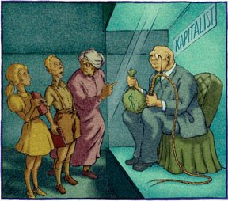

# Avrupa'nin Basarisizlik Felsefesi - II
Bu yazinin I. Bolumu:Alttaki yazi Foreign Policy, Ocak/Subat 2008 sayisinda Stephen Theil'in yazisindan cevirilmistir.---Parayi Sevmeyi OgrenmekAlmanlar cocuklarina benzer bir ekonomik hikaye anlatiyorlar, sadece vurgu biraz daha farkli yerde. Onlarin egitim odagi cocuklara Almanlarin korporatist ve kollektivist geleneklerini asilamak. Almanya'nin her 16 eyaletinin kendi duzenledigi egitim gereklilikleri var, fakat neredeyse hepsi ekonomi egitimini isveren/isci cekismesi merceginden veriyor ve bu baglamda ekonomide ana catismanin "maas ve isyeri kurallari" hakkindaki catisma oldugu soyleniyor. Eger bu kitaplarda en goze batan ana temayi bulmak istesek, bu herhalde "grup cikari"'na yapilan asiri vurgu olurdu. Bu vurgunun temeli dunyayi klasik sosyal demokrat cizgileriyle ayirmis; Sermaye/emek, isci/isveren, patron/calisan. Ders kitaplari isci-isveren iliskisini en ince ayrintisina kadar detaylandiriyor; Isyeri cekismesi, kollektif pazarlik yapmak, sendikalar, grevler, ve calisanin kendini korumasi en ince ayrinti ile anlatilan konular. Bu kitaplara en ustunkoru bakis bile bu metinlerin, gelecekte elinde sendika kontrakti ile bir yerlerde iscilik yapacak olan birisinin perspektifi ile yazildigidir. Patronlar ve sirket sahipleri rutin olarak kitapta yer alan yan karikaturler ve figurlerde puro icen, kucuk cocuklari iscilige suren, Internet hirsizligi yapan, cep telefonu muptelasi, alkolik ve surekli haksiz yere isci cikaran plutokratlar olarak resmedilmektedir. Modern basarili girisimci bu kitapta hicbir yerde gorulememektedir.Alman ogrenciler okullarindan mezun olduklarinda pek cok seyi bilir halde mezun olurlar, ama en iyi bilecekleri konulardan birisi refah devleti alicisi olarak ellerindeki haklaridir. Lise 2. sinifta sosyal dersler icin kullanilan FAKT adindaki bir kitabin "issizlige karsi ne yapmali?"  bolumunde sirketlerin yeni isler yaratacaginin anlatilmasi yerine, isi olmayanlarin birlesip kendilerini organize ederek haftalik protesto yuruyusleri yapmasini ve bunlari "Dogu Almanya Pazartesi gosterileri ruhu ile yapmalarini" soylenmektedir (bu protestolar aslinda 1989'da Kommunist rejimin yikilmasina yardim etmistir, nasilsa (!) bu detay atlanmistir). Burada gizlice yapilan vurgu nedir? Isler devletten siparis edilecek birer haktir. Ayni bolum, ayrica, pek cok refah devleti programini saymakta, isverenlerin isten cikarmayi nasil maaslari azaltmak icin bir taktik olarak kullandigini ogretmektedir. Bu anlatimlar Alman Sendika Federasyonunun politikasindan uzun bir alintiyla bitmektedir; Haftada 30 saat calismak, 60 yasinda emekli olma, mevcut isgucu pastasinin "tekrar dagilitip" bazi tam zamanli islerin yarim zamanli (part-time) islere bolunerek islerin cogaltilmasi. Bu kitapta hicbir piyasa alternatifi ogretilmemektedir. FAKT, issizlige bir suclu bulmak gerektiginde, onu hemen "bilgisayarlar" ve "robotlar" olarak tanimlar. Aslinda bu tema Alman kitaplarinda tekrar tekrar kendini gostermektedir, mesela Internet, gunun birinde calisanlari "anonim bilgisayar kodlari" haline getirecek ve insanlararasi iletisimi yokedecektir.Almaya'da bir o kadar populer olan diger eserler kuresellesme hakkindakilerdir. Bu kitaplarin birinde "Manchester Kapitalizminin Geri Gelisi", "Avrupa'nin Brezilyalasmasi", ve "Karanlik Caglarin Geri Donusu" gibi basliklar yer almaktadir ve bu kitaba gore, Hindistan ve Cin basarili olmustur cunku onlarin pek cok devlet sirketi vardir ve korumacilik yapmaktadirlar [1]. Diger yanda dunyadaki "en serbest piyasalari" fakirlik icinde yasayan Sahara Afrika'sinda yer almaktadir. Pek cok Alman ve Fransiz kitabi gibi, bu kitap ta ogrencilerin kuresellesme karsiti Attac adli grupla iletisime gecerek cok sey ogrenebilecegini ogutlemektedir (Attac, G-8 toplantilari sirasinda asiri gosterileri ile bilenen bir gruptur).Avrupa'lilarin dunyaya hafiften ortanin solu, sosyal demokrat mercekten bakmasi pek cok kisiye aslinda normal gelebilir. Sasirtici olan Avrupa'lilarin okullarinda ogrettikleri inanilmaz derecedeki piyasa karsiti tek tarafli ogretimdir. Ogrenciler, acik bir sekilde sirketlerin isleri yokettigini, devlet politikalarinin ise yeni isleri yarattigini ogrenmektedirler. Isveren hep istismar ederek faydalanir (exploit), devlet ise koruyucudur, kurtaricidir. Serbest piyasalar "kaos" yaratmakta, devlet regulasyonu kaosa "duzen" getirmektedir. Kuresellesme ise birakin yokedici olmayi, tarumar edici bir felaket olarak betimlenmistir. Is dunyasi bir "sifir toplam (zero-sum)" oyunudur, kazanan varsa mutlaka kaybeden vardir, ve bu is dunyasi tum modern sosyal problemlerin anasidir. Muhakkak bazi girisim ruhlu ogretmenler ders sirasinda alternatif bir gorusu ogretebilirler, ve bazi ders kitaplarinin digerlerinden daha az ideolojik oldugu gorulmustur. Ama mufredattaki bias orada oldukca, sonuclari kacinilmaz olacaktir. Onemli olan cocuklarin yetistigi ortamin "cercevesidir". Cocuklarin gunun birinde gercek olarak algilayacaklari duzgun bir sistemin varligidir.Eski Avrupa Yeni Numaralar Ogrenebilir mi?Egitimdeki biasin ic politikayi belirleyen tartismanin cok daha otesinde etkileri var cunku bu tek tarafli aktarilan bilgiler, cocuklarin gelecekte yapacagi secimleri de tanimliyor. Serbest piyasanin tehlikeli bir "yabani ortam" oldugunun ogretilmesi sonucu anketlerde "eger basarisiz olma ihtimalim varsa yeni bir is baslatmam" diyen Alman sayisi, ayni sorunun soruldugu Amerika'lilardan iki kati daha fazla cikiyor. AB'nin kendi ic anketlerine gore her 5 Alman ve Fransiz'dan sadece 2 tanesi kendi kendinin patronu olmayi tercih etmekte, bu sayi, ABD'de 5'te 3 olarak saptanmaktadir. Amerika'lilarin %8'i su anda yeni bir is baslatmakta olduklarini soylerken, Almanya'da bu rakam %2 ve Fransa'da %1'e dusmektedir. Is baslatmayi "planladigini" soyleyen Amerika'lilarin sayisi %28, ayni durumda olan Almanlarin sayisi %18 Fransizlarda %11'dir. Bu istatistikler, Avrupa'nin en buyuk iki ekonomisine issizlik, innovasyon eksikligi ve ekonomik dinamizmde azalis olarak geri donmektedir.Son arastirmalar gostermektedir ki bir ulkedeki insanlarin davranis kaliplari ve zihin halleri/duruslari, o ulkenin ekonomik performansina direk yansimaktadir. Columbia Universitesi Nobel odullu ekonomist Edmund Phelps'e gore ulkelerin ekonomik performanslarini ve o performanslarin niye birinden digerine degistigini aciklamakta klasik olcutler olan sosyal harcamalar, vergi seviyeleri, isgucu piyasasi regulasyonlari yerine, insanlarin piyasalara bakisi, calisma etikleri, ve risk alma istekleri gibi olcutler cok daha basarili olmaktadir. Max Weber'in unlu tespiti olan kapitalizm ve kultur arasindaki baglanti, kita Avrupasinin girisimcilik ve innovasyondaki basarisizligini da aslinda cok guzel resmetmektedir. Massachussets bazli Monitor Group'un hazirladigi Girisimcilik Benchmark Indeks, en son baktigi 9 ulkede insanlarin ekonomi hakkindaki dusunceleri ile ulkelerdeki sirket performanslari arasinda cok guclu baglantilar bulmustur. Arastirmacilar, insanlarin ekonomi hakkindaki hissiyatlarinin, ulkelerdeki start-up baslatma ve sirket buyume hizlari arasindaki degisimin %40'ini aciklayabildigini gostermistir. Bu korelasyon, bakilan diger 31 olcut/gosterge/indikator arasinda en guclu baglantidir. Eger Fransa ve Almanya gibi ulkeler liderlerinin iddia ettigi gibi hakikaten girisimcilik, innovasyon, ekonomik dinamizmi arttirmak istiyorlarsa, bunu yapmak icin en etkili cozum egitimi kullanarak bir is kurmanin kulturel olarak kabul edilmesini saglamak olacaktir.Alman ve Fransizlarin cocuklarina ogretmeye devam ettigi derin piyasa karsiti ogreti, su anda pek cok kisinin tekrarlamakta oldugu "kuresellesme sayesinde tum dunyanin "Bati" usulu serbest piyasa kapitalizminin kabul etmesinin artik an meselesi oldugu" dusuncesini de sarsmaktadir. Demokrasilerde politacilar ulkelerindeki secmenlerin cogunlugunun isteklerine uzun sure karsi cikamazlar. Bu demektir ki bahsedilen bias, Avrupa secimlerini ve bu secimler sonrasi o ulkelerin politikalarini etkilemeye devam edecektir. Olurlugu yuksek bir alternatif senaryo, kuresellesmenin getirdigi degisikliklerin kapitalizme karsi zaten egitim ile islenmis/biriktirilen negatif hissiyatin Avrupa'dan Latin Amerika'ya giden cografyada populist demagoglarin yetismesi icin verimli bir toprak saglayabilecegidir - ki bu trend simdiden bazi solcu hareketlerin tekrar peydahlanmasini aciklamaktadir.Refah devletinde yaptigi minimal reformlar bile Schroder'in 2005'te isini kaybetmesine sebep oldu. Bu reformlar ayni zamanda Alman politikasinin da paralize olmasi sonucunu getirdi. Bunun akabinde eski Komunistler ve aradigini bulamamis saskin Sosyal Demokratlar yanlarina sol kanat Yesilcileri de alarak Almanya'nin yeni solcu partisine akin ettiler. Bu partinin programi berbat bir anti-kapitalist demagoji, ve asiri sagci yabanci dusmanligi karisimindan olusuyor. Anketlere gore bu partinin platformu en ortaci Almanlardan bile destek buluyor. Hem parlamentoda hem halkin icinde sola yaslanan bir cogunluk, dunyanin en buyuk ucuncu ekonomisini kapitalizmi sevmeme ve kuresellesmeden korkma duygularin yuzunden yikim politikalarina surukluyor. Fransa'ya gelirsek: Yeni baskan Sarkozy eski islemez politikalarla bir "kopus" olacagini soyledi. Ulkesinin krallar gibi yasayan devlet memurlarinin yemlikleriyle savasmaya basladi, fakat tum bunlari "ekonomik milliyetcilik" icin yaptigini soyluyor ve tum bunlar eski usul endustriyel korumacilik kokuyor. Fransiz ogrencilerin dunyanin nasil calismasi gerektigine dair ogrendikleri yegane yol zaten budur.Hem Fransiz hem Almanya tecrubeleri uzun sure zihinlere islenmis ekonomik ideolojinin akintisina karsi kurek cekmenin / is yapmanin ne kadar zor oldugunu gosteriyor. Ve evet, gelecegin liderlerini girisimcilik ve uretken olmaya karsi bir zihin yapisinda yetistirmek bir o kadar cilginca olacak. Neyse ki, bu cilginliklar egitimin bir urunu, ve bir yonde oldugu gibi diger yonde de olabilir. Eger Almanya ve Fransa gibi ulkeler ulkelerinin ekonomisini duzeltmek istiyorlarsa, cocuklarinin okullarda neler ogrendiklerine bakmakla ise baslayabilirler.Stephan Theil, Newsweek'in Avrupa ekonomisi editorudur. Amerika, Almanya, Fransa ekonomi derslerinin mufredati ve ders kitaplari hakkindaki arastirmasini  ABD Alman Marshall Fonu'nda trans-Atlantic fellow oldugu sirada tamamlamistir.--[1] Buradaki gariplik, aslinda, Almanya'nin kuresellesmeden en cok kazanan ulkelerden biri olmasidir. Bu durum, Cin'in ucuz uretimde yukselmesinden sonra bile degismemistir. Konu hakkinda yine ayni yazar, Theil'in, yazisi suradan okunabilir.

zaman:

Ağustos 09, 2008

