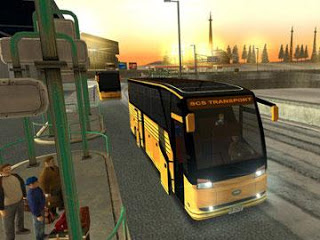

# Bus Driver for PC
Oyun yazicilarinin caninin sıkılmaya basladigini bu oyun ismini gordukten sonra anladim: Bus Driver for PC. Yani "Otobus Soforu". Evet, yanlis duymadiniz, bu oyunda canavarlar ya da kung-fu ustalari ile carpisip dunyayi yokolmaktan kurtarmiyorsunuz, ya da bir Galaktik Imparatorlugunu insa etmeye ugrasmiyorsunuz. Bu oyunda sadece otobus soforlugu yapiyorsunuz.Caddelerde ilerleyip, trafikte sıkısıp duraklarda yolcu bindiriyor, indiriyorsunuz. Bazen yagmur yagiyor, bazen camur oluyor. Cocuklari okullarina yetistirmeniz gerekiyor. Hah! Peki kardesim, bundan sonraki oyun ne olacak yahu? Hademe for PC? Isportaci for Windows? (Bu islere saygisizlik gibi olmasin..... -hmm.. peki olsun-).Ve sunu da soyleyeyim, bu oyunun da musterisi oldugundan hic suphem yok. Bu durum aslinda bize  hayat hakkinda bir sey daha soyluyor ; Eger su anda oldugumuz yasam da bir nevi oyunsa, bu oyunda farkli seviyelerdeki "oyun turlerine" istek olmasi bu benzerlikten yola cikarak anlasilir olmali. Otobus soforlugu yapmak gibi banal bir is bile musteri bulabildigine gore! Aslinda dusunursek, otobus soforlugu bir madende iscilik yapmaktan daha zevkli bir is olabilir. Surekli geziyorsunuz, manzara degisiyor yani, sehir yasamini yakindan takip etme sansiniz oluyor... Neyse.. :)Bus Driver for PC!Inanilmaz..

zaman:

Ağustos 18, 2008

