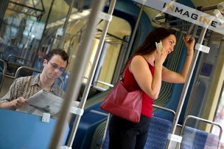

# Cep Telefonlari
IETT otobuslerinde soforlerin, cep telefonu ile konusan yolculara ihtarda bulundugu gibi bir haber aldik. Bu ihtar ve varsa yasak, tamamen bir sacmalik uzerine kurulu - cep telefonlarinin ABS frenlerine zarar vermesi gibi bir durum yok. Bu bir peri masalidir. Insanlar da aptal degiller, Internet'ten bakmislar, ve boyle bir durum olmadigini gormusler, soforleri dinlemiyorlar. Haklilar da.Soforlere bu durum anlatilsin, eger varsa yasak kaldirilsin. Yoksa halkin icinde hirgur cikmasi icin bir sebep daha ortaya cikacak. Aktarilan hikayede yolcu ve sofor birbirlerine bayagi bagirip cagirmislar, "en zengin semtlerimizin birinde" isleyen o yesil klimali otobuslerin birinde. Yani sicak insanlarin basina vurmus diyebilirsiniz, ama o degil.Bizden soylemesi.Bazi baglantilar [1,2] (1. baglantidan bir alinti altta)İstanbul Teknik Üniversitesi (İTÜ) Elektronik Fakültesi Elektronik Haberleşme Mühendisliği Bölümü Öğretim Üyesi Doç. Dr. Melih Pazarcı, cep telefonunun araçlardaki ABS fren sistemini etkilemesi nedeniyle kaza yapılması ihtimalinin yüzde 1’in altında olduğunu söyledi. Cep telefonunda, konuşmanın yapıldığı noktayla, baz istasyonu arasındaki mesafenin ve konuşmanın aracın neresinde yapıldığının önemli olduğunu anlatan Doç. Dr. Pazarcı, ancak bu etkinin de sınırlı olduğunu ifade etti.   Doç. Dr. Pazarcı, şunları kaydetti: “Cep telefonuyla görüşme yapan yolcu ön koltukta dahi olsa etkileme ihtimali çok büyük değil. Cep telefonunun ABS fren sistemini etkilemesi nedeniyle kaza yapılması ihtimali yüzde 1’in altında. Diğer kaza nedenlerinden, örneğin hatalı sollamayla kaza yapma ihtimalinden daha az. Trafik sorunlarının içinde sıralamaya bile girmez.

zaman:

Ağustos 24, 2008

