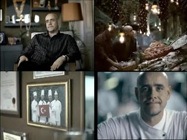

# ING Bank ve Kultur Kodlari
ING Bank'in reklam filmi, Clotaire Rapaille'in Kultur Kodlari adli kitabinda tarif edilen analizlere tamamen uygun tasarlanmis... Filmin ana temasi "icinizden biri olmaya geldik, Turkiye'nin enerjisinden guc almaya, gucunuze guc katmaya geldik" mesaji oncelikle Rapaille'in saptadigi Turkiye'nin kendine atadigi kod olan MISAFIRPERVERLIK hissiyatina uygundur (message is on code). Filmde gosterilen asci zat, disaridan ulkeye gelmis, "kabul edilmis" ve Turk gibi yasamaya baslamistir.Ikinci koda uygun mesaj olan "guce guc katmak" mesajinda; Bu, Turkiye'de eger kultur kod analizi yapilsa ortaya cikacagindan emin oldugum "GUCLU OLMAK" kodununun aktive edilmesidir. Ezilmis, yikilmis, tarumar edilmis bir imporatorluktan ortaya cikan yeni bir ulkenin bu kelimeler etrafinda bir kod gelistirmis olmasi raslanti olmasa gerek (bu kod, duygusal zekada hangi hissiyata bagli bunu bilmiyoruz, arastirilmasi gerekir).Ayrica guclu olma mesaji hayatta kalma durtusu uzerinden surungen beyine de hitap etmektedir.Rapaille'in arastirmalarina gore, bir urunu/servisi alirken, beyindeki uc seviye etkili olmaktadir. Bu seviyeler surungen beyni, duygusal beyin ve analitik beyindir. En alt seviyedeki surungen beyin, hayatta kalma, ureme gibi onceliklerle ugrasir, duygusal zeka ergenlik oncesi yasta kurulan zihinsel baglantilari saklar, analitik zeka ise problem cozucu zekamizdir. En son gelisen ve en sofistike olandir.Surungen beyin en ilkel olmasina ragmen, alim kararlarinda en guclusudur. Diger seviyeler, sofistikelestikce kuvvetlerini kaybederler. Yani ING Bank reklami, surungen ve duygusal zekaya hitap ederek, cok guclu bir kombinasyonu aktive etmistir.Bu reklamda analitik zekaya hitap eden hicbir sey yoktur. Bankanin filanca "servisleri" iyi oldugu icin tercih edilmesi soylenmemektedir. Sadece "guc", "enerji", "gelmek", "icinizden biri" gibi bir takim dugmelere basilmaktadir.Yontem ve varilacak sonuc acisindan bu reklamin basarili bir reklam oldugunu soyleyebiliriz.

zaman:

Ağustos 22, 2008

