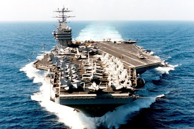

# Uzakdogu ve Donanmalarinin Silah Yarisi
Biraz ulke ve yakin bolge disina cikip, Uzak Dogu'daki guc dinamiklerine bakmamiz faydali olabilir. Yukselen Asya'nin ayni zamanda catisma potansiyeli de yukseliyor. Konu hakkinda Brezinski'nin The Choice adli kitabindan bir alintilar/derleme alttadir:"Tum Asya ulkelerinin cok onemli bir stratejik yumusak karni var.. Her Asya gucu, deniz tasimaciligi ve ticareti icin bolgedeki iki veya uc buyuk limana ihtiyac duyuyor. Japonya, Cin veya Hindistan'in ekonomisine diz cokturmek icin Shangai veya Yokohoma veya Bombay (ve birkac ek liman) gibi girislere birkac manyetik mayin koyulmasi yeterlidir. Gemileri-ve bu gemilerin tasidigi en onemli mal olan petrol bu hatlardan gecmektedir, ve bu malin tum Asya ulkeleri icin ne kadar onemli oldugunu hatirlatmaya gerek yok . Milletlerarasi tren tasimaciligi kullanilabildigi yerlerde bile (Cin, Hindistan) deniz ulasimina oranla kiyaslanamayacak kadar yetersizdir, ve zaten Japonya, Endonezya gibi ada ulkeleri icin gecerli bir secenek degildir. Bu durumda Singapor'un hemen aciklarinda olan Malacca Bogazi tasimaciliktaki en onemli gecitlerden biri haline gelmektedir - Uzak Dogu'nun tamami bu gecitten mal tasimaktadir.Tum bu zayifliklarin ortada olmasi, onlarin korunma ihtiyacini dogal olarak ortaya cikarmistir. Bu yuzden hic sasirmamak gerekir ki, Asya'da sessiz sedasiz bir donanma silahlanma yarisinin isaretleri gozukmeye baslamistir. Bu yarisin bir onceki yuzyilda Avrupa'da vuku bulmus olan donanma yarisina olan parallellik gercekten carpicidir. Bolgedeki tum buyuk oyuncular, fazla reklam ve gurultu cikarmadan, denizalti filolarini genisletmekte, atak helikopteri tasiyan savas gemileri almakta, ucak gemisi almayi planlamakta, ve donanmalarinin "etki/nufuz alanini/mesafesini" arttirmaya ugrasmaktadir. Ozellikle Cin ve Hindistan cok kuvvetli okyanus donanmalarina sahip olma isteklerini belli etmislerdir; Her iki ulke de Rusya'nin Sovyetler oldugu sirada yapmaya basladigi ama tamamlayamadigi ucak gemisini devralmak icin aktif gorusmelerde bulunmaktadir. Her iki ulke ayni zamanda destroyer kabiliyetlerini modernize etmektedir ve en son Rus uretimi destroyerleri envanterlerine eklemislerdir. Cin ve Hindistan onemli bir caydirici kuvvet olarak denizalti kuvvetine ozel onem vermektedirler [2]. Cin stratejik literaturunde donanma planlamacilari Cin'in gitgide etki alanini guneybati'ya dogru genisletmesini savunmakta, Hindistan'da ise ayni planlamacilar hem Hindistan'in Hint Okyanusundaki sorumlulugunun artmasina hem de Malacca Bogazi'nda etkisinin hissettirmesine vurgu yapmaktadirlar.Uzak Dogu'nun kaderini buyuk olcude Cin ve Japonya'nin nasil anlasacagi ve Amerika'nin bu ikisi arasindaki konumu belirleyecektir. Eger ABD bolgeden cekilirse, bu Japonya'nin nukleer guc olmasini bir zorunluluk haline getirir. Zaten su an bile Japonya nukleer enerji uretiminde 3. ulke konumundadir; Yakinda acmayi planladigi nukleer tesisleri ve onlara gereken yakitlari elde ettikten sonra dunyanin en buyuk uranyum birikimi onda olacaktir. Bazi Cin'li stratejisyenlere gore Japonya karar verdikten sonra bir nukleer guc olma suresi alti ustu bir haftadir. Bu aslinda Japonya'yi fiili (de-facto) bir nukleer guc oldugunu gostermektedir".Brezinski, analizinin ilerleyen kisimlarinda ABD'nin bolgeden cekilmemesini savunan bir durusu ortaya koymustur cunku bir yandan nukleer secenekler bir diger yandaki Avrupa tarihini andiran donanma silahlanma yarisi, sonu belli bir noktaya dogru gidecektir. Yani Obama'nin secilmesi durumunda ABD Pasifikte halen varligini surdurmeye ugrasan bir ulke olarak secimini yapacaktir.---[1] The Choice, sf. 109,[2] Stratejik olarak bir denizalti, deniz savaslarinda ucak gemileri icin en oldurucu enstrumanlardan biridir. Soz odur ki, "eger bir ucak gemisi kaptanina Allah korkusu tanitmak isterseniz, ona yakinda bir denizalti oldugunu soyleyin". Bu yuzden ucak gemileri her zaman kendi destroyerleri, ve kendi denizaltilarindan olusan bir filo esliginde seyahat eder. Mumkun bir dusman denizalti saldirisina karsi kendi denizaltisinin karsi koymasi beklenir.

zaman:

Ağustos 20, 2008

