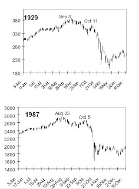

# 1987

Borsa cokuslerinin en ilginc olani 16 Ekim 1987 tarihindeki %23'luk kayip ile Kara Pazartesi adi verilen cokustur. Bu cokusu ilginc yapan cok hizli bir sekilde (bir gunde) meydana gelmesi, tum dunyaya yayilmasi, ve simdiye kadar, halen, dogru durust aciklanamamis olmasidir. Etki/tepki, rasyonellik, tahmin edilebilirlik bu rekor dusus karsisinda tamamen erimekte, yetersiz kalmaktadir.1987'nin aciklanamamasinin sebebi bir bakima cokusun sebebinin klasik ekonomi parametreleri baz alinarak aranmasindadir denebilir. Bu tur aciklamalar, bir borsadaki fiyatlari reel ekonomideki olaylarin (en azindan kisa vadede) sadece "dolayli" olarak etkileyebildigini goz ardi etmekteler. Nitekim, kisa vadede fiyatlari olusturan reel dunya degil, o dunya hakkinda aktorlerin "ne dusundugudur". Bu aktorlerin beklentileridir.Peki 1987'deki dusus hangi "beklentinin" ortaya cikmasi sebebiyle olusmustur?Ortaya konulan hipotez ilginc: Bu beklenti, 1987'nin 1929 kriziyle olan sozde benzerliginden baska bir sey degildir. Ozetlemek gerekirse, 87 dususu oncesinde, aynen 29 oncesine benzer fiyat, hacim hareketleri goruldugu icin, bu benzerlik ilk once buyuk borsacilar tarafindan daha sonra Wall Street Journal, CNBC gibi kitle haber kanallarinca tekerrur olarak algilanmis, ama tekerrur olmasa bile bu algilanis uzerine hareketler yapilinca bu benzerlik, gercek benzerlige donusmustur! Yani Ingilizce'deki deyim, "kendi kendini gerceklestiren kehanet (sell fullfilling prophecy)" durumu olusmustur!Zamanin onde gelen yatirimcilari Paul Tudor-Jones ve Stanley Druckenmiller'in (Soros'un sag kolu, Quantum fonunun yoneticisiydi) verdikleri mulakatlar bu hipotezi dogrular niteliktedir. Her iki yatirimci da Kara Pazartesi'den bir onceki Cuma meydana gelen rekor hacimde azalisi (fiyat seviyesinde azalis rekor degil, dikkat, eksi yonde ama hacim rekor seviyede), farkedip, modellerinde bunun 1929'den hemen onceki bir duruma tekabul ettigini farkedip, sat pozisyonuna gectiklerini belirtmistir. Diger gec uyanan aktorler ise, kismen bu buyuk aktorlere, kismen kendi kurduklari analog (benzerlik) sonrasi ayni sekilde davranmaya baslayinca, tahmin, kendini dogrulamaya degil, kendini "gerceklestirmeye" baslamis ve 1929 cokusune tipatip benzeyen 1987 cokusu meydana gelmistir.Altta her iki buyuk dususun grafigini bulabilirsiniz.Demek ki, 1987'nin sebebi 1929 krizidir. 1929'un insanlarin belleginde olan kalintilaridir.Peki 1987 hafizasi daha sonraki krizleri etkilemis midir? Hayir. Cunku yatirimcilar bu iki tecrubeden ogrendiklerini alim/satim stratejilerine yansitmislardir; 1987 krizi ile beraber baska bir gercek artik hafizalardadir; 1987'den sonraki cabuk duzelis (gerci fiyatlarin 87 oncesine donmesi iki kusur sene almistir, fakat bu Buyuk Buhran zamani ile karsilastirilamaz bile).Daha fazla bilgi icin [1, 2].Dikkat: 87 ve 29 arasinda baglanti kurduk, fakat su anda olan dusus hakkinda yorum yapmiyoruz. Yazinin ana tezi, reel ekonominin direk degil, algilayis uzerinden fiyatlari etkiledigidir, bu algilayis bir onceki algilayis, ondan alinan ders, dersin dersi gibi cetrefil seviyelerde degisebilir. Su anda reel ekonomide riskin uzun sure az fiyatlanmasinin bedeli odenmektedir, bir onceki algilayisin duzeltmesi, ayrica sistemdeki bozukluklarin duzelmesi sozkonusudur. Bu cokus (tarihe gececek bir cokus olacak mi onu zaman gosterecek) buyuk bir ihtimalle eskiye kurulan yanlis analoglar ile alakali olmayacaktir.

