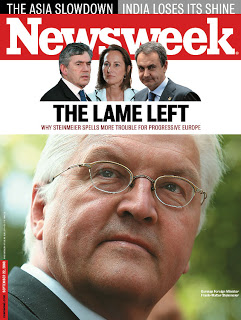

# Solmus, Silik bir Sol
"The Lame (silik, soluk) Left" basligi Newsweek'e kapak oldu. Kapaga tema olan ana yazinin tezi, Avrupa'da solun krize girmis olmasidir. Ana yaziyi kaleme alan kisi, burada daha once bir yazisini [1, 2] tercume ettigimiz Avrupa ekonomi uzmani Stefan Theil.

zaman:

Eylül 20, 2008

