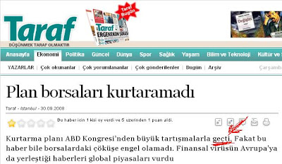

# Taraf: Plan Gecti
Taraf dun yanlis bir sekilde ABD'de kurtarma planinin gectigini yazmis. Herkesin bildigi gibi plan gecmedi. Bu haberi baz alan kose yazarlari da o yonde yorumlar yapmislar; Ortaya ilginc bir "alternatif tarih" durumu cikmis. Bu hatanin nasil ortaya ciktiginin dinamigini aslinda ogrenmek isteriz. Bir sey yetistirmek icin, olurlugu yuksek olan bir olay manset olarak atmak mubah midir? Hata yabanci basini takip eden kiside midir? Oyle ise bu kisi fena cuvallamistir.Bu hata, tabii ki Ergenekoncu medyanin yaptiklari ile karsilastirilamaz. Bu cenah bilerek/amacli olarak yalan yaziyor - arada fark var.

zaman:

Eylül 30, 2008

