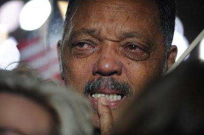

# Agla Bakalim...

Aglayan Jesse Jackson. Bu blog'da daha once hakkinda bir yazi
yazmistik. Jackson o sirada destegini Obama'ya vermisti, fakat daha
sonra bazi garip hareketler yapti: Bir haber programindan once "Barack
Obama zencilere yukaridan bakiyor, onlari kucuk goruyor" diye
yanindaki haberciye fisildarken kameralar calisiyormus "meger(!)", ve
bu goruntu Internet'e sizdi. Sonra buyuk haber oldu. Bu tur zenciler
bu acidan "bir kisim" Turkiyelileri andiriyorlar bu baglamda,
aralarindan biri yukselince, hem gururlanip, hem de onu asagi cekmek
isteyenler oluyor [1]. Simdi burada biraz ayricalik durumu da var:
Jackson gibileri baskanin "kendisi" zenci olunca "zenci lider"
pozisyonlarini kaybedecekler. Adamin zenci lidere niye ihtiyaci olsun?
Kendisi zenci zaten!Yani bu fotografin isi bilenlerin zihninde
canlandirdigi hikaye bu. Aklimdan ilk bu gecti: Agla bakalim
#@##$. Colin Powell da aglamis, ona sozum yok.---[1] Hintlilerde de
benzer bir hissiyat var. Bu kendilerinin soyledigi bir durum. "Biz
kovadaki yengecler gibiyiz" derler "birimiz cikmaya kalkinca
digerlerimiz onu asagi cekeriz" (guya yengecler boyle yaparmis).

