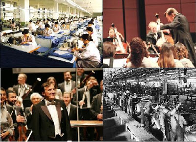

# Muzik Fabrikasi
Sanayici Bulent Eczacibasi orkestra yonetmis. Hiç sürpriz değil, çünkü klasik müzik tamamen endüstriyel kafalıların yapısına uygun bir müziktir.  Sanayileşmeyi temsil eden ikinci dalga Avrupa'ya ulaştığında, Londra'da, Viyena'da, Paris ve diğer şehirlerde hemen ardı ardına mantar gibi konser salonları türemeye başladı. Bu salonlar ve oralarda yapılan müzik bir işkoluna dönüştü; İşadamları konser salonları satın alıp, müzik "ürettiriyorlar" ve sandalye satıyorlardı. İşleri büyüttükçe daha arkalarda olan koltuklara sesi ulaştırmak için "daha fazla müzisyen (işçi)" eklemek gerekti. Çünkü elektronik amfi denen kavram daha ortada yoktu.  Orkestralar aynen fabrikalar gibi düzenlenmiştir; Bir kere "üretim" "departmanlara" ayrılmıştır, her tür çalgının yeri bellidir. Montaj bantının bir müdürü olduğu gibi, orkestranın bir şefi vardır, ve oradan aşağı bir "hiyerarşi" bulunur (müzikte şeften sonra ilk kemanist, yada bölüm şefinin gelmesi gibi).  Endüstriyel çağın temel taşları olan standardizasyon (notalarda yazılan aynen çalınır, fabrikada spesifikasyondaki ürün aynen üretilir), merkezileşme (şef), senkronizasyon (hangi çalgıların neyi aynı anda, arkası arkasına çalacağı) gibi öğeler bir orkestrada noktasına kadar mevcuttur.  Kıyasla bizim çağımızı temsil edebilecek müziklerden caz, bu tür organizasyondan fersah fersah uzaktadır. Bir kere cazda müzisyenler birbirlerinden "o anda" ilham alarak şarkının yönünü değiştirebilirler (jammıng). Baz bir temel vardır, gerisi canlı performansta yaratıcılıktır. Bu birbirine göre değişim yani anlık senkronizasyon ve bunu bütününün bir kollektif senteze yaklaşma kavramından daha önce bahsetmistik.
 Caz ve rock müziklerinde daha fazla ses gerekiyorsa elektronik amfi kullanılır; daha fazla ses için "daha fazla müzisyene" ihtiyaç yoktur.  Rock müzik te, aynen caz gibi, özellikle ilk çıktığı haliyle, tamamen endüstriyel mentalitenin dışına çıkmak amacı gütmüştür (daha sonra bazı kolları poplasti, onlar istisna). Fakat bu ilk zamanlardaki kalıp kırmaya çalışan şarkılara en güzel örnek herhalde The Who grubunun My Generation şarkısıdır. Dikkat edin, adam şarkıyı söylerken resmen kekeliyor, bunu bilerek müziği "yamultmak" için yapıyor, m-m-m-my g-g-g-generation diye söylüyor mesela!... :), o sırada davulcu aksak ritimler atıyor, keşmekeş gibi .. ama değil. Hala müzik. The Who ayrıca sahne tiyatrosu ile de bilinirdi, gitar kırmak vs. onların işlerindendir. Bu da bir asılık ve eski düzenene uymama gösterisiydi tabii.  Eczacıbaşı'nı kutlarız, iyi yönetmiştir herhalde, fakat yaptığı iş, zaten günlük yaptığı işten pek farklı değil. Bir cellatın kasaplık yapması gibi bir şey... Ama eğer bir caz grubuna girip trombon çalmaya başlarsa, o başka.  ---
 [1] Bu arada klasik muzikcilerimizden Fazil Say'in Kemalist'liginin sebebi anlasiliyor; Sanayilesme -> modernite -> kemalizm -> klasik muzik -> Fazil Say -> turban karsitligi (cunku 'standarda' uymayan bir sey var).
 

zaman:

Kasım 27, 2008

