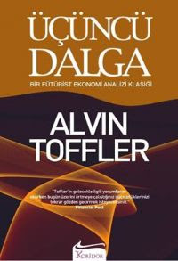

# Ucuncu Dalga - Koridor Yayincilik
Bugun bir kitapcida Toffler'in Ucuncu Dalga kitabinin degisik bir yayinevi ve yeni bir tercumesiyle karsilastim. Soyle bir goz gecirdim, fena olmamis. Bu bana bu kitabin Ingilizcesini ilk kez bir kitapcida gordugumu zamani hatirlatti; Ben arada sirada rasgele, "ucuk" bir kitap secip okumayi severim, eglenceli olur. Third Wave bu denemelerden biriydi, futuristik bir sey ariyordum, kapaginda bol isiklar, patlamalar, "iste gelecek" diyen iddiali ama hafif lakirdilar. Fakat bu kitabin ilk on sayfasindan sonra hic oyle hafif bir kitap olmadigini anlamistim.Oltaya her zaman balik vurmuyor tabii; Rasgele ucuk denemelerimden bir digeri, Sirius Galaksisiyle ilgili bir kitapti. Efendim dunya arada sirada tum gezegen sistemi ile beraber bir "kusaga" girermis, ama bu kusak icindeki yuksek radyasyon varmis, buna normal bunye dayanmiyormus. Fakat Allah'tan  uzayli dostlarimiz  yardimimiza gelmis, bizim genetik yapimizi degistirmeye baslamislar. Su anda genetik yapimiz cift sarmaldan 12-sarmalli yapiya geciyormus! Saglik probleminiz varsa bundan iler geliyor. Hah! Iyi bilim kurgu ama, adam bunu ciddi sekilde yaziyor. Neyse. Arada sirada ucukluk iyidir.

zaman:

Kasım 19, 2008

